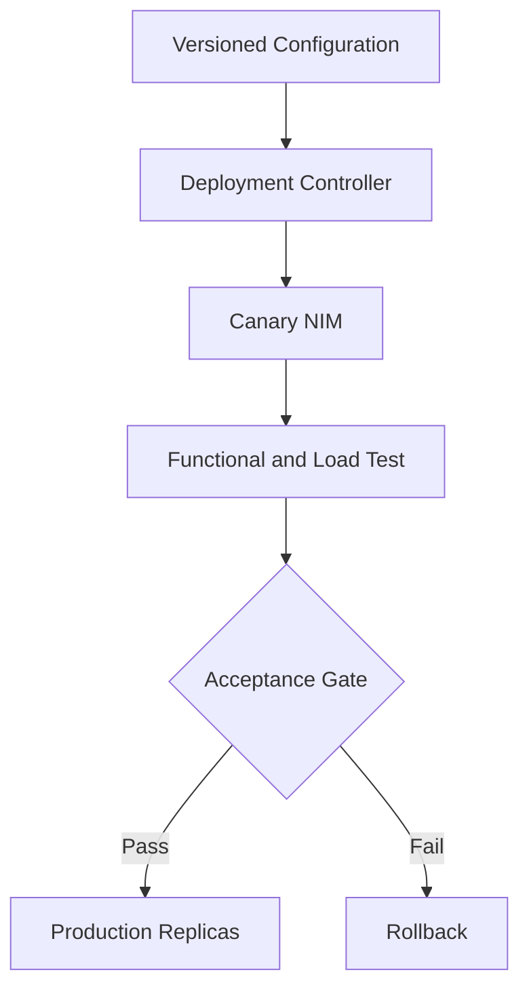

# Deploying and Operating NIM Services

A production NIM service requires more than a Deployment manifest.

## Deployment Layers

- authenticated artifact and model access;
- GPU resource and node selection;
- persistent or warm model cache;
- secrets and workload identity;
- service, ingress, and network policy;
- liveness, readiness, and startup probes;
- queue and overload controls;
- telemetry, logs, and traces;
- canary rollout and rollback.

## Architecture

## Scaling

Scale on queue depth, request rate, latency, and active work rather than GPU utilization alone. Model load time and cache warm-up can make reactive autoscaling too slow.

## Troubleshooting

A new revision that is healthy but slower should fail the canary gate. Functional health is not sufficient for production acceptance.
