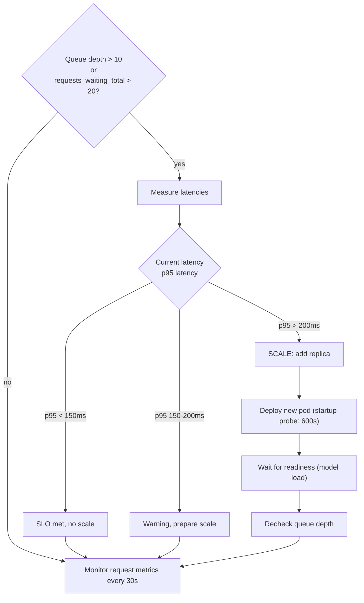

# Deploying and Operating NIM Services

A production NIM service requires more than a Deployment manifest. It requires authentication, resource guarantees, health checks, observability, and a controlled rollout process.

## Beginner's Primer: The Cold Start Problem

If you deploy a generic Nginx web server in Kubernetes, it downloads the 20MB image and starts serving traffic in 2 seconds. 

If you deploy an AI NIM container, it downloads the container image, starts up, and then must download the actual Model Weights. For a model like LLaMA-3 70B, the weights are **140 Gigabytes**. 
Downloading 140GB from the internet takes time. If you do this every time a Pod restarts, your "Startup Time" will be 20+ minutes. This is known as a **Cold Start**.

To solve this in production, you must use **Model Caching**. 
Instead of downloading the weights directly into the ephemeral Pod, you attach a Persistent Volume (PV) to the Pod. The NIM downloads the weights once and saves them to the shared storage volume. The next time the Pod restarts, or when you scale from 1 to 10 replicas, the NIM sees the weights are already cached on disk and loads them instantly into the GPU. 

If you deploy NIMs without configuring a persistent cache volume, your Autoscaler will be effectively useless, because every new Pod will spend 20 minutes downloading data before it can serve a single request.

## Deployment Checklist

Minimal production NIM deployment must include:

- **Artifact access:** NGC container pull credentials in imagePullSecrets; NGC model entitlement token in pod secrets
- **GPU resource:** requests and limits (e.g., `nvidia.com/gpu: 1`), node affinity for GPU nodes
- **Model cache:** persistent volume mount for model weights, OR accept cold-start latency on every pod creation
- **Workload identity:** scoped NGC token (not long-lived), rotated regularly, with audit logging
- **Networking:** Service, Ingress, and NetworkPolicy; model API should not be exposed to untrusted networks
- **Health probes:** separate liveness, readiness, and startup probes; startup probe must account for model download time
- **Resource limits:** CPU, memory, and ephemeral storage; prevent runaway processes from consuming node
- **Observability:** Prometheus scrape config for metrics, structured logs to centralized logging, trace sampling for latency SLOs
- **Canary rollout:** deploy new revision to small percentage first, measure latency/correctness, then expand
- **Rollback plan:** previous revision pinned in Git, tested rollback procedure in runbook

➕ **Real Helm values snippet with all required production details:**

```yaml
# Example: production-ready NIM deployment
nim:
  name: llama2-7b
  replicaCount: 3
  
  image:
    repository: nvcr.io/nvidia/nim/llama2-7b
    tag: "1.0.5"
    digest: "sha256:a1b2c3d4e5f6..." # Pin immutable digest, not tag
    pullPolicy: IfNotPresent
  
  imagePullSecrets:
    - name: ngc-secret  # Pre-created: kubectl create secret docker-registry ngc-secret ...
  
  resources:
    requests:
      nvidia.com/gpu: 1  # Reserve one GPU per pod
      cpu: 4
      memory: "16Gi"
    limits:
      nvidia.com/gpu: 1  # Ensure no over-subscription
      cpu: 8             # Allow burst for preprocessing
      memory: "32Gi"     # Safety headroom above request
      ephemeralStorage: "50Gi"  # For model cache + temp files
  
  nodeSelector:
    node-type: gpu-ml  # Tag nodes that have compatible GPUs
  
  affinity:
    podAntiAffinity:
      preferredDuringSchedulingIgnoredDuringExecution:
        - weight: 100
          podAffinityTerm:
            labelSelector:
              matchExpressions:
                - key: app
                  operator: In
                  values: [llama2-7b]
            topologyKey: kubernetes.io/hostname  # Spread across nodes
  
  env:
    - name: NGC_API_TOKEN
      valueFrom:
        secretKeyRef:
          name: ngc-credentials  # Pre-created, rotated monthly
          key: api-token
    - name: NIM_HTTP_PORT
      value: "8000"
    - name: NIM_GRPC_PORT
      value: "8001"
  
  cache:
    enabled: true
    mountPath: /model_cache
    size: "50Gi"  # Large enough for model + temp
    storageClass: fast-nvme  # Use fast storage, not network NFS
  
  livenessProbe:
    httpGet:
      path: /v1/health
      port: 8000
    initialDelaySeconds: 60    # Allow 60s for GPU initialization
    periodSeconds: 30
    timeoutSeconds: 5
    failureThreshold: 3        # Restart after 3 failures (90s total)
  
  readinessProbe:
    httpGet:
      path: /v1/health
      port: 8000
    initialDelaySeconds: 300   # Model download may take minutes
    periodSeconds: 10
    timeoutSeconds: 5
    failureThreshold: 5        # More lenient than liveness
  
  startupProbe:
    httpGet:
      path: /v1/health
      port: 8000
    initialDelaySeconds: 0
    periodSeconds: 10
    timeoutSeconds: 5
    failureThreshold: 60       # Allow up to 600s (10 min) for model load
  
  service:
    type: ClusterIP
    ports:
      - name: http
        port: 8000
        targetPort: 8000
        protocol: TCP
      - name: grpc
        port: 8001
        targetPort: 8001
        protocol: TCP
  
  networkPolicy:
    enabled: true
    ingress:
      - from:
          - namespaceSelector:
              matchLabels:
                name: inference  # Only this namespace can call NIM
        ports:
          - protocol: TCP
            port: 8000
  
  metrics:
    enabled: true
    scrapeInterval: 15s
    path: /metrics
  
  logging:
    level: INFO  # Change to DEBUG for troubleshooting, back to INFO after
    format: json  # Structured logs for log aggregation
  
  rollout:
    strategy: canary
    canaryReplicas: 1  # Deploy to 1 pod first
    canaryDuration: 5m # Monitor for 5 minutes
    gates:
      - name: latency
        threshold: "p95 < 200ms"  # Measurement from load test
      - name: correctness
        threshold: "deterministic request matches baseline"
      - name: gpu_utilization
        threshold: "gpu_utilization > 50%"  # Not stuck
```

## Scaling

Scale on queue depth, request rate, and latency SLO — not GPU utilization alone.

➕ **Scaling decision logic with real thresholds:**



**Why not scale on GPU utilization?** Model load time and cache warm-up mean that reactive autoscaling (adding pods when GPU utilization hits 70%) will always be too late. By the time the new pod is Ready and accepting requests, the queue is already backed up and latency is already broken.

**Better:** pre-emptively scale based on queue depth measured 5 minutes earlier, so the new pod is ready before the queue gets deep.

## Troubleshooting

**Symptom:** NIM Deployment revision is healthy (all Pods Ready) but latency is 40% slower than the previous revision.

**Root cause:** new revision may use different quantization, batching, or framework version that is functionally correct but slower.

**Prevention (operationally critical):** a new revision that is healthy but slower should fail the canary gate automatically. Define explicit latency SLO in the rollout gate before promoting to full fleet.

➕ **Real production runbook for latency regression detection:**

```yaml
# Example: Prometheus alert + canary gate
canary_gate_latency_check:
  prometheus_query: |
    histogram_quantile(0.95, rate(nim_request_duration_seconds_bucket[5m]))
  
  baseline_latency_p95: "180ms"  # Previous stable revision, measured during peak load
  
  canary_latency_threshold: 
    warning: "250ms"   # 40% slower = circuit breaker
    critical: "300ms"  # 67% slower = automatic rollback
  
  measurement_window: "5 minutes at 80% load"
  
  pass_criteria:
    - "measured latency < 250ms"
    - "no P99 outliers > 500ms"
    - "deterministic 100-token request in < 100ms"
  
  if_fails: "Automatic rollback to previous revision; alert on-call"
```

**Example alert rule:**

```
alert CanaryLatencyRegression
  expr: histogram_quantile(0.95, rate(nim_request_latency_seconds_bucket[5m])) > 0.25
  for: 2m
  action: "Pause canary rollout, investigate revision differences"
```

## Architecture Summary

While NIM simplifies the software stack, operating it requires strict Kubernetes discipline. The primary challenges are handling the massive startup delays caused by downloading model weights (mitigated via Persistent Volume caching), configuring deep health probes so Kubernetes doesn't kill the Pod while it's loading, and configuring Autoscaling based on queue depth rather than generic CPU utilization.

```mermaid
flowchart TD
    subgraph NIM_Deployment_Flow["NIM Production Deployment Architecture"]
        direction TB
        subgraph Registry["NGC Registry"]
            NIM_Img[NIM Container Image]
            Weights[Model Weights & Configs]
        end
        
        subgraph Kubernetes_Node["GPU Worker Node"]
            direction TB
            Kubelet[Kubelet <br/> Waits for Startup Probe]
            
            subgraph Pod["NIM Pod"]
                Engine[Inference Engine]
            end
            
            PV[(Persistent Volume <br/> Local NVMe Cache)]
        end
        
        NIM_Img -.->|1. Pull Image (Fast)| Pod
        Weights -.->|2. Download Weights (Slow)| PV
        PV -->|3. Load Weights into RAM (Fast)| Engine
        Engine -->|4. Probe Returns 200 OK| Kubelet
    end
```
