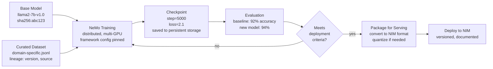

# NeMo Framework and Model Customization

Model customization connects data governance, distributed training, evaluation, checkpointing, and deployment. A production customization workflow requires tracking lineage so that a deployed model can be reproduced or rolled back.

## Workflow



## Infrastructure and Cost Reality

Fine-tuning is smaller than pretraining only in relative terms; it is still a distributed production workload. A realistic fine-tuning job may use 8 GPUs for 1 week to adapt a 7B model to a specific domain.

➕ **Real resource estimate for a domain-specific fine-tune of Llama2-7B:**

```yaml
Job Configuration:
  model: "llama2-7b-hf"
  dataset_size: "500K examples (10GB compressed)"
  training_hours: "168 (1 week continuous)"
  hardware:
    gpus: 8  # Must be connected via high-speed interconnect (NVLink or fast InfiniBand)
    gpu_type: "A100 80GB" # Minimum for distributed training stability
    memory_per_gpu: "80GB"
    total_compute: "640 GPU-hours" # Cost multiplier for infrastructure
  
  distributed_training_config:
    batch_size_per_gpu: 8
    gradient_accumulation_steps: 4
    learning_rate: "1e-5"
    precision: "bfloat16"  # Reduces memory, maintains quality
    distributed_strategy: "FSDP"  # Fully Sharded Data Parallel for 8 GPUs
    
  storage_requirements:
    model_weights: "14 GB"
    activations_in_memory: "~40 GB per GPU (internal, not persistent)"
    checkpoints_saved: "50 GB (one every 1000 steps)"
    training_logs_and_data: "5 GB"
    total_persistent_storage_needed: "100 GB minimum"

  network_requirements:
    gpus_connected_by: "NVLink (A100 to A100) or IB EDR (200 Gbps)"
    collective_communication: "NCCL required"
    expected_all_reduce_time: "< 1 second for 8 GPU average"
    if_network_slow: "training bottlenecks immediately (wait for all-reduce exceeds compute time)"
```

## Governance and Lineage

A production deployment must record immutable evidence so the job is reproducible.

➕ **Concrete metadata to preserve after training:**

```yaml
# training_metadata.yaml — saved alongside checkpoint
training_run:
  id: "fine-tune-llama2-domain-20260807"
  timestamp: "2026-08-07T14:00:00Z"
  status: "completed"  # or: in_progress, failed
  
  # Immutable inputs
  base_model:
    name: "llama2-7b-hf"
    source: "huggingface"
    revision: "main"  # WARNING: not immutable if HF model updated
    digest: "sha256:1f2e3d4c5b6a"  # Better: pin exact commit/version
  
  dataset:
    path: "s3://our-bucket/datasets/domain-corpus-v2.tar.gz"
    sha256: "9a8b7c6d5e4f3a2b1c0d"  # Cryptographic proof of exact data
    size_compressed: "10 GB"
    size_uncompressed: "150 GB"
    preprocessing: "tokenize with llama2 vocab, max_length=2048"
    splits: "train=450K, val=50K"
  
  # Code and configuration (must be version-controlled)
  nemo_framework:
    container_image: "nvcr.io/nvidia/nemo:24.07"
    digest: "sha256:xyz..."
    config_file: "git://our-repo/training_config.yaml#commit=abc123"
  
  # Hardware and environment
  hardware:
    node_count: 1
    gpus_per_node: 8
    gpu_type: "A100 80GB"
    interconnect: "NVLink"
  
  # Results and decision
  training_results:
    loss_training_final: 2.1
    loss_validation_final: 2.15
    baseline_model_accuracy: "92%"
    new_model_accuracy: "94.5%"
    improvement: "2.5 percentage points"
  
  # Manual approval (required for production)
  approval:
    approved_by: "ml-ops-team"
    approved_at: "2026-08-08T09:00:00Z"
    approval_criteria: ["accuracy improves", "no performance regression", "no safety issues"]
    deployment_decision: "approved for staging"
  
  # For troubleshooting or rollback
  checkpoint_path: "s3://our-bucket/checkpoints/fine-tune-llama2-domain-20260807/checkpoint-step-5000.tar.gz"
  checkpoint_size: "15 GB"
  checkpoint_recovery_time: "~5 minutes to load and resume"
```

## Troubleshooting Low GPU Utilization

Low GPU utilization during training means the GPU is sitting idle waiting for something else. The culprit is rarely the GPU itself.

➕ **Diagnostic order (fastest-to-slowest to identify the bottleneck):**

```bash
# Step 1: Check GPU utilization with dcgmi dmon
dcgmi dmon -c 10  # Print GPU metrics every second, 10 times
# Output columns: Timestamp, GPU, Power, Temp, Utilization
# If utilization < 50%, GPU is truly idle (step 2)
# If utilization > 90%, GPU is saturated (not a GPU problem, check app or data loading)

# Step 2: Check if it's data loading (most common culprit)
# Inside training container, profile data loader:
python -c "
import time
from nemo.collections import nlp
loader = nlp.data.text_dataset.TextDataset(...)
start = time.time()
for i, batch in enumerate(loader):
    if i >= 10: break
    elapsed = time.time() - start
    throughput = (i+1) / elapsed
    print(f'Batch {i}: {elapsed:.2f}s total, throughput: {throughput:.1f} batches/sec')
"
# If throughput < 0.5 batches/sec, data pipeline is slow

# Step 3: Check communication (if multi-GPU/multi-node)
# NIM/NCCL all-reduce benchmark:
python -m torch.distributed.launch --nproc_per_node=8 \
  -m nccl_tests.all_reduce --bw  # Reports collective comm bandwidth
# Expected: NCCL reports per-GPU busbw, not an aggregate figure. A100 SXM4's
# third-gen NVLink gives ~600 GB/s bidirectional per GPU; a healthy all-reduce
# typically achieves ~80-90% of that (roughly 480-540 GB/s busbw per GPU) due
# to ring/tree algorithm overhead. (The 8-GPU DGX A100's NVSwitch fabric has an
# aggregate bisection bandwidth of ~4.8 TB/s, but that's a topology figure, not
# what a single all-reduce run reports.)
# If significantly lower than ~480 GB/s, network or NCCL configuration issue

# Step 4: Check computation itself
# Profile inside PyTorch:
with torch.profiler.profile() as prof:
    output = model(batch)
    loss.backward()
prof.print_table()
# Look for: which ops consume most time? Are kernels running?
```

➕ **Real output interpretation:**

```text
$ dcgmi dmon -c 10
Timestamp, GPU, Power(W), Temp(C), Utilization(%)
2026-08-07T14:23:00Z, 0, 320, 65, 95  ← GPU is busy
2026-08-07T14:23:01Z, 0, 295, 64, 15  ← GPU went idle (waiting for data)
2026-08-07T14:23:02Z, 0, 280, 63, 8   ← Still idle
2026-08-07T14:23:03Z, 0, 310, 65, 88  ← Data arrived, GPU busy again
```

**Diagnosis:** GPU utilization oscillates between 95% (busy) and 8% (idle), indicating data pipeline cannot keep up with compute throughput. Recommendation: parallelize data loading (more workers), prefetch batches to GPU, or increase batch size to reduce overhead.
