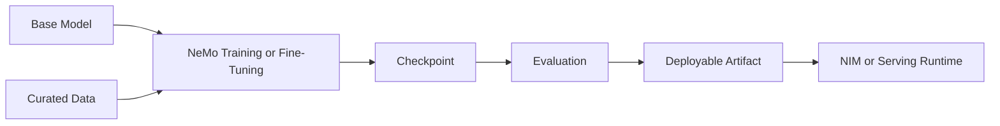

# NeMo Framework and Model Customization

Model customization connects data governance, distributed training, evaluation, checkpointing, and deployment.

## Workflow

## Infrastructure Requirements

The platform must size GPU memory, parallelism, network, storage, data loading, checkpoints, and experiment tracking. Fine-tuning is smaller than pretraining only in relative terms; it can still be a distributed production workload.

## Governance

Record base-model revision, dataset lineage, training configuration, code commit, container digest, checkpoint metadata, evaluation results, and approval.

## Troubleshooting

Low GPU utilization may come from data preparation, storage, communication, or checkpointing. Profile the full pipeline before adding accelerators.
