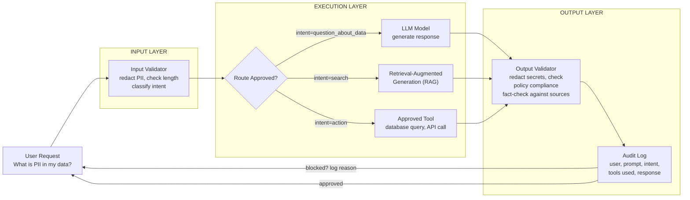
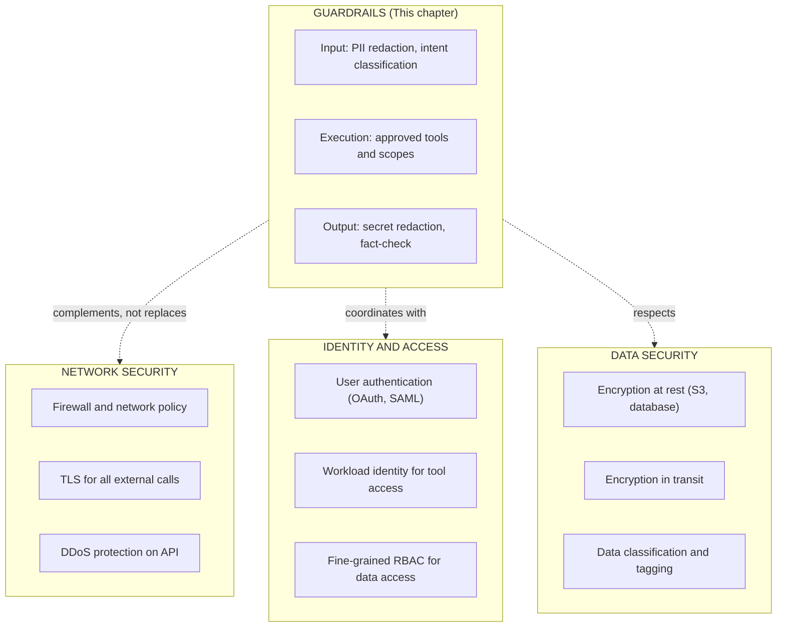

# NeMo Guardrails and Enterprise Controls

An enterprise AI application must control more than model execution. It may need input policy, output policy, topic controls, tool-use restrictions, auditability, and failure behavior. NeMo Guardrails provides a framework to layer these policies on top of a model without retraining.

## Control Architecture



## Engineering Trade-offs

Controls add latency, dependencies, and policy maintenance. A real-world cost:

➕ **Latency impact of guardrails layers (measured on typical inference request):**

```text
Base model inference (no guardrails):        45 ms
+ Input validation (PII check, length):       +15 ms (60 total)
+ Intent classifier (which path?):            +30 ms (90 total)
+ RAG retrieval (if applicable):            +100 ms (190 total)
+ Output validator (fact-check):             +50 ms (240 total)
+ Audit logging (write to database):         +10 ms (250 total)

Total latency increase: from 45ms to 250ms (5.5x slower)

SLO decision: Is 250ms acceptable, or must policy be simplified to stay under budget?
```

Guardrails should be measured, versioned, and designed to fail safely.

## Policy Governance

A production guardrail policy should track:

```yaml
# guardrail_policy.yaml — version controlled, with approval
policy_version: "1.2.3"
policy_owner: "security-team"
last_reviewed: "2026-08-01"
next_review_due: "2026-09-01"  # Quarterly review cadence

input_controls:
  max_length: 2048  # Reject requests longer than this
  
  pii_detection:
    enabled: true
    model: "presidio-analyzer:2.2.1"
    actions: ["redact", "alert"]
    redaction_placeholder: "[REDACTED]"
  
  intent_classification:
    enabled: true
    classifier: "zero-shot-classifier:1.0"
    timeout_ms: 1000  # If classifier hangs, fail open or closed?
    fail_strategy: "allow"  # Fail open: let request through
  
  rate_limiting:
    per_user: "100 requests / hour"
    per_ip: "1000 requests / hour"

execution_controls:
  approved_tools:
    - name: "knowledge_base_search"
      endpoint: "https://kb-internal.company.com/search"
      timeout_ms: 5000
      requires_auth: true
    - name: "metrics_query"
      endpoint: "https://metrics-internal.company.com/query"
      allowed_databases: ["prod_metrics"]  # Never allow customer_pii or payroll
      timeout_ms: 2000

output_controls:
  secret_redaction:
    enabled: true
    patterns:
      - "API_KEY.*=.*"
      - "password.*=.*"
    action: "redact"
  
  fact_check:
    enabled: true
    model: "fact-checker:1.0"
    source_docs: "https://kb-internal.company.com/approved_facts"
    action: "flag_if_uncertain"  # Alert if LLM claims something not in approved sources
  
  confidence_threshold:
    min_confidence_to_respond: 0.85  # If model is < 85% confident, admit uncertainty
    response_if_uncertain: "I don't have reliable information to answer that."

audit_and_compliance:
  log_destination: "s3://audit-logs-immutable/guardrail-logs/"
  retention_days: 2555  # ~7 years for compliance
  fields_logged:
    - timestamp
    - user_id (hashed)
    - original_input (redacted of PII)
    - guardrail_decisions: [input_check, intent, execution, output_check]
    - policy_version_used
    - response_sent
    - execution_time_ms
    - if_rejected: [reason, policy_rule_violated]
  
  # For debugging: which guardrail rule rejected a user's request?
  rejected_request_logging:
    destination: "s3://audit-logs/rejected-requests/"
    sample_rate: 1.0  # Log all rejections
```

## Security Boundary

Guardrails complement but do not replace other security controls.



## Troubleshooting

**Symptom:** A user's request was rejected, but it should have been allowed.

**Diagnosis:** Check which guardrail rule blocked it.

```bash
# 1. Check audit logs for the request
kubectl logs guardrail-controller -f | grep "user_id:john@example.com"
# Look for: "policy_version", "input_check_result", "reason_rejected"

# 2. Verify the policy version actually deployed
kubectl get cm guardrail-policy -o yaml | grep policy_version
# Compare deployed version with your Git repository's latest policy

# 3. Simulate the exact request with policy
# Debug endpoint (or in your test environment):
curl -X POST http://guardrails:8000/debug \
  -H "Content-Type: application/json" \
  -d '{
    "input": "What is in table users?",
    "policy_version": "1.2.3",
    "trace_steps": true
  }'
# Output will show exactly which step rejected it and why

# Example output:
# {
#   "input_validation": "passed",
#   "intent_classification": "query_database",
#   "execution_check": "FAILED - database 'users' not in approved_databases",
#   "reason": "policy rule: execution_controls.approved_tools.metrics_query.allowed_databases",
#   "resolution": "Add 'users' database to allowed list or use different tool"
# }
```

**Prevention:** Version and test every policy change in a staging environment before deploying to production.

```bash
# Example: policy change workflow
1. Branch: git checkout -b feature/allow-hr-queries
2. Edit:   guardrail_policy.yaml (add hr_database to allowed_databases)
3. Test:   Run test suite against new policy with known requests
   pytest tests/guardrail_policy_test.py --policy-file=guardrail_policy.yaml
4. Review: PR approval from security-team before merge
5. Deploy: Canary rollout to 10% of traffic, measure rejection rate change
6. Monitor: Alert if rejection rate increases > 5% (indicates policy broke legitimate requests)
```
