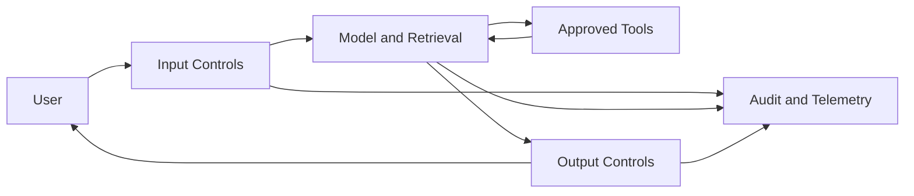

# NeMo Guardrails and Enterprise Controls

An enterprise AI application must control more than model execution. It may need input policy, output policy, topic controls, tool-use restrictions, auditability, and failure behavior.

## Control Path

## Engineering Trade-offs

Controls add latency, dependencies, and policy maintenance. They should be measurable, versioned, tested, and designed to fail safely.

## Security Boundary

Guardrails complement identity, authorization, data controls, network segmentation, and application security. They do not replace them.

## Troubleshooting

If safe requests are rejected, inspect policy version, context, classifier or rule outcome, downstream tool permissions, and trace data.
