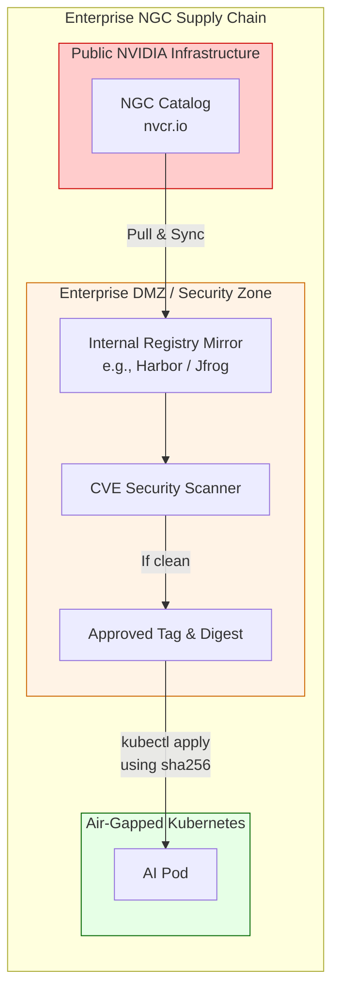

# NGC Catalog, Containers, and Artifacts

NGC distributes containers, models, charts, and related artifacts. Production use requires artifact governance — because a mutable tag can change, a credential can expire, and supply-chain risk depends on reproducible versioning.

## Beginner's Primer: The AI Supply Chain

Every software engineer knows about Docker Hub: the place where you go to download container images like Nginx or Redis. 
NVIDIA has its own version of Docker Hub called **NGC (NVIDIA GPU Cloud)**. 

However, NGC contains much more than just Docker containers. It is the central distribution hub for the entire NVIDIA AI ecosystem. It hosts:
- **Containers:** GPU Operator, Triton, NeMo, NIM.
- **Models:** Massive 140GB model weights.
- **Helm Charts:** Kubernetes deployment manifests.
- **SDKs:** Specialized CUDA libraries.

In a hobbyist environment, you just type `docker pull nvcr.io/nvidia/nim/llama3:latest` and run it. 
In an enterprise, pulling code randomly from the internet into your secure data center is a massive security risk. What if a bad actor injected a cryptominer into the image? What if NVIDIA pushes an update to `:latest` that breaks your application?

Platform Engineers must secure this supply chain. They do this by setting up a **Mirror** (an internal registry like Harbor or Artifactory), forcing Kubernetes to pull images from the internal mirror instead of NGC directly, and using **Digest Pinning** (e.g., `sha256:123abc...`) so that the code can literally never change without the security team's approval. 

## Artifact Lifecycle

```mermaid
flowchart LR
    Catalog["NGC Catalog<br/>nvcr.io/nvidia/nim/llama2-7b:latest<br/>mutable tag, always latest"]
    
    Approve["Security & License Review<br/>scan for CVE, verify model license<br/>approved by security-team"]
    
    Mirror["Enterprise Registry<br/>private ECR or Harbor<br/>controlled egress, cached locally"]
    
    Pin["Digest Pinning<br/>nvcr.io/.../llama2-7b@sha256:abc123<br/>immutable, independently verified"]
    
    Scan["Re-scan in Staging<br/>same image, staging policy<br/>before production approval"]
    
    Deploy["Controlled Deployment<br/>Helm values pin exact digest<br/>Git history proves approval"]
    
    Retain["Retain and Rollback<br/>preserve N versions minimum<br/>3-month retention minimum"]

    Catalog --> Approve --> Mirror --> Pin --> Scan --> Deploy --> Retain
```



## Production Principles — Why Each One Matters

```text
❌ never rely on a mutable tag alone
   Why: Container image can be replaced after deployment. If you deploy 
   "llama2-7b:latest" and later rebuild that tag with different code, 
   your "latest" now points to an untested version.

✅ Correct: Always use immutable digest
   kubectl set image deployment/llm llm=nvcr.io/nvidia/nim/llama2-7b@sha256:abc123
   Now the digest sha256:abc123 is explicitly pinned and cannot change.

❌ never trust a single registry alone
   Why: NGC's registry can be down, rate-limited, or (in extreme scenarios) 
   compromised. A deployment that depends only on "nvcr.io" has a single 
   point of failure.

✅ Correct: Mirror to enterprise registry
   # On a trusted GKE cluster or private data center:
   docker pull nvcr.io/nvidia/nim/llama2-7b@sha256:abc123
   docker tag ... harbor-internal.company.com/llama2-7b:1.0.5
   docker push harbor-internal.company.com/llama2-7b:1.0.5
   # Now Kubernetes pulls from internal harbor, not NGC

❌ never skip license and entitlement verification
   Why: A model may require a commercial license even though NGC distributes it freely. 
   Deploying without verifying your license scope exposes the organization to 
   compliance risk.

✅ Correct: Document license and entitlement in Git
   # deployment_metadata.yaml
   models:
     llama2-7b:
       source: "NGC"
       entitlement_required: "AI Enterprise 24.07+"
       license: "Community License"
       approved_use_cases: "internal non-commercial"
       approval_ticket: "SEC-12345"
```

## Governance Workflow

➕ **Real artifact review checklist (saved in Git):**

```yaml
# artifact_review_template.yaml
artifact_review:
  image_or_model: "nvcr.io/nvidia/nim/llama2-7b:1.0.5"
  digest: "sha256:abc123def456..."
  review_date: "2026-08-07"
  reviewed_by: "security-team"
  
  security_scan:
    tool: "Trivy"
    high_cves: 0  # Threshold: 0 critical, 0 high
    medium_cves: 0
    low_cves: 2  # Acceptable if documented
    scan_results_url: "s3://artifact-scans/llama2-7b-1.0.5-trivy.json"
  
  license_review:
    base_model_license: "Community License"
    framework_licenses: ["Apache 2.0", "MIT"]
    conflicting_licenses: "none detected"
    approval: "approved for internal non-commercial use"
    not_approved_for: "commercial inference, redistribution"
  
  entitlement_check:
    ngc_account_entitled: true
    model_requires_subscription: "AI Enterprise"
    our_subscription_status: "active, expires 2027-01-31"
    approval: "approved to download and deploy"
  
  mirror_and_retention:
    mirrored_to: "harbor-internal.company.com/llama2-7b:1.0.5"
    mirror_digest: "sha256:abc123def456..." # Must match NGC digest
    retention_policy: "keep minimum 3 versions"
    approved_for_production: true
  
  deployment_approval:
    approved_by: "infrastructure-lead"
    approved_for: "production inference"
    next_review_date: "2026-11-07"  # Quarterly
```

## Troubleshooting

**Symptom:** `ImagePullBackOff` or model download fails with a cryptic error.

**Diagnosis order** (by commonality):

```bash
# Step 1: Verify the exact image reference and digest
kubectl describe pod <pod> | grep Image
# Output: Image: nvcr.io/nvidia/nim/llama2-7b:1.0.5
# (Note the tag, not the digest — this is a problem if it's mutable)

# Step 2: Check if the image pull secret exists and is valid
kubectl get secret ngc-secret -o yaml
# Should have .dockerconfigjson with nvcr.io credentials

# Step 3: Manually test the pull (from pod's node)
# SSH to the node and run:
docker pull nvcr.io/nvidia/nim/llama2-7b:1.0.5
# Errors here tell you the exact problem:

# "401 Unauthorized" → NGC credentials invalid or expired
# Solution: kubectl create secret docker-registry ngc-secret \
#   --docker-server=nvcr.io \
#   --docker-username=\$oauthtoken \
#   --docker-password=$NGC_API_TOKEN

# "429 Too Many Requests" → NGC rate limit hit
# Solution: 1) wait 1 hour, or 2) pull from enterprise mirror instead

# "x509: certificate signed by unknown authority" → Proxy/firewall issue
# Solution: Configure docker daemon to trust internal CA cert

# Step 4: Verify entitlement if pull succeeds but model download fails
# Inside container logs:
kubectl logs <pod> | grep -i "401\|entitlement\|unauthorized"
# If "401 Unauthorized" during model download:
kubectl get secret ngc-credentials -o yaml  # Check NGC_API_TOKEN scoping
# Is the token scoped to the specific model? 

# Step 5: Check DNS from pod
kubectl exec <pod> -- nslookup api.ngc.nvidia.com
# Should resolve to NGC's IP. If "connection refused", network policy blocks it
```

➕ **Real error output and fix:**

```text
$ kubectl describe pod llm-deployment-abc123
Events:
  Type     Reason       Age    From               Message
  ----     ------       ----   ----               -------
  Normal   Scheduled    2m     default-scheduler  Successfully assigned to gpu-node-1
  Warning  Failed       2m     kubelet            Failed to pull image "nvcr.io/nvidia/nim/llama2-7b:1.0.5": rpc error: code = Unknown desc = failed to pull and unpack image "nvcr.io/nvidia/nim/llama2-7b:1.0.5": failed to resolve reference "nvcr.io/nvidia/nim/llama2-7b:1.0.5": pull access denied, repository does not exist or may require authentication: server message: insufficient_scope

Fix: The error "insufficient_scope" means the NGC token doesn't have permission for this model.
1. kubectl create secret docker-registry ngc-secret \
     --docker-server=nvcr.io \
     --docker-username=\$oauthtoken \
     --docker-password=<full-api-key-not-truncated>
2. Verify token is not expired: curl -H "Authorization: Bearer $NGC_API_KEY" https://api.ngc.nvidia.com/
3. Re-deploy the pod (will re-pull with new secret)
```

## Architecture Summary

NGC is the definitive source of truth for NVIDIA AI software. To use it in a secure enterprise environment, engineers must decouple their production clusters from the public internet. This requires implementing an internal Enterprise Registry cache, strictly scanning all artifacts for vulnerabilities, and pinning cryptographic SHA256 digests to prevent supply chain poisoning.


