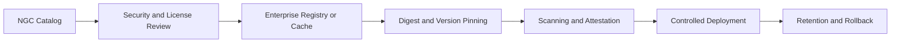

# NGC Catalog, Containers, and Artifacts

NGC distributes containers, models, charts, and related artifacts. Production use requires artifact governance.

## Artifact Lifecycle

## Production Principles

- never rely on a mutable tag alone;
- mirror critical artifacts for availability;
- record digest and provenance;
- scan within enterprise policy;
- preserve rollback versions;
- control credentials and egress;
- document model and container licenses.

## Troubleshooting

Image-pull or model-download failures may come from entitlement, expired credentials, proxy policy, registry trust, DNS, storage, or rate limits. Preserve the exact artifact reference and error.
