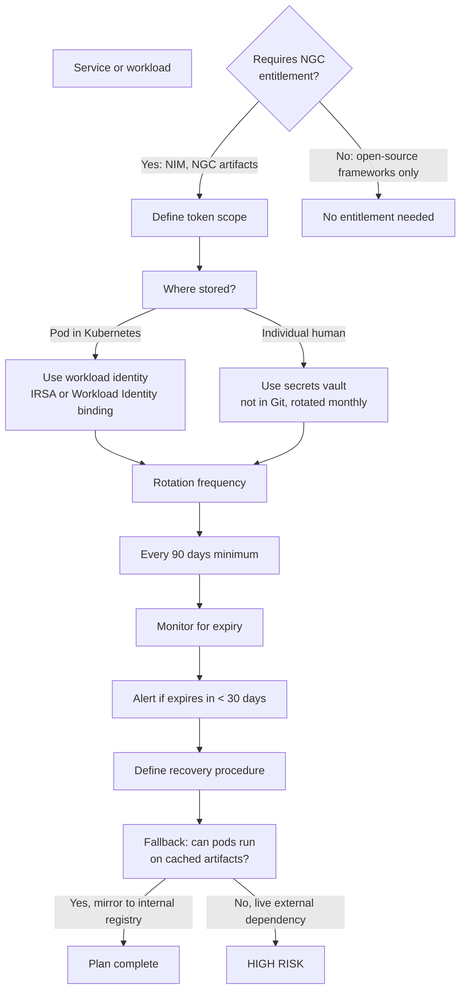

# Licensing and Entitlement Operations

Licensing is part of availability. A platform that depends on entitlement must define how credentials are issued, rotated, monitored, audited, and recovered. A missing or expired NGC token is no different from a missing database password — it's an outage.

## Entitlement Decision Tree



## Operational Design

➕ **Concrete implementation decisions for a production system:**

```yaml
# entitlement_operations.yaml
credential_management:
  ngc_api_token:
    owner: "ml-platform-team"
    storage_location: "AWS Secrets Manager (encrypted)"
    access_method: "IRSA for pod authentication"
    
    # Pod uses IAM role, not explicit secret in manifest:
    # kubectl annotate serviceaccount nim-runner \
    #   eks.amazonaws.com/role-arn=arn:aws:iam::ACCOUNT:role/nim-runner-irsa
    
    rotation_schedule: "every 90 days"
    next_rotation_due: "2026-11-06"
    
    scope_by_identity:
      nim_inference_pods:
        token_scope: "download llama2-7b, mistral-7b models only"
        read_only: true
        rate_limit: "1000 pulls per hour"
      
      ci_cd_pipeline:
        token_scope: "pull any NGC container for build/test"
        expires_after: "24 hours (short-lived, CI job refreshes)"
      
      data_scientist_personal:
        token_scope: "all NGC read access"
        expires_after: "90 days"
        mfa_required: true

  rotation_automation:
    trigger: "90 days or manual via ticket"
    procedure:
      step1: "Generate new NGC token in web UI"
      step2: "Test new token before rotation: curl https://api.ngc.nvidia.com/v2/models --header 'Authorization: Bearer $NEW_TOKEN'"
      step3: "Update Secrets Manager with new token"
      step4: "Restart all pods using the token (rolling restart)"
      step5: "Verify all pods still Ready after rotation"
      step6: "Revoke old token in NGC UI"
      step7: "Document rotation in audit log"
    
    validation_after_rotation:
      - "all nim pods Ready within 5 minutes"
      - "model download succeeds on first pod startup"
      - "inference requests work without errors"

  expiry_monitoring:
    check_frequency: "daily"
    alert_threshold: "30 days until expiry"
    alert_destination: ["ml-ops@company.com", "pagerduty-escalation-policy"]
    
    automatic_check:
      - "curl https://api.ngc.nvidia.com/v2/models --header 'Authorization: Bearer $TOKEN'"
      - "if: 401 Unauthorized, escalate immediately (token may already be revoked)"
      - "if: 200 OK, token is still valid"

  failure_handling:
    scenario_token_expired_immediately:
      detection: "ImagePullBackOff with 401 Unauthorized"
      manual_fix:
        - "check current token expiry in NGC web UI"
        - "if expired, generate new token immediately"
        - "update Secrets Manager and restart pods"
        - "test: kubectl run debug -it --image=nvcr.io/nvidia/cuda:12.4.1-base -- curl https://api.ngc.nvidia.com/v2/models --header 'Authorization: Bearer $TOKEN'"
      time_to_restore: "~15 minutes (manual intervention + pod startup)"
    
    scenario_external_outage:
      detection: "All image pulls fail with network timeout or 503"
      assumption: "NGC API is down"
      mitigation:
        - "all NIM pods already Running with model in cache ✓"
        - "inference continues without re-pulling model ✓"
        - "new pods cannot start (will evict old pods if autoscaler triggers)"
      design_principle: "Mirror critical artifacts locally; avoid live external dependencies in production"

  audit_and_compliance:
    log_destination: "immutable S3 bucket, append-only"
    events_logged:
      - timestamp
      - actor (user or service account)
      - action: "token_created / token_rotated / token_revoked / model_pulled"
      - token_id (not the full token value)
      - artifact_pulled: "llama2-7b:1.0.5"
      - result: "success / 401 Unauthorized / timeout"
    
    retention: "7 years (regulatory requirement)"
    alerting:
      - "any token_revoked not in scheduled rotation → investigate"
      - "401 errors > 10 per hour → wake oncall (NGC or credential issue)"
```

## Security Best Practices

```text
✅ DO:
- Rotate credentials every 90 days or when team member leaves
- Use workload identity (IAM roles) instead of embedding secrets
- Scope NGC tokens to specific models, not "all artifacts"
- Log all entitlement-related actions
- Test token expiry before it becomes an outage
- Mirror critical artifacts to internal registry as fallback

❌ DON'T:
- Embed NGC tokens in container images or Git repos
- Use the same token across multiple environments/teams
- Store credentials in ConfigMaps (they're not encrypted at rest in etcd by default)
- Ignore expiry warnings; wait for the pod to fail
- Create long-lived tokens without rotation schedule
```

## Troubleshooting

**Symptom:** Previously healthy deployments cannot pull a new NIM artifact. Pods stuck in ImagePullBackOff with "401 Unauthorized."

**Diagnosis order:**

```bash
# Step 1: Verify the NGC token hasn't expired
echo "Token expiration date is:"
# Check in NGC web UI → account settings → API keys
# Or if you have token, estimate: NGC tokens are typically valid for 1 year from creation

# Step 2: Test token manually from a test pod
kubectl run ngc-test -it --image=curlimages/curl -- \
  sh -c 'curl -H "Authorization: Bearer $NGC_API_TOKEN" \
  https://api.ngc.nvidia.com/v2/models/nvidia/nim/llama2-7b'
# 200 = token works
# 401 = token invalid/expired/revoked

# Step 3: Verify the Kubernetes secret is being read correctly
kubectl get secret ngc-credentials -o yaml | grep NGC_API_TOKEN
# Should show base64-encoded token

# Step 4: Check if NGC API is accessible from your network
kubectl run network-test -it --image=ubuntu:22.04 -- \
  bash -c 'apt-get update && apt-get install -y curl && curl -I https://api.ngc.nvidia.com'
# Connection refused or timeout = network/firewall issue
# 200 = NGC is reachable
```

**Prevention:** Monitor token expiry proactively with an automated job.

```bash
# Kubernetes CronJob to monitor NGC token health
apiVersion: batch/v1
kind: CronJob
metadata:
  name: ngc-token-monitor
spec:
  schedule: "0 9 * * *"  # Daily at 9 AM
  jobTemplate:
    spec:
      template:
        spec:
          containers:
          - name: check
            image: curlimages/curl:latest
            env:
            - name: NGC_API_TOKEN
              valueFrom:
                secretKeyRef:
                  name: ngc-credentials
                  key: api-token
            command:
            - /bin/sh
            - -c
            - |
              # Try to fetch NGC catalog; if 401, alert
              STATUS=$(curl -s -o /dev/null -w "%{http_code}" \
                -H "Authorization: Bearer $NGC_API_TOKEN" \
                https://api.ngc.nvidia.com/v2/models)
              if [ "$STATUS" != "200" ]; then
                echo "ERROR: NGC token health check failed with HTTP $STATUS" >&2
                curl -X POST https://hooks.slack.com/services/XXX \
                  -H 'Content-Type: application/json' \
                  -d '{"text":"NGC token may be expired or invalid"}'
                exit 1
              fi
          restartPolicy: OnFailure
```
