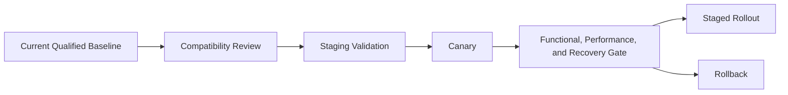

# Lifecycle, Compatibility, and Upgrades

An enterprise AI platform is a compatibility graph, not a list of latest versions.

## Compatibility Matrix

Track hardware, firmware, OS, kernel, driver, CUDA, container runtime, Kubernetes or hypervisor, AI Enterprise release, NIM or NeMo version, model artifact, and application client.

## Upgrade Workflow

## Production Advice

Upgrade one defined failure domain at a time, preserve old artifacts, test model load and inference or training, verify metrics, and prove rollback before expansion.

## Troubleshooting

When several layers change together, isolation becomes difficult. Prefer smaller, observable changes and preserve before-and-after inventories.
