# Lifecycle, Compatibility, and Upgrades

An enterprise AI platform is a compatibility graph, not a list of latest versions. A single upgrade can cascade through GPU driver, CUDA, framework, model weights, and application code. If they all change at once and something breaks, finding the culprit becomes impossible.

## Compatibility Matrix — What to Track

➕ **Concrete example: production environment inventory (saved in Git):**

```yaml
# production_baseline.yaml — git history is the changelog
deployment_name: "llm-inference-prod"
snapshot_date: "2026-08-07"
qualified_until: "2026-11-07"  # Quarterly review schedule

infrastructure:
  hardware:
    node_count: 4
    gpu_per_node: 2
    gpu_type: "NVIDIA A100 80GB SXM4"
    firmware_version: "535.104.05"  # GPU firmware
    interconnect: "NVLink, PCIe 4.0"
  
  os_and_kernel:
    os: "Ubuntu 22.04 LTS"
    kernel_version: "5.15.0-105-generic"
    container_runtime: "containerd 1.7.2"
  
  cluster_infrastructure:
    kubernetes_version: "1.28.5"
    gpu_operator_version: "24.3.0"
    gpu_device_plugin_version: "0.15.1"  # Comes with GPU Operator
    device_plugin_monitor: "nvidia-dcgm-exporter:3.1.7"

ai_enterprise_stack:
  nvidia_driver:
    version: "550.127"
    last_tested_with_cuda: "12.4"  # Verified combination
    release_date: "2024-05-14"
    eol_date: "2026-05-14"  # Driver lifecycle
  
  cuda_toolkit:
    version: "12.4"
    container_image: "nvcr.io/nvidia/cuda:12.4.1-runtime-ubuntu22.04"
    cuDNN_version: "9.1.1"  # Bundled in container, not separate
    tensorRT_version: "10.1"
    nccl_version: "2.21.5"  # For multi-GPU collective ops
  
  nemo_and_nim:
    nemo_framework_version: "2.0.0"
    nim_container_digest: "nvcr.io/nvidia/nim/llama2-7b@sha256:abc123def456"
    nim_version_tag: "1.0.5"
    base_model_version: "llama2-7b-hf-meta-revision-main"  # Immutable, if pinned
  
  model_artifacts:
    llama2_7b:
      source: "HuggingFace"
      revision: "sha256:abc123"  # Immutable commit, not just "main"
      quantization: "none (bfloat16 native)"
      size_gb: 14
      expected_load_time_sec: 45
  
  other_dependencies:
    redis_version: "7.2"  # For model cache warmup
    postgresql_version: "15"  # For audit logs
    prometheus_version: "2.52.0"  # Observability
```

## Upgrade Workflow

```mermaid
flowchart LR
    Current["Current Baseline"]
    ProposeChange["Propose one change<br/>e.g., driver 550→551"]
    CompatCheck["Check compatibility matrix<br/>with new version"]
    ReviewTicket["Write RCA-style review:<br/>what changes, why, what tested"]
    TestStaging["Deploy to staging:<br/>same config, test workload"]
    TestMetrics["Measure:<br/>latency, throughput, memory"]
    CompareBaseline["Compare to baseline<br/>within SLO?"]
    Canary["Canary to 10% prod<br/>monitor 30 min"]
    CanakyGate["Canary metrics OK?"]
    FullRollout["Staged rollout<br/>10% → 50% → 100%"]
    RollbackReady["Rollback tested<br/>and ready"]
    UpdateBaseline["Update production_baseline.yaml<br/>Commit to Git"]
    
    Current --> ProposeChange
    ProposeChange --> CompatCheck
    CompatCheck --> ReviewTicket
    ReviewTicket --> TestStaging
    TestStaging --> TestMetrics
    TestMetrics --> CompareBaseline
    CompareBaseline -->|"No (regression)"| Current
    CompareBaseline -->|"Yes"| Canary
    Canary --> CanakyGate
    CanakyGate -->|"No"| Current
    CanakyGate -->|"Yes"| FullRollout
    FullRollout --> RollbackReady
    RollbackReady --> UpdateBaseline
```



## Production Upgrade Procedure

➕ **Step-by-step for driver upgrade (driver 550.127 → 550.135, both qualify for CUDA 12.4):**

```bash
# 1. Verify compatibility: Check NVIDIA matrix for CUDA 12.4 + driver 550.135
#    (Assume verified; fictional numbers for example)

# 2. Test in staging cluster (run same workload)
kubectl config use-context staging
kubectl apply -f deployment.yaml --set gpu_operator.driver.version=550.135
# Wait for GPU Operator to roll out new driver
sleep 60
# Run test inference
pytest tests/inference_test.py --iterations=100 --measure-latency

# 3. Capture baseline metrics from staging
kubectl top nodes
nvidia-smi
# Record: latency p95, throughput, GPU memory

# 4. Write upgrade ticket with decision
#    Title: "Upgrade driver 550.127 → 550.135"
#    Body includes:
#    - Compatibility verified: CUDA 12.4 + driver 550.135 ✓
#    - Staging test results: p95 latency 185ms (baseline 180ms, within 3% ✓)
#    - GPU memory: stable 28GB usage (no increase ✓)
#    - Rollback plan: revert GPU Operator Helm chart to previous version
#    - Timeline: Tuesday 3am UTC (lowest traffic)
#    Approval: [wait for on-call + platform-lead]

# 5. Canary: Deploy to node-0 only (1 of 4 GPU nodes = 25%)
#    OR use Helm/ArgoCD to canary-deploy to replica-1 of replica-4

kubectl get nodes -L node-pool
# node-0: current driver 550.127
# node-1: current driver 550.127  ← keep unchanged
# node-2: current driver 550.127  ← keep unchanged
# node-3: current driver 550.127  ← keep unchanged

# Scale workload to include node-0:
kubectl patch node node-0 -p '{"metadata":{"labels":{"driver_upgrade_candidate":"true"}}}'

# Canary deploy (e.g., with Argo Rollouts):
kubectl argo rollouts set image llm-inference gpu-operator=nvidia/gpu-operator:v24.3.0 \
  --set nodeSelector.driver_upgrade_candidate=true

# 6. Monitor canary for 30 minutes
# Check: Are pods still Running? Is inference working?
kubectl logs -n default -l app=llm-inference --tail=20
# Check metrics: is latency OK? Any OOM errors?
curl http://prometheus:9090/api/v1/query?query=histogram_quantile%280.95%2C+rate%28request_duration_seconds_bucket%5B5m%5D%29%29

# 7. Promote canary to 25% (add node-1)
kubectl patch node node-1 -p '{"metadata":{"labels":{"driver_upgrade_candidate":"true"}}}'
# Monitor for 20 minutes

# 8. Full rollout
for node in node-2 node-3; do
  kubectl patch node $node -p '{"metadata":{"labels":{"driver_upgrade_candidate":"true"}}}'
  sleep 300  # 5 min between nodes, watch for issues
done

# 9. Verify full rollout and update Git baseline
kubectl get nodes -o wide
# All nodes should show "550.135" in driver version

git checkout -b upgrade/driver-550.135
# Edit production_baseline.yaml: driver_version: 550.135
git commit -am "Upgrade driver 550.127 → 550.135; staging and canary testing passed"
git push origin upgrade/driver-550.135
# Open PR, get approval, merge to main

# 10. Document lessons learned
# Any latency regression? Memory growth? Unexpected errors?
# File ticket if new issues found; otherwise, mark as "complete"
```

## Troubleshooting

**Symptom:** Driver upgrade succeeds on 2 nodes but fails with "GPU failed to initialize" on node-2.

**Root cause:** Node-2 may have a different GPU model, firmware revision, or BIOS setting incompatible with driver 550.135.

**Investigation:**

```bash
kubectl describe node node-2 | grep -i gpu
nvidia-smi --query-gpu=gpu_name,driver_version,compute_cap --format=csv
# Compare node-2 to node-0 (which succeeded)
# If GPU model differs or firmware version differs, this is a hardware mismatch

# Fix: Exclude node-2 from this upgrade; test driver on same GPU model first
kubectl patch node node-2 -p '{"metadata":{"labels":{"driver_upgrade_candidate":"false"}}}'
# Rollback node-2 to previous driver
# File ticket: "Driver 550.135 fails on GPU firmware revision XYZ"
```

**Prevention:** Before any upgrade affecting GPU or driver, check that all nodes have identical hardware.

```bash
# Query to verify hardware homogeneity
kubectl describe nodes | grep -A 5 -B 5 "nvidia.com/gpu"
# All should show same GPU model, same nvidia.com/gpu count
```
