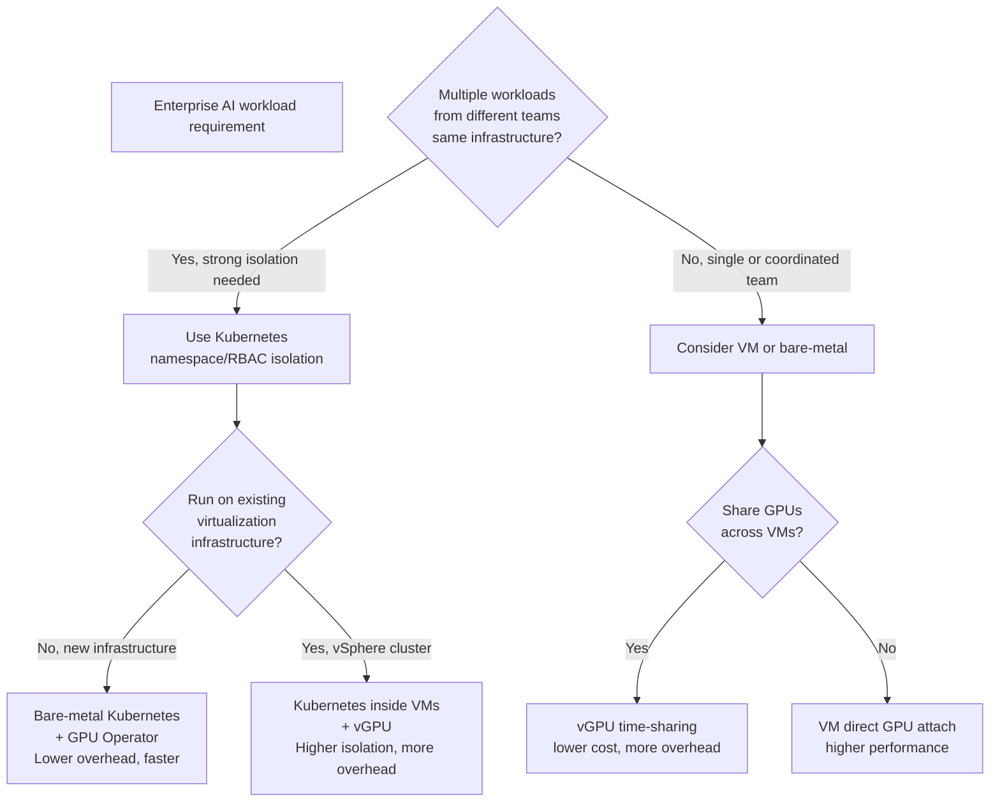

# Kubernetes and Virtualization Integration

NVIDIA AI Enterprise can participate in bare-metal Kubernetes, virtualized Kubernetes (running inside VMs), and VM-based application architectures. The correct model depends on isolation, operations, performance, and support requirements. Each architecture has a different failure boundary.

## Integration Layers and Support Boundaries

| Layer | Bare-metal Kubernetes | Kubernetes on vSphere | VM-only (no K8s) |
|---|---|---|---|
| **GPU access** | GPU Operator + device plugin + driver on host | GPU Operator in Linux VM + vGPU host driver + vSphere Config | VM hypervisor + vGPU profile |
| **Ownership** | NVIDIA driver and K8s jointly | vSphere + NVIDIA (coordinated) | vSphere only |
| **Performance** | Direct attach, ~2% overhead | VM overhead + vGPU time-slicing, ~10-15% | Depends on vGPU profile |
| **Isolation** | Pod network policies | VM network + Kubernetes network policies | VM firewall |
| **Storage** | PVC with host path or network storage | PVC via vSphere storage class | VM virtual disk or NFS |
| **Update cadence** | Coordinated with K8s upgrades | Requires vSphere and K8s sync | vSphere-driven |

## Architecture Decision Tree



## Production Guidance by Architecture

### Bare-metal Kubernetes + GPU Operator (RECOMMENDED FOR NEW DEPLOYMENTS)

```bash
# GPU visibility check
$ kubectl describe node | grep nvidia.com/gpu
  nvidia.com/gpu: 2  # GPU Operator advertised available GPUs

# GPU Operator status
$ kubectl get pods -n gpu-operator
NAME                                                 READY   STATUS    RESTARTS   AGE
gpu-operator-7f4d8l9m2n                            1/1     Running   0          2d
nvidia-driver-daemonset-abcd1                      1/1     Running   0          2d
nvidia-container-toolkit-daemon-set-xyz9           1/1     Running   0          2d
nvidia-device-plugin-daemonset-12345               1/1     Running   0          2d
dcgm-exporter-daemon-set-qwer5                     1/1     Running   0          2d

# Driver verification
$ kubectl debug node/gpu-node-0 -it --image=ubuntu:22.04 -- \
  bash -c "apt-get update && apt-get install -y nvidia-utils && nvidia-smi"
# Output should show GPU info

# Pod GPU allocation
$ kubectl run gpu-test -it --image=nvidia/cuda:12.4.1-runtime-ubuntu22.04 \
  --limits="nvidia.com/gpu=1" -- nvidia-smi
# Should show GPU in container
```

### Kubernetes in VM (vSphere with vGPU)

```yaml
# Example: vGPU profile assignment
vmware_vgpu_config:
  vm_name: "k8s-node-gpu-1"
  vgpu_profile: "NVIDIA-A100-40-4MIG"  # Time-shared A100, 4 MIG instances
  # This profile allows 4 VMs to share same A100
  
# Inside K8s cluster on vSphere:
# GPU Operator sees vGPU device, not bare GPU
$ nvidia-smi
Fri Aug  7 14:23:00 2026
+-----+------------------+------+
| GPU | Name             | Mem  |
+-----+------------------+------+
|  0  | NVIDIA A100 40GB  | 10GB |  # MIG-partitioned, not full 40GB
+-----+------------------+------+

# K8s device plugin advertises based on vGPU profile
$ kubectl describe node
nvidia.com/gpu: 1  # 1 MIG partition, not full GPU
```

**Trade-off:** vGPU reduces GPU cost/VM but adds latency (time-slicing overhead) and reduces peak throughput.

### Troubleshooting GPU Access Failures

➕ **Diagnostic order for "GPU not visible in container":**

```bash
# Layer 1: Physical GPU exists and is in hypervisor
lspci | grep -i nvidia
# Expected: 17:00.0 3D controller: NVIDIA Corporation ...
# If not found: hardware/firmware issue

# Layer 2: Host driver can access GPU
nvidia-smi  # On hypervisor or node OS
# Expected: lists GPU(s)
# If "command not found": driver not installed
# If "no devices": driver installed but GPU not recognized

# Layer 3: GPU is accessible to guest VM (if vSphere)
# Inside VM, check vGPU device:
lspci | grep -i nvidia
# If vGPU: should see "Processing accelerators: NVIDIA Corporation ..."
# If bare GPU: should see "3D controller: NVIDIA Corporation ..."

# Layer 4: Container runtime can see host GPU
# On node:
nvidia-smi  # ✓ Works
grep -i nvidia /proc/modules  # nvidia.ko should be loaded
ls -la /dev/nvidia*  # /dev/nvidia0, /dev/nvidiactl should exist

# Layer 5: GPU Operator is running
kubectl get pods -n gpu-operator | grep -i device-plugin
# Expected: Running

# Layer 6: Kubernetes device plugin advertised GPU
kubectl describe node <node> | grep nvidia.com/gpu
# Expected: nvidia.com/gpu: 1 (or however many)

# Layer 7: Pod can request GPU
kubectl run test --image=nvidia/cuda:12.4.1-runtime-ubuntu22.04 \
  --limits="nvidia.com/gpu=1" -- nvidia-smi
# Pod should enter Running state and show GPU

# If stuck at any layer, check logs:
kubectl logs -n gpu-operator -l app=nvidia-device-plugin --tail=50
# Look for "advertised devices", "failed to load", etc.
```

## Network and Storage in Multi-Architecture Setups

| Component | Bare-metal K8s | K8s on vSphere | VM-only |
|---|---|---|---|
| Model cache | Host path (fast) or NFS | vSphere NFS/block storage (shared) | VM virtual disk or NFS |
| Model download speed | Direct to NGC (fast) | Through vSphere network (slower) | Through vSphere network |
| Pod-to-pod communication | Direct (fast) | VM → hypervisor (slight overhead) | N/A |
| Backup/rollback | Via K8s snapshots | Via vSphere VM snapshots | Via vSphere VM snapshots |

## Production Checklist

✅ **Before deploying NVIDIA AI Enterprise:**

- [ ] GPU type and quantity is the same on all nodes (no heterogeneity)
- [ ] Driver version is the same across all nodes (coordinated updates, not per-VM)
- [ ] If using vGPU, all VMs have same vGPU profile
- [ ] Model cache storage is persistent and fast (not ephemeral local storage)
- [ ] Network policy allows pod → NGC API communication
- [ ] Identity (service accounts or VM identity) is configured for entitlement token access
- [ ] Kubernetes version is compatible with GPU Operator version (check matrix)
- [ ] Test GPU allocation: `kubectl run test --image=nvidia/cuda:12.4.1-runtime --limits="nvidia.com/gpu=1"`
- [ ] Upgrade path is documented (GPU Operator updates, K8s version sync)
