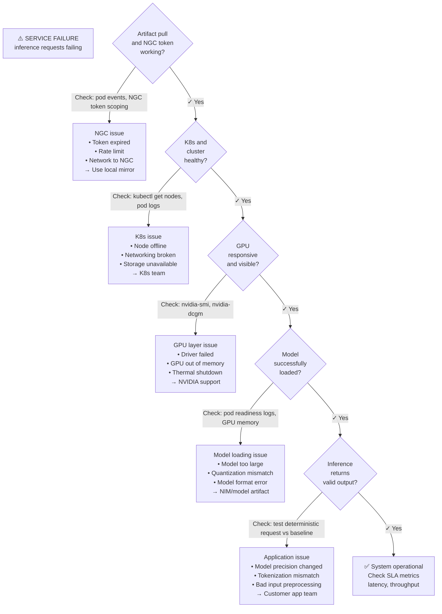

# Customer Architecture and Troubleshooting

Enterprise customer design begins with constraints: data location, identity, platform standard, support model, latency, throughput, tenancy, facility, and change policy. A "proper" architecture for a startup differs from a proper architecture for a regulated financial institution.

## Discovery Framework

A complete discovery interview answers these nine questions, in order:

1. **Business outcome and workload class**
   - What is the actual business problem? (e.g., "Recommend products in &lt;2s", "Summarize documents overnight", "Auto-generate code snippets")
   - Is it interactive (user waiting) or batch (offline processing)?
   - What SLA is required? (e.g., "99.9% availability", "5s latency p99")

2. **Model and data governance**
   - Which model? (open source, proprietary, custom-fine-tuned)
   - Does the model require licensing? Is it Llama2 (permissive), or proprietary (restricted)?
   - Where is training/fine-tuning data? (customer's data center, cloud, third-party)
   - Can model leave customer's network? (data residency constraint)

3. **Deployment platform**
   - What's the existing infrastructure? (AWS, GCP, Azure, on-prem, hybrid)
   - Is Kubernetes already in use? (yes = GPU Operator path, no = consider bare metal or VM)
   - Can customer manage Kubernetes upgrades? (if not, consider managed K8s like EKS/GKE)

4. **Hardware and capacity**
   - Throughput requirement: how many inferences/minute?
   - Latency requirement: p99 latency target?
   - Model size: how much GPU memory needed? (impacts GPU type selection)
   - Multi-GPU training or distributed inference? (requires interconnect, topology awareness)

5. **Security and network boundaries**
   - Can pods access external registries? (NGC, Docker Hub, or only internal mirror?)
   - Is firewall blocking outbound HTTPS? (NGC download, metadata updates)
   - Does data leave the network? (customer's data in inference logs — compliance issue if yes)
   - Which identity system? (RBAC, ABAC, SAML, OAuth, service accounts)

6. **Artifact and entitlement path**
   - Where are models stored? (NGC, Hugging Face, internal S3, git-lfs)
   - Who manages model updates? (ML ops team, platform team, data scientists)
   - Is NGC entitlement token managed centrally? (Secrets Manager, custom system, hardcoded)
   - What's the disaster recovery plan? (backup models locally? Rollback versions?)

7. **Availability and disaster recovery**
   - What's the maximum tolerable downtime? (RTO)
   - How much data loss is acceptable? (RPO)
   - Are there multi-region requirements?
   - Is warm standby needed or cold standby acceptable?

8. **Observability and support workflow**
   - Do metrics/logs go to a centralized platform? (Prometheus, Datadog, Splunk)
   - Who owns on-call? (Platform team? ML ops? Separate?)
   - SLA for incident response? ("4 hours for P1 GPU failure" ← must be defined)
   - Where are GPU logs captured? (DCGM, nvidia-smi, NVIDIA-SMI logs)

9. **Upgrade and rollback policy**
   - How often can production be patched? (weekly, monthly, quarterly)
   - Can workloads tolerate rolling restarts? (or must they finish mid-request)
   - How many old versions must be retained? (for rollback)
   - Who approves upgrades? (security team, platform team, both)

## Discovery Output — A Real Architecture

➕ **After discovery, capture decisions as code:**

```yaml
# customer_architecture.yaml
customer: "FinBank"
deployment_date: "2026-09-15"
architecture_owner: "ml-platform-team@finbank.com"

workload:
  type: "document_summarization"
  sla:
    availability: "99.9% uptime"
    p99_latency_ms: 2000
    throughput_qps: 100
  use_case: "internal staff tool, non-revenue"

model:
  name: "llama2-13b"
  source: "Meta Llama 2"
  license: "Community License (non-commercial)"
  size_gb: 26
  training_data_location: "on-prem, must remain on-prem"
  fine_tuning: "no custom fine-tuning planned"

platform:
  infrastructure: "on-premise vSphere"
  kubernetes: "yes, existing Kubernetes cluster v1.28"
  managed_k8s: "no, customer operates"
  upgrade_frequency: "Quarterly, after staging validation"
  network_constraints: "Air-gap egress: can only pull from internal mirror"

hardware:
  node_count: 4
  gpu_per_node: 2
  gpu_type: "A100 40GB"
  interconnect: "NVLink (high-speed, multi-GPU support)"
  total_capacity: "8 A100s = estimated 400 req/sec batch inference"

security:
  authentication: "LDAP (customer identity system)"
  data_residency: "All data must stay on-prem"
  egress_policy: "No external API calls from pod (must mirror NGC)"
  compliance: "SOC 2, subject to audit"

artifacts:
  model_store: "Internal Harbor registry (mirrored from NGC)"
  entitlement: "NGC token stored in HashiCorp Vault, rotated quarterly"
  version_control: "Git for Helm values, pinned digests in values.yaml"

availability:
  rto_hours: 4  # Restore service within 4 hours
  rpo_hours: 1  # Up to 1 hour of data loss acceptable
  multi_region: false
  standby: "cold standby in second DC, 1-day old model cache acceptable"

observability:
  platform: "Prometheus + Grafana (customer-managed)"
  gpu_monitoring: "DCGM exporter (part of GPU Operator)"
  centralized_logging: "Splunk (customer-managed)"
  support_sla: "4-hour response for critical GPU issues"

upgrades:
  cadence: "Quarterly"
  change_control: "Change Advisory Board approval required"
  rollback_versions_retained: 3
  approval_process: "staged → canary → production"

support_boundary:
  nvidia_responsibility:
    - "Driver 550.127 and CUDA 12.4 compatibility"
    - "NIM and NeMo framework bugs"
    - "NGC model artifact issues"
  
  customer_responsibility:
    - "Kubernetes cluster operations and upgrades"
    - "Network and storage infrastructure"
    - "Identity and access management"
    - "Data governance and compliance"
    - "On-call runbooks and incident response"
```

## Troubleshooting Tree — Ordered by Speed to Isolate Root Cause



➕ **Real incident walk-through: "Inference latency increased 3x overnight"**

```text
Discovery questions (in order):

Q1: Did anything change? (deployment, config, traffic, time-of-day)
   A: Traffic increased 10x (legitimate spike)
   → Latency spike may be normal due to queueing

Q2: Is the increase uniform or outliers?
   A: p50 latency 150ms→450ms (uniform), p99 latency 2000ms→6000ms (high variance)
   → Not just queueing; something in the inference path

Q3: Are GPUs maxed out?
   A: kubectl exec <pod> nvidia-smi
      GPU Util: 98% ✓ (GPU saturated, expected under load)
      GPU Memory: 35/40GB ✓ (model still fits)
   → GPU is not the constraint

Q4: Is memory thrashing? (high swap use)
   A: kubectl top pod <pod>: Memory 18GB request, using 17GB ✓
   → No memory issue

Q5: Is preprocessing slow?
   A: Add timestamps in application logs:
      "start_tokenization: 14:23:00.100"
      "end_tokenization: 14:23:00.150"  (50ms)
      "end_inference: 14:23:00.600"      (450ms total)
   → Inference is 450ms, tokenization is only 50ms
   → GPU inference is the bottleneck (450ms / inference * 100 reqs/sec = GPU saturated)

Q6: Did precision or quantization change?
   A: Check deployed NIM image digest
      kubectl get deployment nim -o yaml | grep image
      Currently: nvcr.io/nvidia/nim/llama2-13b@sha256:abc123
      No recent change
   → Config stable

Q7: Is a background process running on the node?
   A: kubectl top nodes
      Node CPU: 60% (normal)
      Node GPU: 98% in-use (expected)
   → No rogue process

CONCLUSION:
Workload is simply saturated: 100 concurrent requests * 450ms/request = queue depth growing.
Solution: scale horizontally (add another NIM replica) or reduce traffic.
NOT a system failure; system is working as designed under load.
```

## Customer Advice

**DO:** Promise that NVIDIA AI Enterprise qualifies specific combinations and reduces integration uncertainty — but it does NOT eliminate architecture work.

**DON'T:** Promise that "enterprise support makes the platform just work" or that "you don't need to understand Kubernetes/GPU/networking."

**Better:** "NVIDIA qualifies NIM + CUDA + driver combinations, so if you hit a bug in that layer, we have clear support. But you're responsible for your Kubernetes cluster stability, network throughput to your model cache, and whether your application's data pipeline is fast enough. Those are your architecture decisions, not ours."
