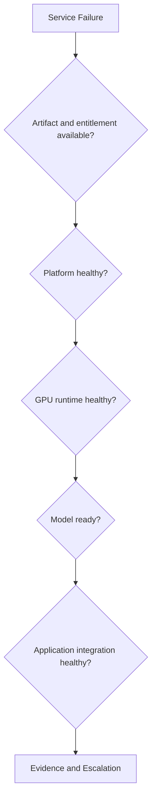

# Customer Architecture and Troubleshooting

Enterprise customer design begins with constraints: data location, identity, platform standard, support model, latency, throughput, tenancy, facility, and change policy.

## Discovery Framework

1. Business outcome and workload class.
2. Model and data governance.
3. Deployment platform.
4. Hardware and capacity.
5. Security and network boundaries.
6. Artifact and entitlement path.
7. Availability and disaster recovery.
8. Observability and support workflow.
9. Upgrade and rollback policy.

## Troubleshooting Tree

## Customer Advice

Do not promise that a supported stack removes architecture work. Explain which integration risk is reduced and which operational responsibilities remain.
