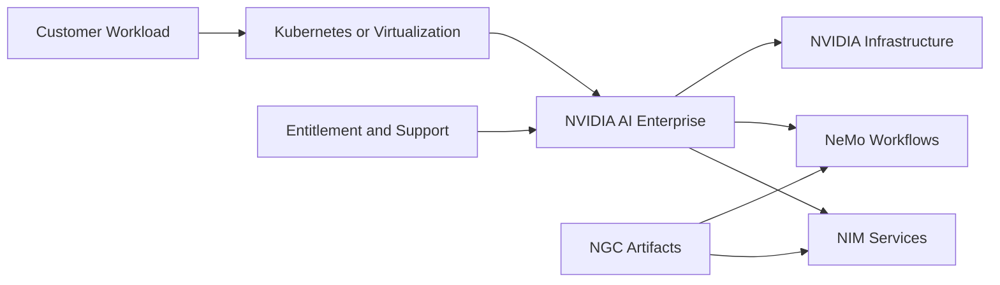

# Volume 14 — NVIDIA AI Enterprise

Enterprise AI platforms are not judged only by whether a model runs. They must provide supportable software combinations, controlled artifacts, security, lifecycle management, entitlement, predictable deployment patterns, and clear escalation boundaries.

This volume explains NVIDIA AI Enterprise as an operational and support framework. It covers NIM, NeMo, NGC artifacts, licensing, compatibility, Kubernetes and virtualization integration, customer architecture, and production troubleshooting.

| Volume field | Value |
|---|---|
| Difficulty | Advanced |
| Estimated reading time | 18–24 hours |
| Prerequisites | Volumes 01–13 |
| Primary focus | Enterprise AI software lifecycle and support |
| Outcome | Design and operate a supportable NVIDIA enterprise AI platform |

## Big Picture

**Figure 14.0.1 — Enterprise AI is a lifecycle boundary.** Software, artifacts, entitlement, support, and infrastructure must remain compatible.

## Chapters

1. [Why NVIDIA AI Enterprise Exists](./chapter-01-why-nvidia-ai-enterprise-exists)
2. [Platform Architecture and Support Boundary](./chapter-02-platform-architecture-and-support-boundary)
3. [NVIDIA NIM Architecture](./chapter-03-nvidia-nim-architecture)
4. [Deploying and Operating NIM Services](./chapter-04-deploying-and-operating-nim-services)
5. [NeMo Framework and Model Customization](./chapter-05-nemo-framework-and-model-customization)
6. [NeMo Guardrails and Enterprise Controls](./chapter-06-nemo-guardrails-and-enterprise-controls)
7. [NGC Catalog, Containers, and Artifacts](./chapter-07-ngc-catalog-containers-and-artifacts)
8. [Licensing and Entitlement Operations](./chapter-08-licensing-and-entitlement-operations)
9. [Lifecycle, Compatibility, and Upgrades](./chapter-09-lifecycle-compatibility-and-upgrades)
10. [Kubernetes and Virtualization Integration](./chapter-10-kubernetes-and-virtualization-integration)
11. [Customer Architecture and Troubleshooting](./chapter-11-customer-architecture-and-troubleshooting)
12. [Volume 14 Summary](./chapter-12-volume-14-summary)

## Labs

- [Inspect an NGC and NIM Deployment Plan](./labs/lab-01-inspect-an-ngc-and-nim-deployment-plan)
- [Deploy and Validate a NIM Service](./labs/lab-02-deploy-and-validate-a-nim-service)
- [Build a NeMo Customization Workflow](./labs/lab-03-build-a-nemo-customization-workflow)
- [Troubleshoot Entitlement and Runtime Failures](./labs/lab-04-troubleshoot-entitlement-and-runtime-failures)
