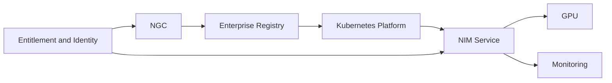

# Lab 01 — Inspect an NGC and NIM Deployment Plan

## Objective

Produce a reviewable plan for one NIM service without deploying it.

## Deliverables

- model and container identifiers;
- immutable digests and versions;
- license and entitlement requirements;
- GPU and memory sizing assumptions;
- driver, runtime, and platform matrix;
- registry mirror and cache design;
- secrets and egress controls;
- health and metrics plan;
- canary and rollback procedure;
- support ownership matrix.

## Architecture

## Failure Injection

Assume external registry access is unavailable during recovery. Determine which artifacts must already exist internally.

## Validation

A reviewer should be able to reproduce the proposed deployment and identify every external dependency.
