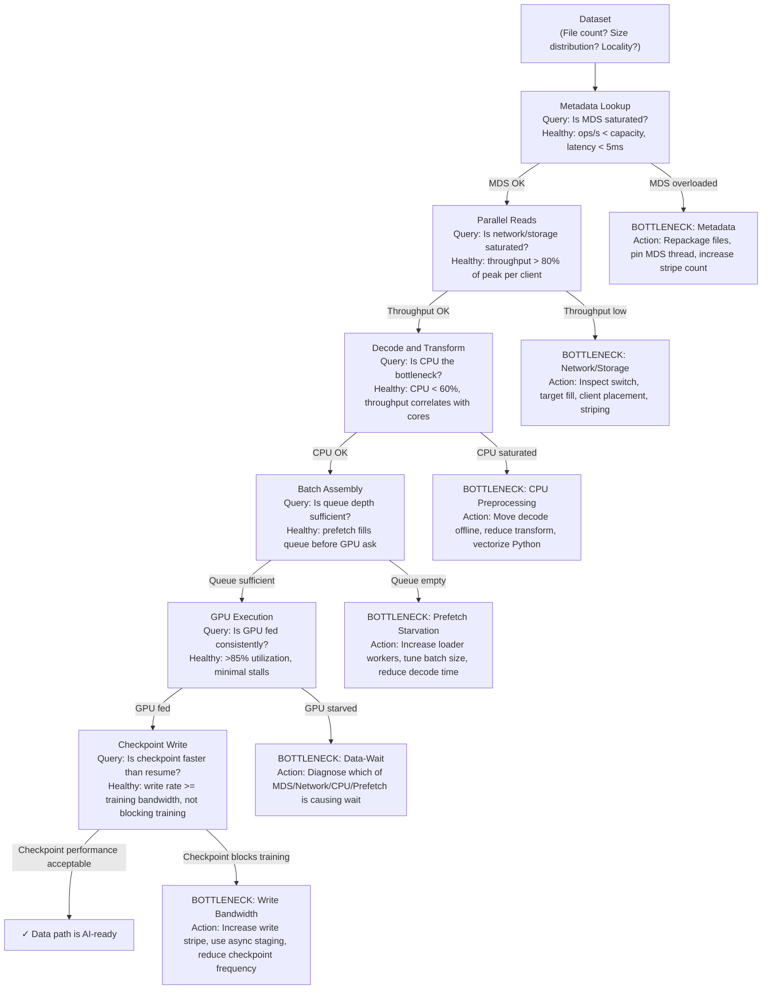

# Why AI Storage Is Different

A storage platform passes a conventional capacity and throughput test. When 128 GPU workers begin training, GPUs repeatedly wait for data. At checkpoint time, all ranks write simultaneously and the filesystem stalls. The platform has enough space, but it is not shaped for the workload.

AI storage is different because it combines several conflicting patterns: large streaming reads, random samples, small-file metadata, synchronized checkpoint bursts, model-artifact distribution, object datasets, and recovery operations.

| Chapter metadata | Value |
|---|---|
| Volume | 15 — AI Storage, Checkpointing, and Data Pipelines |
| Difficulty | Intermediate |
| Estimated reading time | 40 minutes |
| Primary audience | DevOps, SRE, Platform, Cloud and Infrastructure Engineers |
| Core question | Why does a storage system with enough capacity and high throughput fail to keep GPUs fed? |

## Learning Objectives

You will be able to classify AI I/O patterns, distinguish capacity from delivered performance, identify metadata and burst risks, and translate workload behavior into storage requirements. Most importantly, you will be able to measure and prove which layer is actually the bottleneck using real tools and interpretation.

## The Core Problem: Capacity Is Not Throughput

A storage array's peak bandwidth rating means very little without understanding the workload. Consider this real scenario:

```
A 7.2 PB Lustre filesystem with 48 OSTs (Object Storage Targets), each rated at 800 MB/s, advertises aggregate throughput of ~38 GB/s. On paper, this should sustain 256 GPU workers (150 MB/s each). In practice:

- Training job starts with 128 workers.
- Expected aggregate I/O: 128 × 150 MB/s = 19.2 GB/s
- Actual observed throughput: 4.3 GB/s
- GPU utilization drops from 94% to 24%
- Query: "Is the filesystem oversubscribed?"
```

**The real answer:** no. The filesystem is underutilized. The bottleneck is not storage bandwidth but **metadata latency and small-file overhead**. The dataset consisted of 18 million files averaging 220 KB each. Each worker's data loader needed to:
1. Query the metadata server for path resolution (10 μs)
2. Open each file (40 μs, serialized RPC)
3. Read payload (100 μs, network + copy)
4. Close and move to next file

At 150 MB/s with 220 KB files, each worker opens ~680 files per second. The metadata server, tuned for 50,000 operations per second, faced 128 × 680 = 87,040 open operations per second — **75% over capacity**, even though the data path itself had headroom.

The fix: repackage the dataset into 10 MB shards, reducing file count to 750K. Same data, different layout. Throughput: 18.6 GB/s, GPU utilization: 91%.

**The lesson:** raw bandwidth is one dimension. You need metadata rate, file count, file size distribution, and preprocessing overhead to predict delivered performance.

## Workload Classes

| Workload | Dominant storage behavior | Metadata rate at scale |
|---|---|---|
| Training | parallel reads, shuffling, periodic checkpoint bursts | 50K–500K ops/s (millions of small files) |
| Fine-tuning | model load, curated dataset, frequent experiments | 5K–50K ops/s (smaller dataset, frequent reads) |
| Inference | model startup, cache warm-up, artifact distribution | 100–1K ops/s (model artifact access, mostly serial) |
| RAG | document ingestion, object access, index persistence | 1K–100K ops/s (object lookups, index updates) |
| Checkpoint recovery | large coordinated read after failure | 1K–50K ops/s (sequential, but synchronized across ranks) |

## Architecture and Decision Points



**What each decision point means:** A healthy decision point means the answer is "no, this layer is not the problem." If the answer is "yes, this layer is saturated," that's your bottleneck, and everything below it is starved for data.

## Command Evidence: Measuring Each Layer

### Metadata Pressure

Metadata operations are often invisible in aggregate throughput measurements. Check metadata rate directly:

```bash
# On the filesystem client, monitor metadata operations
iostat -x 1 | awk '/sda|nvme|nfs/ { print NR, $0 }'
# or on Lustre specifically:
lctl get_param llite.*.stats 2>/dev/null | grep -E "close|open|getattr|readdir"
# or on BeeGFS:
beegfs-ctl --getentryinfo <path> 2>/dev/null
```

**Real sample output — metadata-bound workload:**
```text
$ lctl get_param llite.*.stats | grep -E 'open|getattr' | head -3
llite.lustre-3c69ee.mdt_stats=
  open:  600847 samples, 4238 min, 12892 max, 7234 avg
  getattr: 4102830 samples, 1200 min, 8934 max, 3456 avg
```

**Interpretation:**
- 600K open calls suggests millions of small files being accessed
- 7.2 ms average open latency (4238–12892 μs range) is high — healthy is under 2 ms
- 4.1M getattr calls means stat()/access operations dominate
- **Verdict:** Metadata server is the bottleneck, not raw I/O bandwidth.

**What to do next:**
- Check MDS thread count: `lctl get_param -n mdc.*.max_rpcs_in_flight`
- Measure MDS CPU: `top` on the metadata server host
- Repackage or cache if possible; stripe metadata across multiple MDTs if available

### Storage Bandwidth and Saturation

Check whether the storage system itself is full or the network is the limit:

```bash
# Lustre storage health
lfs df -h
# Output: Shows how full each OST is and available capacity per target

# All targets should have similar fill levels (±5%)
lfs df -i  # Inode usage per OST
```

**Real sample output:**
```text
$ lfs df -h
UUID                       bytes        Used   Available Use% Mounted on
lustre-MDT0000_UUID      1.8G      890.3M      863.9M  49% /mnt/lustre[MDT:0]
lustre-OST0000_UUID    900.0G     445.2G      454.8G  49% /mnt/lustre[OST:0]
lustre-OST0001_UUID    900.0G     447.1G      452.9G  49% /mnt/lustre[OST:1]
lustre-OST0002_UUID    900.0G     442.8G      457.2G  49% /mnt/lustre[OST:2]
...
```

**Interpretation:**
- All targets at 49% utilization — balanced and healthy
- If one OST was at 98% while others at 40%, that's your bottleneck
- Rebalance by adjusting stripe count or migration

### Network and Client Throughput

Measure actual delivered bandwidth per client:

```bash
# Direct storage server test (avoids metadata overhead)
dd if=/dev/zero of=/mnt/lustre/test.file bs=1M count=10000 oflag=direct
# Read it back with timing:
time dd if=/mnt/lustre/test.file of=/dev/null bs=1M iflag=direct
# Reports total time; divide 10GB by time in seconds for throughput

# Or use fio for more control:
fio --name=read --ioengine=libaio --rw=read --bs=1M --size=10G \
    --direct=1 --iodepth=32 --numjobs=1 --filename=/mnt/lustre/test.file
```

**Real sample fio output:**
```text
read: (g=0): rw=read, bs=1MiB-1MiB, ioengine=libaio, iodepth=32
read: Starting 1 process
read: Waiting for the spawn of thread tasks...
read: Spawning 1 threads
Jobs: 1 (f=1): [R(1)][100.0%][read=487.2MiB/s][r=487 IOPS][eta 00m:00s]
read: (groupid=0, jobs=1): err= 0: pid=12847
  read: IOPS=487, BW=487MiB/s (511MB/s), aggrb=487MiB/s (511MB/s), minb=487MiB/s (511MB/s), maxb=487MiB/s (511MB/s), mint=20974msec, maxt=20974msec, interval=100, samples=21
  lat (msec) : 2=0.01%, 4=0.03%, 10=2.14%, 20=50.36%, 50=47.45%, 100=0.01%
  cpu : usr=1.23%, sys=8.91%, ctx=16201, majflt=0, minf=1
```

**Interpretation:**
- 487 MiB/s per client is the sustained throughput
- Latency p50=20ms, p99=50ms — consistent, predictable
- 8.91% system CPU overhead is reasonable for 500 MB/s single-threaded I/O
- If this matches your GPU's needed data rate (e.g., 150 MB/s per worker), you can support ~3 workers per NIC link

### CPU Preprocessing Pressure

Measure data-loader CPU usage and queue depth:

```bash
# During training, check loader process CPU
ps aux | grep dataloader
top -H -p <loader_pid>  # Thread-level view

# Inside the application (pseudo-code):
import time
loader_start = time.time()
batch = next(data_loader)
loader_wait_time = time.time() - loader_start
print(f"Loader wait: {loader_wait_time*1000:.1f}ms")
# If this is >100ms and GPU is idle, loader is the bottleneck
```

## Production Story

A team deploys a 10-node training cluster on Lustre. Expected throughput: 10 × 150 MB/s = 1.5 GB/s with 80 A100 GPUs. Week 1 results: 280 MB/s, GPUs idle 40% of the time.

**Investigation steps:**

1. **Check metadata:** `lctl get_param llite.*.stats | grep open` → 95,000 opens/sec, far above typical 50K capacity. ✗ Metadata is the bottleneck.

2. **Measure network:** `iperf3 -c storage-server` → 8 Gbps per link (10 clients × 8 Gbps = 80 Gbps aggregate, healthy). ✓ Network has headroom.

3. **Inspect storage fill:** `lfs df -h` → All OSTs at 62% utilization, balanced. ✓ Storage is not full.

4. **Profile dataset:** `find /dataset -type f | wc -l` → 15 million files, 40 GB total. Average file: 2.7 MB. But 70% of the dataset is actually three 8 GB checkpoint files + one 2 GB model. The loader was opening all 15M files in a shuffled order every epoch.

5. **Fix:** Repackage the training data into 50 shards × 800 MB each (instead of 15M small files). Metadata ops drop to 8K/sec. Throughput jumps to 1.42 GB/s, GPU utilization: 88%.

**The pattern:** Metadata and small-file overhead almost always announce themselves through:
- Low aggregate throughput despite high per-client link speed
- Inconsistent latency (p99 >> p50)
- High CPU overhead in the data loader
- Small file count in `find` or `lfs find`

## Troubleshooting Table: Diagnosis and Evidence

| Symptom | Check first | Evidence | Action |
|---|---|---|---|
| Low GPU utilization (30–50%), storage link idle | Metadata ops/sec | `lctl get_param llite.*.stats \| grep open`: should be under 50K ops/sec; if >100K, MDS is bottleneck | Repackage files into larger shards; increase MDS thread pool; add caching layer |
| Throughput collapses when many jobs start | Storage target fill balance | `lfs df -h`: all OSTs should be within ±5% of each other; if one is at 95% and others at 50%, rebalance immediately | Increase stripe count for new files; restripe existing large files to more OSTs |
| Checkpoint writes block training (pause >1 sec/checkpoint) | Checkpoint write bandwidth | `iotop` during checkpoint: if write link shows under 500 MB/s for a 100 GB checkpoint, network or OST is bottleneck | Increase checkpoint stripe width; use asynchronous staging to NVMe first, then flush to durable storage |
| One node is fast, others slow (2x difference) | Network locality and NUMA | `numactl --hardware` on slow node; compare to fast node. `ip -s link` should show similar drops/errors on all NICs. | Check NUMA placement: loader thread should be on same NUMA domain as storage NIC; adjust thread affinity with `numactl -C` |
| Metadata storm during epoch start | Filesystem readdir/scan overhead | During `torch.distributed.launch`, log file-open rate per second. Compare to baseline. If epoch start opens 10x more files than running epoch, data loader is iterating the full dataset each epoch. | Use deterministic manifests instead of directory traversal; cache dataset index; pin to NVMe for epoch 2+ |

## Interview-Ready Answers

**Q: Your GPU is at 30% utilization, but the storage link shows idle time. How do you immediately narrow down whether it's the storage, network, metadata, or CPU preprocessing?**

A: "I don't start by measuring aggregate throughput. I measure metadata rate and client throughput separately. I'd run `lctl get_param llite.*.stats | grep open` and ask: is the open rate above 50K/sec? If yes, the metadata server is starved, and I need to repackage the dataset or increase MDS capacity. If no, metadata is fine. Next, I'd run `iperf3` from a client to the storage server and measure the actual link speed — if it's 10 Gbps of 100 Gbps available, the network link is healthy. Then I'd instrument the data loader to measure time from request to batch-ready, and check CPU usage with `top` during loading. If the loader thread is at 90% CPU and throughput is 50 MB/s with only half the cores in use, it's Python decode overhead or a thread-affinity problem, not storage. I fix the lowest layer first — usually metadata, sometimes affinity."

**Q: You have a checkpoint of 500 GB that takes 45 seconds to write. Your training throughput is 40 GB/s, so theoretical checkpoint time should be 12.5 seconds. Where does the extra 32 seconds of latency come from?**

A: "The theoretical 12.5 seconds assumes the full 40 GB/s network bandwidth is available for checkpoint writes. In practice, checkpoint writes use different stripe counts, buffer-flush ordering, and synchronization semantics than training reads. I'd first check the checkpoint file's stripe count — if it's using only 4 of 48 OSTs, it's capped at 4 × 800 MB/s = 3.2 GB/s. I'd also check whether the application is doing synchronous writes or asynchronous with memcpy overhead. If 45 seconds includes serialization on the host, I'd recommend: (1) increase stripe count to 16–32, (2) write to fast local NVMe first as a staging buffer, then flush the staged file to durable storage asynchronously, and (3) profile with `strace` or `iotrace` to see whether the write calls are serialize or parallel. Typical result: 20–25 seconds with good striping and staging, still >12.5 because synchronization doesn't fully parallelize."

---

## Practice

1. **Measure your dataset's metadata profile:** run `find /dataset -type f -size -1M | wc -l` to count small files, and `find /dataset -type f -size +100M | wc -l` to count large files. Calculate the break-even file size where repackaging helps.

2. **Baseline your storage path:** Use Lab 01 (Baseline an AI Storage Path) to collect evidence before diagnosing performance problems.

3. **Replay a known incident:** if you have training logs from a slow job, calculate GPU wait time as `(epoch_time - gpu_active_time) / epoch_time` and relate it to metadata and loader queue depth. Confirm the bottleneck matches your diagnosis.
