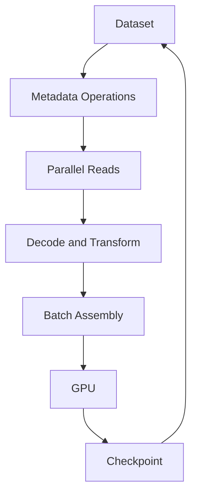

# Why AI Storage Is Different

A storage platform passes a conventional capacity and throughput test. When 128 GPU workers begin training, GPUs repeatedly wait for data. At checkpoint time, all ranks write simultaneously and the filesystem stalls. The platform has enough space, but it is not shaped for the workload.

AI storage is different because it combines several conflicting patterns: large streaming reads, random samples, small-file metadata, synchronized checkpoint bursts, model-artifact distribution, object datasets, and recovery operations.

## Learning Objectives

You will be able to classify AI I/O patterns, distinguish capacity from delivered performance, identify metadata and burst risks, and translate workload behavior into storage requirements.

## Workload Classes

| Workload | Dominant storage behavior |
|---|---|
| Training | parallel reads, shuffling, periodic checkpoint bursts |
| Fine-tuning | model load, curated dataset, frequent experiments |
| Inference | model startup, cache warm-up, artifact distribution |
| RAG | document ingestion, object access, index persistence |
| Checkpoint recovery | large coordinated read after failure |

## Architecture

## Production Story

A team adds faster storage media, but utilization does not improve. Profiling shows millions of small files and serial Python preprocessing. The bottleneck is metadata and CPU transformation, not raw media bandwidth.

## Troubleshooting

**Symptom:** low GPU utilization with apparently idle storage bandwidth.

**Diagnosis:** inspect data-loader wait, metadata rate, CPU decode, cache hit rate, network path, and per-client throughput.

**Root cause:** architecture focused on aggregate bandwidth while the workload was metadata- or preprocessing-bound.

## Customer Questions

- What are file sizes and counts?
- How many clients read concurrently?
- What is the checkpoint size and interval?
- Where is the data source of truth?
- What recovery time is required?
