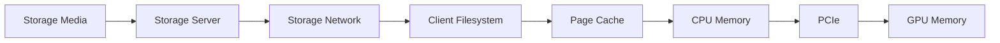

# The AI Data Path from Storage to GPU

Data may cross storage media, storage servers, switches, NICs, the kernel, page cache, CPU memory, PCIe, and GPU memory before a kernel can use it.

## Path

Each stage can introduce copying, queueing, serialization, or locality penalties.

## Control Versus Data

Metadata operations locate and authorize data. The data path moves payload bytes. A workload can be blocked by metadata even when data targets are idle.

## Locality

NUMA and PCIe topology influence NIC, NVMe, CPU, and GPU paths. Pinning a loader to the wrong CPU domain can reduce delivered throughput.

## Troubleshooting

Measure from both ends: storage target and GPU consumer. If the target is busy but the GPU waits, inspect client, network, CPU, and copy overhead. If the target is idle, inspect request generation and metadata.
