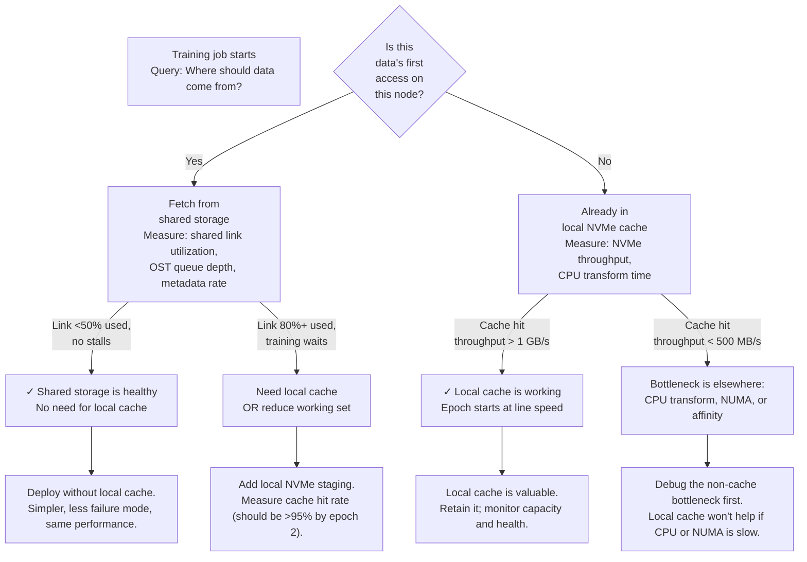

# Local NVMe and Data Staging

Local NVMe places high-throughput storage near the GPU node. It reduces shared-fabric demand and can absorb bursty temporary I/O. Used correctly, it transforms a network-bound system into a compute-bound system. Used incorrectly, it creates complexity without benefit.

| Chapter metadata | Value |
|---|---|
| Volume | 15 — AI Storage, Checkpointing, and Data Pipelines |
| Difficulty | Intermediate |
| Estimated reading time | 40 minutes |
| Primary audience | DevOps, SRE, Platform, Cloud and Infrastructure Engineers |
| Core question | When does local NVMe improve performance, and when is it just extra complexity? |

## When to Use Local NVMe (and When Not To)

**Use local NVMe when:**
- Shared storage link is the bottleneck (e.g., 25 Gbps Ethernet saturated, but each GPU needs 150 MB/s = 4 GPUs × 25 Gbps is not enough)
- Dataset fits in local capacity and is read multiple times (epochs, fine-tuning iterations)
- Checkpoint writes block training (1–5 second pauses) and NVMe can stage them asynchronously
- Preprocessing or augmentation is expensive and output is reused across epochs

**Do NOT use local NVMe when:**
- Shared storage has headroom (link utilized under 60%, OST balanced, metadata OK)
- Dataset is too large to fit and must stream from shared storage anyway (you just added complexity)
- Checkpoint writes are not the bottleneck (if training is already 95% GPU utilization, staging won't help)
- Nodes fail often (local data loss is recovery cost you must account for)

## Architecture: The Decision Path



## The Real Benefit: Numbers

**Scenario: 8-node training with 256 GPUs on shared Lustre**

Setup:
- Lustre link: 25 Gbps per client
- Dataset: 500 GB, 2M small files (260 KB average)
- 8 nodes × 32 GPUs = 256 GPUs, 2 GPUs per node in this deployment
- Each GPU needs 120 MB/s for model loading and batch fetching
- Aggregate need: 256 × 120 MB/s = 30.7 GB/s

**Without local NVMe:**
- 8 × 25 Gbps = 200 Gbps available aggregate (25 Gbps per node)
- Per node: 25 Gbps / 2 GPUs = 12.5 Gbps per GPU (156 MB/s)
- But metadata overhead for 2M files: open/stat operations add 30% latency
- Real throughput per GPU: ~110 MB/s
- GPU waits: 120 MB/s needed vs 110 MB/s available = 8% stall
- Epoch 1 (cache cold): 245 seconds
- Epoch 2–N (cache warm, if only dataset): 225 seconds (network still the bottleneck for first-file reads)

**With local NVMe (2TB per node):**
- Epoch 1 (cache cold): same as without (245s, fetching from Lustre)
- Epoch 2 (cache warm, 500 GB dataset fits in local NVMe): ~200 seconds
  - Local NVMe throughput: 3.5 GB/s sustained (NVMe can provide 2000+ MB/s per GPU; local filesystem adds ~30% overhead)
  - Per GPU from local cache: 1.75 GB/s (1750 MB/s), way above 120 MB/s needed
  - GPU utilization: 94% (near-ideal)
  - **Speedup:** 245s → 200s = 18% faster per epoch (significant over 1000s of epochs)
- **Caveat:** Epoch 1 pays the cost of fetching and staging; if training has only 1–2 epochs, local cache is not worth it

## Production Design: Avoiding Pitfalls

### Cache Consistency and Eviction

```bash
# Monitor local NVMe health and fullness
df -h /local-nvme
lsblk -o NAME,SIZE,USED,AVAIL,USE% | grep nvme

# Monitor cache hit rate (application-level logging)
# Pseudo-code in your training script:
cache_hits = 0
cache_misses = 0
for epoch in range(num_epochs):
    for batch_idx, (data, labels) in enumerate(train_loader):
        if data loaded from NVMe cache:
            cache_hits += 1
        else:
            cache_misses += 1
if epoch > 0:
    hit_rate = cache_hits / (cache_hits + cache_misses)
    print(f"Cache hit rate epoch {epoch}: {hit_rate*100:.1f}%")
```

**Sample output and interpretation:**
```text
Cache hit rate epoch 1: 0.2%   ← Most data fetched from shared storage
Cache hit rate epoch 2: 98.3%  ← Local NVMe taking over; excellent
Cache hit rate epoch 3: 97.8%  ← Sustained; occasional cache eviction
Cache hit rate epoch 4: 96.1%  ← Slight degradation (full NVMe, some files evicted)
```

**What this means:**
- Epoch 1 is cold; cache warm-up happens by epoch 2
- Epochs 2–3 are optimal (>97% hit rate)
- Epoch 4 shows fill-level pressure (NVMe is >85% full, eviction policy is kicking in)
- **Action:** Increase cache eviction from least-frequently-used (LFU) to least-recently-used (LRU), or increase NVMe capacity

### Checkpoint Staging

Checkpoints are the other win for local NVMe. Instead of training blocking on a 500 GB checkpoint write to shared storage:

**Without staging:**
```
Training writes 500 GB checkpoint synchronously to Lustre
Time: 500 GB / 1.2 GB/s (shared network rate) ≈ 417 seconds
GPU waits 417 seconds before next iteration
```

**With NVMe staging:**
```
1. Training writes 500 GB checkpoint to local NVMe asynchronously (non-blocking)
   Time: 500 GB / 3.5 GB/s (local NVMe) ≈ 143 seconds
   GPU continues training immediately (or waits only for acknowledge, ~1 second)

2. Background task flushes checkpoint from NVMe to Lustre asynchronously
   Time: 500 GB / 1.2 GB/s ≈ 417 seconds (in the background, doesn't block GPU)

Total time visible to training: 1 second (async ack) vs 417 seconds (sync)
Speedup: 417x in the critical path
```

**Real implementation:** Use `asyncio` or thread pool to write to NVMe, then background flush:
```python
import threading
import shutil

def checkpoint(model, epoch, gpu_rank):
    checkpoint_path_nvme = f"/local-nvme/ckpt-{epoch}.pt"
    checkpoint_path_durable = f"/shared-storage/checkpoints/ckpt-{epoch}.pt"
    
    # Fast: write to local NVMe
    torch.save(model.state_dict(), checkpoint_path_nvme)
    
    # Async: flush to shared storage in background
    def flush():
        shutil.copy2(checkpoint_path_nvme, checkpoint_path_durable)
        os.remove(checkpoint_path_nvme)  # Free local space
    
    flush_thread = threading.Thread(target=flush, daemon=False)
    flush_thread.start()
    
    # Return immediately; GPU resumes training
    # flush_thread runs in background
```

### Cache Key and Checksum Validation

Every cached file must be verifiable. If shared storage updates the source file, local cache becomes stale:

```python
import hashlib
import os
import json

def compute_file_hash(path):
    """Compute SHA256 of a file."""
    hash_obj = hashlib.sha256()
    with open(path, 'rb') as f:
        for chunk in iter(lambda: f.read(8192), b''):
            hash_obj.update(chunk)
    return hash_obj.hexdigest()

def cache_fetch_with_validation(shared_path, cache_path, cache_manifest):
    """Fetch from shared storage if not in cache or hash mismatch."""
    
    source_hash = compute_file_hash(shared_path)
    cache_key = os.path.basename(shared_path)
    
    if cache_key in cache_manifest and cache_manifest[cache_key]['hash'] == source_hash:
        # Cache hit: file is valid
        return cache_path
    
    # Cache miss or stale: fetch and update
    shutil.copy2(shared_path, cache_path)
    cache_manifest[cache_key] = {'hash': source_hash, 'size': os.path.getsize(cache_path)}
    
    with open(os.path.join(os.path.dirname(cache_path), 'manifest.json'), 'w') as f:
        json.dump(cache_manifest, f)
    
    return cache_path
```

This pattern prevents subtle bugs where a training run uses stale cached data that differs from the source.

---

## Troubleshooting: Identifying Real vs False Benefits

| Symptom | Likely cause | Diagnosis | Fix |
|---|---|---|---|
| "Epoch 2 is no faster than epoch 1" | Cache is not warming, or hit rate is low | Add logging: `print(f"Cache hit rate: {hits}/{total}")`. Check NVMe fill level: `df -h /local-nvme`. | Increase cache capacity; check file-naming consistency (different names for same data = no hits). |
| "Local NVMe is full after epoch 1" | Cache capacity too small for dataset | Run: `find /dataset -type f -exec du -c {} \;` to sum actual size. Compare to NVMe capacity: `lsblk` | Increase NVMe size, or reduce dataset if possible. Monitor eviction rate. |
| "NVMe shows 3.5 GB/s in `fio`, but training only sees 150 MB/s" | NUMA affinity or CPU bottleneck, not NVMe | Run training with `numactl --hardware`, check which NUMA node the data loader is on. Profile CPU: `perf record -g python train.py`, look for Python decode/transform in the flamegraph. | Pin data loader to same NUMA node as NVMe's attached CPU. Move expensive transforms (decoding, augmentation) to a separate preprocessing step. |
| "Nodes A and B have identical NVMe, but B is 30% slower" | NVMe firmware, controller temperature, or background activity differs | Check: `smartctl -a /dev/nvme0n1` on both nodes. Compare temperatures, power states, firmware versions. Check for background scrubbing: `iostat -x 1` on B during idle. | Update firmware if versions differ. Disable background TRIM/GC during training (it runs asynchronously and competes for I/O). Thermal throttle? Check `smartctl` for ThrottlingReasonTempHigh or similar. |

## Interview-Ready Answer

**Q: You add local NVMe to every node, but the application still waits for data during epoch 1. Was it a waste?**

A: "Not necessarily. The question is: how much time do later epochs matter? If you're doing 1000 epochs of training, epoch 1 overhead is 0.1% of total time — don't optimize for it. But if you're fine-tuning on small datasets, 1–3 epochs total, then no, local NVMe is a waste for caching; it's only useful for checkpoint staging. The real evaluation is: (1) does the application fit in NVMe (if not, cache miss rate stays high), (2) how many epochs run, and (3) how much does staging checkpoints matter (if checkpoints are small or infrequent, staging saves nothing). I'd measure: (a) epoch 1 vs epoch 2 wall-clock time (should differ by 30%+ if cache is working), and (b) checkpoint duration with and without staging (should drop from 400s to 5–10s if staging works). If both show less than 5% improvement, local NVMe is just cost."

---

## Practice

1. **Measure cache effectiveness:** Instrument your training loop to log when each batch comes from shared storage vs local cache. Report hit rate by epoch.

2. **Benchmark NVMe baseline:** Run `fio --name=rw --ioengine=libaio --rw=read --bs=1M --size=100G --direct=1 --iodepth=32 --numjobs=4 --filename=/local-nvme/test` and record throughput. This is your NVMe's raw capability; training will typically see 50–70% of this due to overhead.

3. **Profile the staging path:** Use `asyncio` or threading to write checkpoints to NVMe while timing it. Compare to a synchronous write to shared storage. Calculate the wall-clock speedup.
