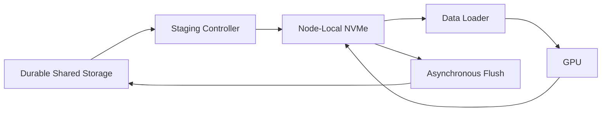

# Local NVMe and Data Staging

Local NVMe places high-throughput storage near the GPU node. It reduces shared-fabric demand and can absorb bursty temporary I/O.

## Appropriate Uses

- dataset cache for repeated epochs;
- temporary preprocessing output;
- shuffle and spill space;
- model and container cache;
- checkpoint staging before durable copy;
- local inference model cache.

## Architecture

## Trade-offs

Local storage improves performance but creates data-placement, eviction, durability, and node-failure concerns. The source of truth must remain explicit.

## Production Design

Use checksums, cache keys, capacity limits, cleanup policy, warm-up observability, and failure-safe fallback. Do not let unbounded caches consume the operating-system disk.

## Troubleshooting

If some nodes are fast and others slow, compare NVMe health, filesystem, fill level, NUMA locality, cache state, and background flush activity.
