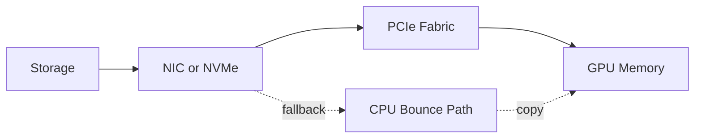

# GPUDirect Storage Architecture

GPUDirect Storage can reduce unnecessary CPU staging in supported I/O paths between storage and GPU memory.

## Architecture



## Why It Exists

Traditional paths often move data through CPU memory before copying it to GPU memory. This consumes CPU cycles and memory bandwidth and may add latency.

## Requirements

Benefits depend on supported GPU, driver, filesystem or storage stack, `nvidia-fs`, topology, alignment, buffer size, and application use of the correct APIs.

## Verification

```bash
nvidia-fs --version 2>/dev/null || true
cat /proc/driver/nvidia-fs/status 2>/dev/null || true
nvidia-smi topo -m
```

## Fallback

A working application may silently use a fallback path. Validate the actual path and compare CPU utilization and throughput.

## Troubleshooting

**Symptom:** enabling GDS produces no improvement.

**Diagnosis:** inspect compatibility, topology, filesystem support, alignment, request size, fallback counters, and whether storage or application is already the bottleneck.
