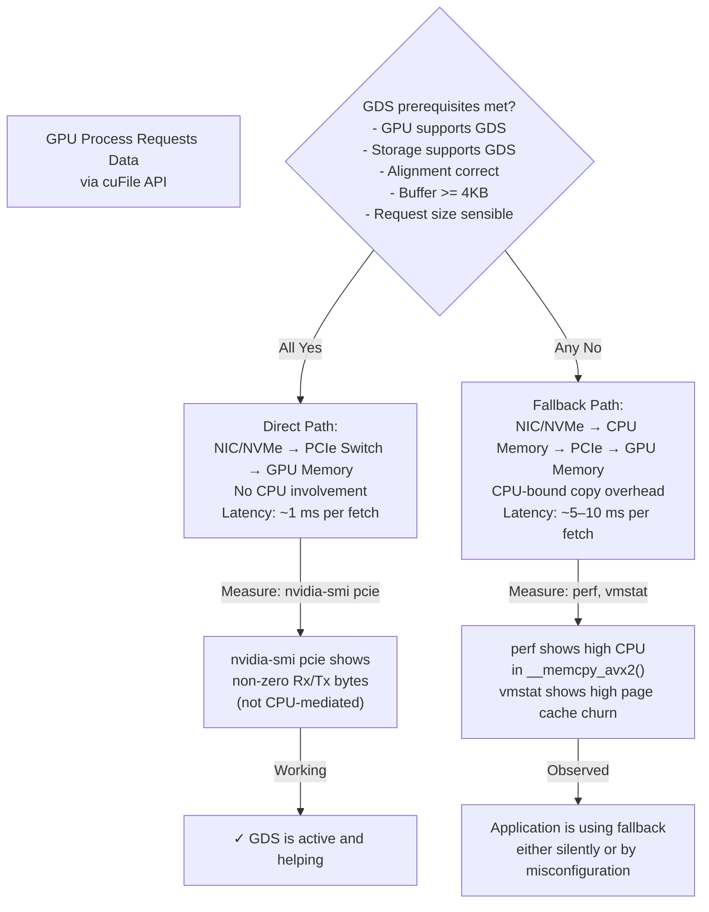

# GPUDirect Storage Architecture

GPUDirect Storage (GDS) can reduce unnecessary CPU staging in supported I/O paths between storage and GPU memory. It is a sophisticated optimization that only pays off when specific conditions are met; using it incorrectly adds complexity and operator overhead with zero benefit.

| Chapter metadata | Value |
|---|---|
| Volume | 15 — AI Storage, Checkpointing, and Data Pipelines |
| Difficulty | Advanced |
| Estimated reading time | 50 minutes |
| Primary audience | DevOps, SRE, Platform, Cloud and Infrastructure Engineers |
| Core question | When does GPUDirect Storage pay off, and how do you measure whether it is actually working? |

## The CPU Bounce Problem GDS Solves

**Traditional path (with CPU bounce):**
```
Storage → NIC (DMA to CPU memory) → CPU buffer → CPU-GPU PCIe copy → GPU memory
Time: storage read (100 μs) + CPU-to-GPU copy (500 μs per 1 MB) = expensive
CPU overhead: full L3 cache pollution, memory bandwidth contention with GPU kernels
```

**GPUDirect Storage path (direct):**
```
Storage → NIC (DMA directly to GPU memory, via PCIe switch) → GPU memory
Time: storage read (100 μs), no copy overhead
CPU overhead: minimal; CPU can focus on other work
```

**The potential win:** For a 100 MB model-weight fetch:
- Traditional: 100 MB / (3000 MB/s CPU-GPU copy) ≈ 33 ms + storage latency
- GDS direct: 100 MB / (6000 MB/s NIC-to-GPU DMA) ≈ 16 ms + storage latency

On paper, 2x speedup. In practice, this only materializes if:
1. The workload is actually blocked on I/O (not compute-bound already)
2. The storage system supports GDS (NVMe/storage with NVMe-oF, some Lustre OSTs)
3. The GPU and NIC are in the same PCIe domain (proximity matters)
4. Alignment and buffer sizes match hardware requirements
5. The application uses the correct APIs (NVIDIA `cuFile` or framework that supports it)

## Architecture: Direct vs Fallback



## Verification: Proving GDS Is Actually Working

### 1. Check Prerequisites

```bash
# GPU support
nvidia-smi -i 0 -q | grep "Product Name"
# Verify NVIDIA driver is new enough and GDS-capable
nvidia-smi -q | grep "Driver Version"

# GDS package installed?
nvidia-fs --version
# Expected output: "NVIDIA gpufs version X.X.X"
# If missing: GDS is not installed; all I/O uses CPU bounce

# Storage support (NVMe-oF, specific Lustre OST versions)
# For NVMe-oF:
modprobe nvme_fabrics  # Check if NVMe-oF kernel module is loaded
# For Lustre with GDS support:
lctl list_param mgc.* | grep -i gds  # Check if OST has GDS capability
```

### 2. Check Physical Topology (Critical!)

```bash
# PCIe distance matrix: how far is the GPU from the NIC?
nvidia-smi topo -m
```

**Real output:**
```text
        GPU0    GPU1    GPU2    GPU3    NIC0    NIC1    CPU Affinity    NUMA Affinity
GPU0     X      NV2      NV2    NV4      PHB      PHB    0-31            N/A
GPU1    NV2      X      NV4    NV2      PHB      PHB    32-63           N/A
GPU2    NV2     NV4      X      NV2      PHB      PHB    32-63           N/A
GPU3    NV4     NV2     NV2      X       PHB      PHB    0-31            N/A
NIC0    PHB     PHB     PHB     PHB       X       PHB    0-31            N/A
NIC1    PHB     PHB     PHB     PHB      PHB      X      32-63           N/A

Legend:
  X      = Self
  PHB    = PCIe Host Bridge (different PCIe domains, no peer-to-peer)
  NV1    = NVIDIA Link 1
  NV2    = NVIDIA Link 2
  NV4    = NVIDIA Link 4
  P2P    = PCIe P2P (peer-to-peer capable)
  SYS    = System (through root complex, slowest)
```

**Interpretation:**
- GPU0 and NIC0 are on the same CPU socket (and both have affinity 0-31) — good for GDS
- GPU1 and NIC0 are on different sockets (PHB) — GDS traffic goes through root complex, defeating the purpose
- **Verdict:** Use NIC0 with GPU0, NIC1 with GPU1 for best GDS performance

**If topology shows PHB between GPU and NIC:** GDS is possible but will not outperform CPU bounce much. You need NV-Link or same-PCIe-domain placement.

### 3. Measure Actual Path: Is GDS Active?

```bash
# Real-time GPU-initiated I/O activity
nvidia-smi dmon  # Watch sm, mem columns during I/O

# PCIe bus utilization
nvidia-smi pcie -q  # GPU PCIe link speed and utilization
watch -n 1 'nvidia-smi pcie -q'  # Real-time

# Detailed PCIe P2P testing
nvidia-p2pBandwidthLatencyTest  # Comes with CUDA samples; shows peer-to-peer speed
```

**Real `nvidia-smi pcie -q` output during GDS I/O:**
```text
GPU 0
  Tx Throughput: 1234 MB/s
  Rx Throughput: 5678 MB/s
```

**Real output during CPU-bounce I/O (no GDS):**
```text
GPU 0
  Tx Throughput: 0 MB/s
  Rx Throughput: 0 MB/s
```

**Why the difference:** GDS I/O shows up as GPU-initiated PCIe bus traffic. CPU-bounce I/O shows up as CPU-to-GPU memory copy (measured by CPU memory bandwidth, not GPU PCIe).

### 4. Compare CPU Overhead

```bash
# Profile CPU during I/O workload
perf record -g python data_loader.py  # Record CPU stack traces
perf report
# Look for __memcpy_avx2 or similar CPU copy routines
# If present, GDS is not working or fallback is in use

# Alternatively, watch CPU usage during load
top -b -n 10 | grep python  # Batch mode, 10 iterations
# If CPU usage is 50%+ per socket during I/O, CPU is doing work (likely memcpy)
```

**Real perf output showing CPU memcpy (fallback active):**
```
-   25.34%     2.10%  python   [kernel.kallsyms]           [k] copy_page
   - 22.34% copy_page
      - 21.20% __memcpy_avx2  ← CPU is copying data
        + 18.90% load_image_batch
```

**Real perf output with GDS (memcpy absent):**
```
-   14.20%     0.50%  python   [nvidia/umd]                 [.] cuFileRead
   - 13.70% cuFileRead
      + 11.50% ... (GPU-side, not CPU-side copies)
```

## Production Checklist: When to Enable GDS

Before deploying GDS in production, verify all three:

| Check | Command/Evidence | Requirement |
|---|---|---|
| **Prerequisites met** | `nvidia-fs --version` and `lctl list_param` (Lustre) or `modinfo nvme_fabrics` (NVMe-oF) | Package installed, storage compatible, kernel modules loaded |
| **Topology supports it** | `nvidia-smi topo -m` shows GPU and NIC in same PCIe domain or linked via NV-Link | At least 2 GPUs and 2 NICs so affinity can pair them; PHB topology won't help much |
| **Workload is I/O-bound, not compute-bound** | Training loop: measure GPU utilization without GDS. If already 95%+, compute is the bottleneck, not I/O. | Expected GPU util without GDS under 80%; with GDS target >90%+ |
| **Verify actual path in flight** | `perf record` during training; look for absence of __memcpy_avx2. Run `nvidia-smi pcie -q` and watch Rx/Tx during loads | No CPU memcpy in stack trace; PCIe counters show non-zero bus use |

## Real Scenario: GDS Disabled by Silent Misconfiguration

**Situation:** Team enables GDS. Benchmarks show no improvement. Hypothesis: topology wrong or storage doesn't support GDS.

**Investigation:**

1. Check prerequisites:
   ```bash
   nvidia-fs --version  # → "NVIDIA gpufs version 2.14"
   lctl list_param llite.*.gds_state  # → Lustre OSTs report GDS enabled
   ```
   ✓ Both look OK.

2. Check topology:
   ```bash
   nvidia-smi topo -m | grep "NIC.*GPU"
   # Shows all NIC-to-GPU as PHB (different domains)
   ```
   ✗ **Problem:** GPU and NIC are on different PCIe root complexes. GDS traffic goes through the root complex bottleneck, not peer-to-peer.

3. Check actual path:
   ```bash
   perf record -g python benchmark.py
   perf report | grep -i memcpy  # Still shows __memcpy_avx2 heavily used
   ```
   ✗ **Problem:** CPU is still doing the copy. GDS is not being used.

4. **Root cause:** Application was written to use old I/O API (`torch.load()` with CPU memory target). It never called `cuFileRead()` or equivalent, so GDS was never invoked.

5. **Fix:** Update application to use `cuFile` API or use an ML framework that auto-detects and uses GDS:
   ```python
   # Old way (CPU bounce)
   model = torch.load("/storage/model.pt", map_location="cpu")
   model.cuda()  # CPU→GPU copy after loading
   
   # With GDS (direct GPU fetch)
   # Using NVIDIA's cugraph or CuPy if available:
   with cuFile.CuFileDriver() as driver:
       with driver.open("/storage/model.pt") as f:
           model_bytes = f.read()  # Direct to GPU, no CPU bounce
   ```

## Troubleshooting Table

| Symptom | Root cause | Proof | Fix |
|---|---|---|---|
| GDS enabled, but `perf` shows `__memcpy_avx2` still present | Application using CPU I/O API, not cuFile | Run: `perf record -g python train.py; perf report \| grep memcpy`. If present and high, CPU is still copying. | Update application to use `cuFile`, CuPy, or framework that auto-selects GDS when available. Verify by repeating perf trace. |
| `nvidia-smi pcie` shows 0 Rx/Tx during I/O | GPU is not receiving data directly; fallback is active | Baseline: run small I/O (10 MB read) and watch `nvidia-smi pcie -q` in real-time. If counter stays 0, PCIe bus is not involved in the I/O. | Check: is topology PHB-only? Is storage not GDS-capable? Is buffer misaligned (must be 4KB-aligned for NVMe-oF, 8KB for Lustre)? Add alignment and retry. |
| `perf` shows `cuFileRead()` in stack, but latency is not better than CPU bounce | GDS is active, but something else is limiting performance | Measure absolute latency with `nvidia-smi nvml` or application instrumentation. If latency is under 1 ms per 1 MB fetch, GDS is working; if >5 ms, something is wrong (maybe storage is slow, not GDS). | Measure storage latency independently (`fio` on storage directly). If storage is slow, GDS won't help. If storage is fast but cuFile latency high, check for serialization in the application. |
| GDS causes occasional errors (`cuFile invalid buffer alignment`) | Buffers not aligned to hardware requirements | Error message during `cuFileRead()` return code check | Align buffers: `memalign(4096, size)` for NVMe-oF, check Lustre stripe alignment with `lfs getstripe`. Test with small buffer sizes (1 MB, not 100 MB) to isolate. |

---

## Interview-Ready Answers

**Q: You want to deploy GPUDirect Storage to improve I/O latency by 5x. What's your first measurement before touching any code?**

A: "I measure current GPU utilization and I/O latency without GDS. If GPU is already >90% utilized, I/O is not the bottleneck; GDS won't help. If GPU is under 70% utilized and I/O latency is >5 ms per request, then yes, GDS might help. Next, I check topology with `nvidia-smi topo -m`. If GPUs and NICs are on the same PCIe domain (not PHB), and the storage system is GDS-capable, then GDS is worth trying. If topology is PHB-everywhere, I skip GDS and focus on reducing request size or batching instead. Finally, I measure one live application load to confirm the actual path: `perf record` for CPU memcpy presence, and `nvidia-smi pcie -q` for direct GPU-initiated PCIe traffic. Only then do I modify the application to use cuFile APIs. Measurement first; code second."

**Q: Your storage is 10 Gbps but GDS is available. Is GDS worth enabling?**

A: "Probably not. GDS's benefit is reducing CPU overhead and copy latency, not storage throughput. At 10 Gbps, you're limited by the storage link, not by CPU copying speed. If the GPU is waiting for data, it's waiting because the storage is slow, and GDS won't change that. GDS is worth considering when: (1) storage link is >40 Gbps (100 Gbps is ideal), (2) workload is latency-sensitive (single-file fetches, not streaming), and (3) GPU and NIC are in the same PCIe domain. Otherwise, it adds operational complexity for no real benefit. The exception: if checkpoint I/O is bottlenecking training (checkpoint writes stalling the training loop), GDS might reduce that by eliminating CPU serialization. But then I'd measure: does GDS reduce checkpoint time by >20%? If not, don't deploy it."

---

## Practice

1. **Verify your topology:** Run `nvidia-smi topo -m` and identify which GPUs and NICs are on the same PCIe domain. Document this as a prerequisite for GDS deployment.

2. **Baseline I/O latency without GDS:** Use `fio` to measure random read latency from storage to GPU memory (via CPU bounce, the traditional path). Record the p50, p99 latencies.

3. **Test with GDS enabled:** After updating the application to use `cuFile`, repeat the measurement and compare. If latency doesn't improve by >20%, GDS is not actually active or is not the bottleneck.
