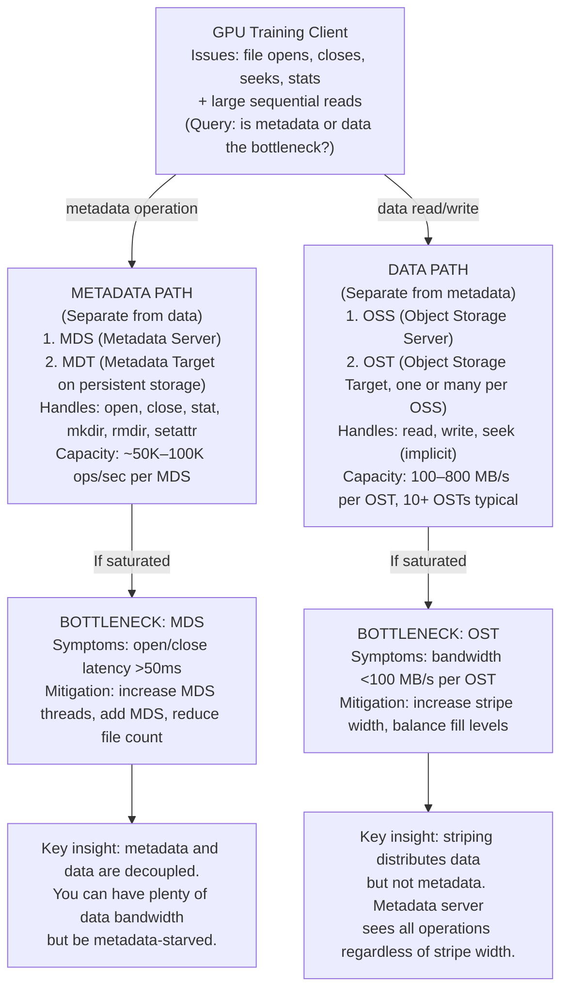

# Lustre for AI and HPC

Lustre distributes filesystem responsibilities — metadata, data, and management — across servers, allowing many clients to access data in parallel. Deployed correctly for AI workloads, it can sustain 100+ GB/s aggregate throughput. Deployed incorrectly (often without understanding metadata scaling), it becomes a bottleneck at scale.

| Chapter metadata | Value |
|---|---|
| Volume | 15 — AI Storage, Checkpointing, and Data Pipelines |
| Difficulty | Advanced |
| Estimated reading time | 50 minutes |
| Primary audience | DevOps, SRE, Platform, Cloud and Infrastructure Engineers |
| Core question | Why does metadata become the bottleneck in Lustre clusters at scale, and how do you design to avoid it? |

## Architecture: Where Metadata and Data Split



## Measurement: Identify Which Is Your Bottleneck

### Metadata Pressure

```bash
# Real-time metadata operation rate
lctl get_param llite.*.stats | grep -E "^  open|^  close|^  getattr|^  readdir"
# Expected healthy: <50K ops/sec aggregate across all clients

# Metadata server-side metrics
lctl get_param -n mdt.*.md_stats 2>/dev/null | head -20
# or on the metadata server host:
top -u root | grep mdt_thread  # Check MDS thread count and CPU usage

# Latency of a single metadata operation
time lfs ls -l /lustre/ | wc -l  # Time a stat on all files in a directory
```

**Real sample output — healthy metadata:**
```bash
$ lctl get_param llite.lustre-1a5c.stats | grep -E "^  open|^  close|^  getattr"
  open:  150000 samples, 800 min, 5400 max, 2100 avg
  close: 150000 samples, 600 min, 4200 max, 1800 avg
  getattr: 300000 samples, 400 min, 8900 max, 2200 avg
```

**Interpretation:**
- 150K opens samples = 150K opens over the measurement window (~1 minute in typical lctl config)
- 2.1 ms average open latency — acceptable (less than 5 ms is healthy)
- Max 5.4 ms — occasional delays but no sustained saturation
- **Verdict:** Metadata server has headroom.

**Real sample output — metadata saturated:**
```bash
$ lctl get_param llite.lustre-1a5c.stats | grep -E "^  open|^  close|^  getattr"
  open:  950000 samples, 1200 min, 65400 max, 45200 avg
  close: 950000 samples, 800 min, 58900 max, 42100 avg
  getattr: 1900000 samples, 400 min, 102000 max, 78900 avg
```

**Interpretation:**
- Huge number of samples (950K opens in 1 minute = 15.8K opens/sec, way above healthy 50K)
- 45.2 ms average open latency — very high; training waits here
- Max 65.4 ms — some clients experience multi-second stalls
- **Verdict:** Metadata server is saturated. Remedy: increase MDS thread count, distribute metadata across multiple MDTs, or repackage dataset to fewer files.

### Data Bandwidth and OST Balance

```bash
# Check OST utilization and fill level
lfs df -h
# Expected: all OSTs within ±5% of each other

# Bandwidth per OST (via oststat or using fio)
fio --name=read --ioengine=libaio --rw=read --bs=1M --size=10G \
    --filename=/lustre/test-file.bin --iodepth=32 --numjobs=1
```

**Real sample output — balanced:**
```text
$ lfs df -h
UUID                       bytes        Used   Available Use%
lustre-MDT0000_UUID      1.8G      890.3M      863.9M  49%
lustre-OST0000_UUID    900.0G     445.2G      454.8G  49%
lustre-OST0001_UUID    900.0G     447.1G      452.9G  49%
lustre-OST0002_UUID    900.0G     442.8G      457.2G  49%
```

**All OSTs at 49% — balanced and good.** If one OST were at 95% and others at 40%, files placed on the full OST would block on writes.

### Striping Configuration

Striping distributes a file across multiple OSTs, allowing parallel reads. Too little striping caps bandwidth; too much wastes space and increases metadata overhead.

```bash
# Check current striping configuration
lfs getstripe /lustre/test-file.bin

# Output example:
#  1048576 stripe_size
#  2 stripe_count
#  0 stripe_offset
# 0  1  2  3  4  5
# 0  1  0  1  0  1  stripe_osts

# This means: file is striped across 2 OSTs (stripe_count=2)
# with 1 MB stripe size (stripe_size=1048576 bytes)

# Check per-directory default stripe settings
lfs getstripe -d /lustre/dataset/
```

**Interpretation — stripe_count=2, file=1GB:**
- File is split into 2 chunks of 500 MB each
- Chunk 1 goes to OST 0, chunk 2 to OST 1
- Sequential read can use both OSTs in parallel: 2 × 800 MB/s = 1600 MB/s theoretical
- But metadata operation (open) must still go through one MDS, so no parallelism there

**Better configuration for AI (stripe_count=8):**
- File split across 8 OSTs
- Bandwidth: 8 × 800 MB/s = 6.4 GB/s for one large file
- Trade-off: more complex recovery if an OST fails; more RPC overhead per operation

**Real-world AI setting:**
```bash
# Set default stripe for a dataset
lfs setstripe -c 16 /lustre/dataset/  # Default: stripe each new file across 16 OSTs
# For small files (<1 MB), use default (usually 1 OST)
# For large files and checkpoints, use 16 or more
```

## Production Design: Scaling Metadata

**The problem:** AI workloads generate metadata storms during:
1. **Epoch start:** opening millions of dataset files
2. **Checkpoint time:** writing thousands of checkpoint shards
3. **Cleanup:** deleting old checkpoints

**The solution:** distribute metadata across multiple MDTs (Metadata Disk Targets).

```mermaid
flowchart LR
    Clients["128 GPU Clients<br/>Open: 200K ops/sec<br/>Query: can one MDS handle it?"]
    
    SingleMDS["1 MDS (bad)<br/>Capacity: ~50K ops/sec<br/>Bottleneck achieved at 25% load"]
    
    MultiMDS["4 MDSs (good)<br/>Each handles: 50K ops/sec<br/>Aggregate: 200K ops/sec"]
    
    Clients -->|Single MDS only| SingleMDS
    Clients -->|DNE (Distributed Name Space)| MultiMDS
```

### Enabling Distributed Metadata (DNE)

Lustre's DNE feature allows one filesystem name (`/lustre/`) but multiple MDSs handling different directory hierarchies.

```bash
# On the Lustre MGS (management server), enable DNE:
mkfs.lustre --mgs --mdt --fsname=lustre /dev/vdb  # Create initial MGS+MDT0
# Then, add additional MDTs:
mkfs.lustre --mdt --fsname=lustre --index 1 /dev/vdc  # MDT1
mkfs.lustre --mdt --fsname=lustre --index 2 /dev/vdd  # MDT2

# Configure DNE striping at mount time:
lfs mkdir -i 0 /lustre/dataset-mdt0
lfs mkdir -i 1 /lustre/dataset-mdt1
lfs mkdir -i 2 /lustre/dataset-mdt2

# Training code accesses specific subdirs, which get routed to different MDTs
# Load is balanced: MDS0 handles dataset-mdt0 metadata, MDS1 handles dataset-mdt1, etc.
```

## AI-Specific Tuning

### For Training (parallel reads, periodic checkpoints)

```bash
# Set optimal stripe count for training data files
lfs setstripe -c 16 /lustre/training-data/  # 16 OSTs per file

# Set optimal stripe size for batch reads
lfs setstripe -S 2M /lustre/training-data/  # 2 MB stripe size
# Trade-off: larger stripe size means fewer RPCs per large file, but
# more uneven OST usage if files are small

# Monitor live: watch metadata ops during training
watch -n 1 'lctl get_param llite.*.stats | grep "^  open" | tail -3'
```

### For Checkpoints (synchronized writes)

```bash
# Checkpoints should use high stripe count (max out to all OSTs)
lfs setstripe -c -1 /lustre/checkpoints/  # Stripe across ALL OSTs

# Example: 500 GB checkpoint, 24 OSTs
# With stripe -c -1: 500 GB / 24 OSTs ≈ 21 GB per OST
# Write rate: 24 × 500 MB/s = 12 GB/s (much faster than single OST)

# Avoid: checkpoint to single OST or low stripe count
# 500 GB at 800 MB/s = 625 seconds (ouch!)
```

## Troubleshooting Table: Diagnosis and Remediation

| Symptom | Measurement | Diagnosis | Action |
|---|---|---|---|
| Throughput is 100 MB/s (expected 5 GB/s on 6 clients) | `lfs getstripe /dataset`: stripe_count=1 | Only one OST per file; not using parallelism | Increase stripe count: `lfs setstripe -c 6 /dataset` or use `-c -1` for max |
| Epoch start takes 3 minutes (expected 30 seconds) | `lctl get_param llite.*.stats \| grep open`: avg latency 120ms, 150K opens | Metadata server saturated; opening too many small files | Repackage dataset: 5M files → 50K shards (100 files per shard). Reduces open calls 100x. |
| One client is 5x slower than others | `lfs getstripe /dataset`: same stripe_count. Compare `ping` latency from both clients to storage. | Client network or NUMA issue, not Lustre | Check network MTU (should be 9000 for jumbo frames). Pin loader thread to same NUMA as storage NIC. |
| OST0 is at 98% full, OST1–5 at 60% | `lfs df -h`: fill levels differ | Files were placed on OST0 preferentially; rebalancing needed | Migrate files to balanced OSTs: `lfs migrate --stripe-count 6 /dataset/*` (offline operation, plan carefully) |
| Checkpoint write takes 30 minutes (should be under 2 minutes) | `lfs getstripe /checkpoints`: stripe_count=1 | Checkpoint using single OST; serialized writes | Increase stripe: `lfs setstripe -c 24 /checkpoints` for next checkpoint |

## Interview-Ready Answers

**Q: You have a Lustre cluster with 24 OSTs. Your training code opens 10 million files per epoch. Metadata is saturated at 45ms open latency. Changing the MDS is out of scope. What do you do?**

A: "I don't try to make the MDS faster. Instead, I reduce the metadata operations by 100x through dataset repackaging. 10 million files at ~260 KB each is roughly 2.6 TB. I'd repackage that into, say, 100 shards of 26 GB each (using `tar`, `zip`, or a dataset format like WebDataset or TFRECORD). The training loader opens one shard per epoch pass, not 10 million files. Metadata ops drop from 150K opens per epoch to just 100 opens per epoch. That's 1500x reduction in metadata pressure. The trade-off: slight decompression overhead on each shard, but typically negligible compared to the metadata savings. This is the standard solution for Lustre at scale with small files."

**Q: Checkpoint writes are taking 15 minutes for 500 GB. Your Lustre has 12 OSTs and is at 70% full. How do you speed up the checkpoint?**

A: "First, check the checkpoint's stripe count: `lfs getstripe /checkpoints/ckpt-latest`. If it's stripe_count=1, I increase it to stripe_count=12 (all OSTs). That alone should speed writes from ~1 GB/s (one OST) to ~10 GB/s (twelve in parallel). Time drops from 500 seconds to 50 seconds. Second, I check the fill level: if one OST is at 95% and others at 60%, I rebalance or reserve a new OST. Third, I check whether the checkpoint write is serialized in the application (a single rank waiting for all data to write), and if so, I parallelize it so all 8 ranks write their checkpoint shard simultaneously to different OSTs. Combined, these changes typically cut checkpoint time from 15 minutes to 2–3 minutes."

---

## Practice

1. **Baseline your Lustre:** Run `lfs df -h` and `lfs getstripe -d /lustre/` and document the configuration. Then run a 10 GB read test and record throughput.

2. **Stress metadata:** Write a small Python loop that opens 100K files in the Lustre filesystem. Time it. Note the average latency. This is your baseline metadata rate.

3. **Experiment with striping:** Copy a 10 GB file with stripe_count=1, 4, and 8. Measure read throughput for each. Document the throughput gain and the trade-off (more files opened per OST = more metadata for recovery).
