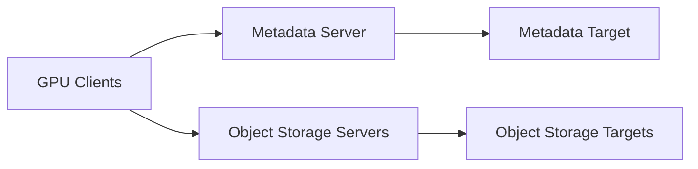

# Lustre for AI and HPC

Lustre distributes filesystem responsibilities so many clients can access data in parallel.

## Architecture



Metadata operations and data operations follow different paths. Both must scale.

## Striping

Striping distributes a file across object-storage targets. Too little striping can limit large-file bandwidth. Excessive striping can waste resources and increase overhead.

## AI Workloads

Large shard files benefit from parallel data targets. Millions of small files can overload metadata. Dataset packaging and layout are therefore part of the storage architecture.

## Commands

```bash
lfs df -h
lfs getstripe <path>
lctl get_param llite.*.stats | head
```

## Troubleshooting

**Symptom:** bandwidth collapses when many jobs start.

**Diagnosis:** inspect metadata rate, target imbalance, striping, client RPCs, network counters, and synchronized read behavior.
