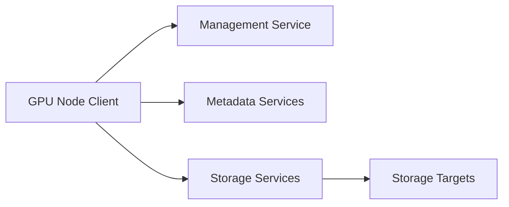

# BeeGFS for GPU Clusters

BeeGFS separates management, metadata, storage, and client roles while distributing files across storage targets.

## Architecture



## Strengths

The architecture supports flexible scale-out and can serve mixed HPC and AI workflows. Delivered performance still depends on client configuration, target balance, network, file layout, and workload concurrency.

## Operations

```bash
beegfs-ctl --listnodes --nodetype=storage
beegfs-ctl --listtargets
beegfs-ctl --getentryinfo <path>
```

## Troubleshooting

If only some clients are slow, compare client versions, mounts, NUMA and network locality, target selection, and node health.

## Customer Perspective

Choose a parallel filesystem after measuring workload patterns and operational fit, not from a single peak-throughput figure.
