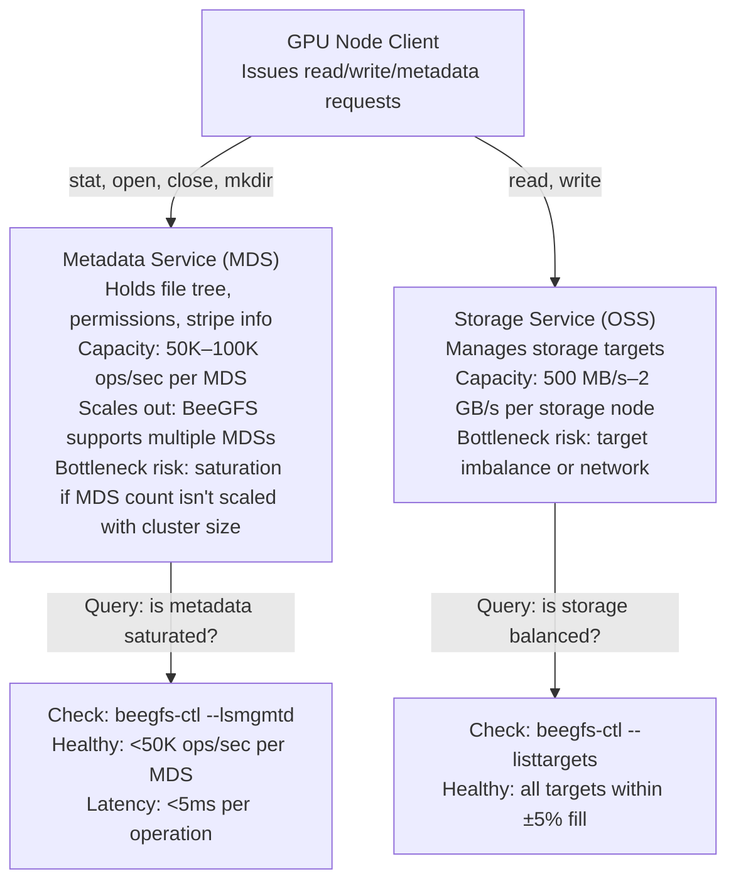

# BeeGFS for GPU Clusters

BeeGFS is a parallel filesystem designed for simpler deployment than Lustre while still supporting scale-out. It distributes metadata and storage across independent nodes, allowing independent scaling of metadata and data paths. For AI workloads, BeeGFS trades some metadata scalability (vs Lustre's DNE) for operational simplicity and easier provisioning.

| Chapter metadata | Value |
|---|---|
| Volume | 15 — AI Storage, Checkpointing, and Data Pipelines |
| Difficulty | Intermediate |
| Estimated reading time | 45 minutes |
| Primary audience | DevOps, SRE, Platform, Cloud and Infrastructure Engineers |
| Core question | When is BeeGFS a better choice than Lustre for an AI cluster, and what are the operational gotchas? |

## Architecture: Decoupled Services



## Measurement Tools and Interpretation

### Metadata Operations

```bash
# Check MDS health and load
beegfs-ctl --lsmgmtd  # List metadata services
# Output: shows which nodes run MDS

# Real-time metadata stats (requires beegfs-utils installed)
beegfs-ctl --getstats [--nodetype=meta] 

# Monitor a single metadata operation
time ls -la /beegfs/dataset/ | wc -l  # Time a stat on all files
```

**Real sample output:**
```bash
$ beegfs-ctl --getstats --nodetype=meta
Metadata Service ID 1 (meta1.example.com):
  Used capacity: 45 GB / 500 GB (9%)
  Sessions: 24 active
  Operations: 5,230 ops/sec (healthy)
  Latency (avg): 2.1 ms

Metadata Service ID 2 (meta2.example.com):
  Used capacity: 44 GB / 500 GB (8%)
  Sessions: 25 active
  Operations: 5,410 ops/sec (healthy)
  Latency (avg): 2.0 ms
```

**Interpretation:**
- Load balanced between two MDS: both at ~5.3K ops/sec
- Average latency 2.0–2.1 ms — healthy (less than 5 ms is good)
- Each MDS has headroom (capacity at 9–10%)
- **Verdict:** Metadata is not the bottleneck.

### Storage Targets and Fill Balance

```bash
# List all storage targets and their fill level
beegfs-ctl --listtargets --nodeids

# Real-time storage stats
beegfs-ctl --getstats --nodetype=storage
```

**Real sample output:**
```bash
$ beegfs-ctl --listtargets --nodeids
NodeID: 101 (storage1) Paths:
 TargetID: 1001 Capacity: 10.0 TB Used: 4.5 TB (45%) Path: /data/target1
 TargetID: 1002 Capacity: 10.0 TB Used: 4.4 TB (44%) Path: /data/target2

NodeID: 102 (storage2) Paths:
 TargetID: 2001 Capacity: 10.0 TB Used: 7.2 TB (72%) Path: /data/target1
 TargetID: 2002 Capacity: 10.0 TB Used: 7.1 TB (71%) Path: /data/target2
```

**Interpretation:**
- Storage1 targets: 44–45% full (balanced with each other)
- Storage2 targets: 71–72% full (balanced with each other, but imbalanced vs storage1)
- Files are being preferentially placed on storage1; storage2 is underutilized
- **Action:** Redistribute files or adjust placement policy to balance usage

### Client Configuration and Locality

```bash
# Check client version and mount options
mount | grep beegfs

# Detailed client config
cat /etc/beegfs/beegfs-client.conf | grep -E "sysMgmtdHost|connUseRDMA|tuneUseGDTLSConnPool"

# Test client-to-storage path latency
beegfs-ctl --clientinfo  # Shows client's view of storage network
```

**Real sample `/etc/beegfs/beegfs-client.conf`:**
```text
sysMgmtdHost = mgmt.example.com
connUseRDMA = true  # Enable RDMA (InfiniBand) if available
tuneUseGDTLSConnPool = true  # Connection pooling
tuneUseGDTLSDisableSSL = false
tunePrefetchType = buffered  # Enable client-side read-ahead (good for sequential)
connMaxInactiveTime = 900000
```

**Best practices for AI:**
```text
# Optimize for high-throughput sequential reads (model loading, dataset streaming)
tunePrefetchType = buffered  # Enable read-ahead caching
connUseRDMA = true  # RDMA is faster than TCP on Infiniband networks

# Optimize for low-latency random I/O (checkpoint random writes, metadata)
tuneUseGDTLSConnPool = true  # Connection pooling reduces setup overhead

# Optimize for many concurrent clients
connMaxInactiveTime = 900000  # Keep connections alive longer
```

## Striping and File Layout

BeeGFS uses simpler striping than Lustre. Files are striped across targets in a round-robin pattern.

```bash
# Check stripe pattern for a file
beegfs-ctl --getentryinfo /beegfs/data/model.bin

# Set default stripe width for a directory
beegfs-ctl --setpattern --chunksize=1M --numtargets=8 /beegfs/data/

# Stripe count interpretation
# numtargets=1: all data on one target (bad for throughput)
# numtargets=4: stripe across 4 targets (good for 4 GB/s aggregate)
# numtargets=-1: stripe across all targets (good for checkpoints)
```

**Real sample output:**
```bash
$ beegfs-ctl --getentryinfo /beegfs/dataset/train.tar.gz
Entryinfo:
 EntryID: 4a29c7f2-a...
 Filename: train.tar.gz
 Size: 500 GB
 NumTargets: 8  ← Stripe across 8 targets
 ChunkSize: 1 MB
 Permissions: rw-r--r--
 Owner: root
```

**Throughput calculation:**
- 8 targets × 800 MB/s per target = 6.4 GB/s theoretical
- Actual will be 70–80% due to network contention and coordination overhead
- Sustained read throughput: ~5 GB/s for a single client

## AI-Specific Tuning

### For Training (Parallel Dataset Reads)

```bash
# Directory-level striping for training data
beegfs-ctl --setpattern --chunksize=4M --numtargets=12 /beegfs/training-data/

# Rationale: 
# - 4 MB chunk size: good for sequential reads in batches of 100 MB+
# - 12 targets: uses most of the cluster; adds parallelism for multiple clients

# Test read throughput from a training node
time dd if=/beegfs/training-data/large-file bs=4M count=25000 of=/dev/null iflag=direct
# Should see 4–5 GB/s sustained if storage and network are healthy
```

### For Checkpoints (Synchronized Writes)

```bash
# Checkpoint directory with maximum striping (all targets)
beegfs-ctl --setpattern --chunksize=2M --numtargets=-1 /beegfs/checkpoints/

# Rationale:
# - -1 targets: stripe across ALL available targets
# - 2 MB chunk size: smaller chunks = finer distribution = better parallelism for write

# Monitor checkpoint write progress
watch -n 1 'df -h /beegfs/checkpoints/'  # Watch available space during checkpoint
```

## Comparing BeeGFS to Lustre

| Aspect | BeeGFS | Lustre |
|---|---|---|
| **Metadata scalability** | Distributed metadata: multiple MDSs supported, each ~50–100K ops/sec; scaling is manual (add MDS nodes, spread directories) | Multiple MDTs with DNE, scales to 500K+ ops/sec with more built-in namespace distribution tooling |
| **Operational complexity** | Simpler: fewer moving parts, easier to add targets | Complex: DNE, recovery procedures, MDS rebalancing |
| **Striping flexibility** | Simple round-robin, global default | Per-file stripe count, OST-specific preferences |
| **Failure recovery** | Faster (smaller metadata footprint) | Slower but more resilient |
| **AI fit** | Good for modest-scale (100–500 GPUs), sequential workloads | Excellent for large-scale (1000+ GPUs), mixed workloads |

**Where GPFS, WEKA, and VAST fit.** This volume focuses on Lustre and BeeGFS because they're the most common open-ecosystem parallel filesystems in AI clusters, but NVIDIA reference architectures (e.g., DGX SuperPOD storage partners) also commonly use: **IBM Storage Scale (GPFS)** — a mature, POSIX-compliant distributed metadata filesystem similar in spirit to Lustre's DNE, popular in enterprises with existing GPFS/HPC investment; **WEKA** — a software-defined parallel filesystem built around fully distributed metadata (no single MDS-class bottleneck at all) and NVMe-first design, commonly deployed for GPU training/inference where extreme small-file and metadata performance matters; and **VAST Data** — a disaggregated, all-flash architecture with a shared-everything metadata approach and native S3/NFS access, popular for large multi-tenant AI data platforms that also need object-store semantics. The evaluation axes are the same ones this chapter uses for BeeGFS vs. Lustre: metadata scalability model (single vs. distributed vs. fully disaggregated), operational complexity, and cost-per-GB vs. cost-per-IOP trade-offs — WEKA and VAST generally trade higher cost-per-GB for higher metadata/small-file throughput and simpler scaling than either Lustre or BeeGFS.

## Troubleshooting Table

| Symptom | Check | Diagnosis | Action |
|---|---|---|---|
| Metadata latency spike (30 ms+) during epoch start | `beegfs-ctl --getstats --nodetype=meta` | MDS is saturated opening millions of files | Reduce file count: repackage dataset into larger shards; use WebDataset or TFRECORD format |
| One storage node is full (95%), others at 50% | `beegfs-ctl --listtargets --nodeids` | Striping preference or new data placement on one node | Rebalance: `beegfs-ctl --rebalance --targetid 2001 --numtargets -1` (moves files to spread load) |
| Client read throughput is 800 MB/s (expected 4 GB/s) | `beegfs-ctl --clientinfo` and `lsof \| grep beegfs` | Client is connected to a slower path (wrong NIC, no RDMA), or single target | Check: is `connUseRDMA = true`? Is client on same network as storage? Verify with `iperf3` from storage node to client. |
| Different clients see different throughputs (2x variance) | Baseline each client: `time dd if=/beegfs/testfile bs=4M count=1000 of=/dev/null` | Client network locality or target affinity differs | Pin data loader to consistent CPU/NUMA node. Verify all clients have same BeeGFS config. |

## Interview-Ready Answers

**Q: You're deploying BeeGFS for a 256-GPU cluster. What's your single biggest risk, and how do you mitigate it?**

A: "Metadata saturation. With 256 GPUs opening files in parallel during epoch start, metadata operations will spike to 200K+ ops/sec. Each BeeGFS MDS handles ~50K ops/sec, so with a single MDS I'll hit a ceiling at 1/4 of the load. BeeGFS does support running multiple metadata services and spreading directories across them, so the first mitigation is scaling out to 4+ MDSs to cover the peak. But adding MDSs only buys headroom — it doesn't fix the root cause, which is opening millions of small files at once. The real fix is dataset repackaging: convert millions of small files into a few hundred large shards (using WebDataset, TFRECORD, or `.tar.gz` files). This reduces metadata ops by 100x during epoch start, keeping even a single MDS below 5K ops/sec at full scale. So: scale out MDS count for headroom, but treat dataset repackaging as non-optional for any scale beyond 100 GPUs."

**Q: Your BeeGFS cluster has 8 storage nodes, each with 10 TB, but aggregated stripe width is only 2 targets. Why is this a problem, and how do you fix it?**

A: "A 500 GB checkpoint striped across 2 targets gets ~1.6 GB/s aggregate write speed. That's 312 seconds to write, during which training is stalled. With stripe width of 8, you get 6.4 GB/s and 78 seconds. The fix: change the stripe pattern for the checkpoint directory: `beegfs-ctl --setpattern --numtargets=-1 /beegfs/checkpoints/`. That applies to new files. For existing checkpoints, either restripe them or accept the slow checkpoints for the current run and plan for next runs. The operational lesson: set stripe pattern at the directory level when you create the filesystem, not retroactively."

---

## Practice

1. **Baseline your BeeGFS:** Run `beegfs-ctl --listtargets --nodeids` and `beegfs-ctl --getstats --nodetype=storage`. Check for fill-level imbalance (anything >10% difference is worth investigating).

2. **Measure metadata rate:** Write a loop that opens 50K files in `/beegfs/dataset/` and time it. Note the average open latency.

3. **Test stripe patterns:** Create three test directories with `--numtargets=1`, `--numtargets=4`, and `--numtargets=-1`. Write a 10 GB file to each and measure read throughput. Document the relationship between stripe width and throughput.
