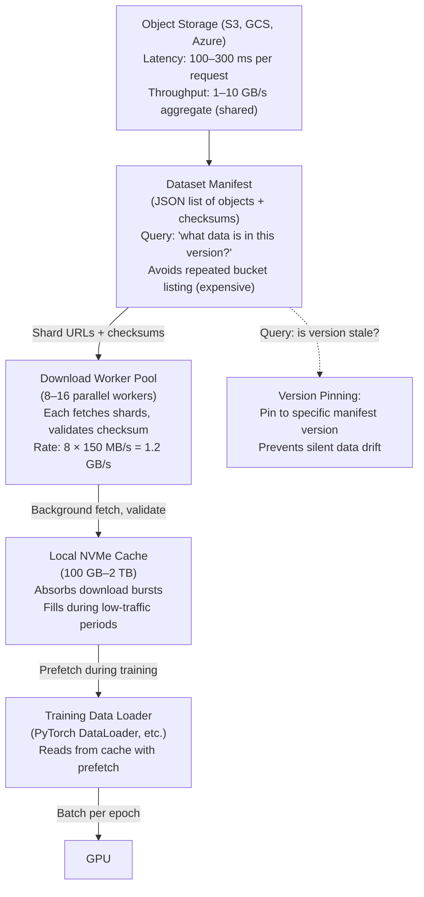

# Object Storage and Dataset Pipelines

Object storage (S3-compatible, GCS, Azure Blob, etc.) is durable and scales horizontally but has fundamentally different latency and throughput characteristics than filesystems. At scale, object storage is best used as a source-of-truth repository, not as a direct training input store. Training workloads should pipeline data through a caching or staging layer.

| Chapter metadata | Value |
|---|---|
| Volume | 15 — AI Storage, Checkpointing, and Data Pipelines |
| Difficulty | Intermediate |
| Estimated reading time | 45 minutes |
| Primary audience | DevOps, SRE, Platform, Cloud and Infrastructure Engineers |
| Core question | Why does training directly from object storage stall, and how do you pipeline it efficiently? |

## Why Direct Object Storage Is Slow

Object storage is optimized for **throughput and durability at scale**, not for **latency** or **random access**.

**Scenario: Training from S3**
```
Model in S3: 100 MB
Dataset in S3: 500 GB, 2 million objects of 260 KB each

Training needs:
- Model load: 100 MB in < 1 second (latency-sensitive)
- Dataset prefetch: 1 MB per second sustained (throughput-sensitive)

What happens:
1. GET model from S3 → TCP/TLS connect (50 ms) + S3 API call (100 ms) + 1 GB/s download (~100 ms) = 250 ms total
2. GET dataset object 1 → 150 ms (overhead > payload!)
3. GET dataset object 2 → 150 ms
4. ... × 2 million objects = 300,000 seconds = 83 hours just on API calls

GPU waiting 99% of the time, burning wall-clock time.
```

**The fix: Pipeline**
```
S3 → Download worker pool (8 workers) → Local NVMe cache → Training loader → GPU
- Download workers fetch in parallel (8 × 150 MB/s = 1.2 GB/s)
- Local cache absorbs bursts and fills during training
- GPU never waits for object download; only for cache refill
```

## Architecture: A Production Pipeline



## Measurement: Bottleneck in the Pipeline

### Object Download Latency and Throughput

```bash
# Test direct S3 access latency and throughput
# Use AWS CLI or boto3:

# Single-object latency
time aws s3 cp s3://bucket/model.bin /tmp/model.bin --region us-east-1
# Record wall-clock time

# Parallel download throughput (8 workers)
# Pseudo-code:
import threading
import boto3
import time

s3 = boto3.client('s3')
start = time.time()

def download(key):
    s3.download_file('bucket', key, f'/tmp/{key}')

threads = [threading.Thread(target=download, args=(f'shard-{i}.tar',)) for i in range(8)]
for t in threads: t.start()
for t in threads: t.join()

elapsed = time.time() - start
throughput_mb_s = (8 * 1000) / elapsed  # 8 GB / elapsed time in seconds
print(f"Parallel download: {throughput_mb_s:.0f} MB/s")
```

**Real sample results:**
```text
Single object (1 GB):
  Time: 6.2 seconds
  Throughput: 161 MB/s
  Latency breakdown:
    - TLS handshake: 50 ms
    - S3 API call: 80 ms
    - Data transfer: 6000 ms (actual bottleneck)

Parallel (8 × 1 GB objects):
  Total time: 7.5 seconds (not 8 × 6.2 = 49.6!)
  Aggregate throughput: 1067 MB/s
  Per-object throughput: 133 MB/s (actually drops slightly due to network shared bandwidth)
```

**Interpretation:**
- Single object: 161 MB/s is reasonable for S3
- Parallel: 1067 MB/s across 8 = 133 MB/s per object, a bit lower due to shared bandwidth
- Healthy S3 pipeline: aim for 800 MB/s–2 GB/s aggregate across the cluster

### Cache Hit Rate and Prefetch Effectiveness

```python
# Instrument the training loader to measure cache behavior
import time
import os

cache_hits = 0
cache_misses = 0
download_wait_time = 0

for epoch in range(num_epochs):
    for batch_idx, (data, labels) in enumerate(train_loader):
        # Check: is this data in cache or being downloaded?
        cache_path = f'/local-cache/{batch_idx}.tar'
        
        if os.path.exists(cache_path):
            cache_hits += 1
        else:
            # Cache miss: have to wait for download or GPU stalls
            cache_misses += 1
            wait_start = time.time()
            # (download worker fills cache here, blocking the loader)
            download_wait_time += time.time() - wait_start
        
        # Train on batch...
        
    if epoch > 0:
        hit_rate = cache_hits / (cache_hits + cache_misses)
        print(f"Epoch {epoch}: hit_rate={hit_rate*100:.1f}%, download_wait={download_wait_time/60:.1f}min")
```

**Sample output:**
```
Epoch 1: hit_rate=0.1%, download_wait=45.3min  ← Cache cold, lots of waiting
Epoch 2: hit_rate=98.2%, download_wait=2.1min  ← Cache warm, GPU mostly fed
Epoch 3: hit_rate=97.5%, download_wait=3.5min  ← Cache filling (eviction is starting)
```

**What this means:**
- Epoch 1 is slow (cache cold); epoch 2 onwards are fast (cache warm)
- By epoch 3, eviction is happening (fill level >85%); some data not in cache anymore
- **Action:** Increase cache size or use LRU eviction policy

## Production Patterns

### Pattern 1: Dataset Versioning with Manifests

Never rely on bucket listing during training. Always use a pre-computed manifest.

```json
{
  "name": "imagenet-2024-v1",
  "created": "2024-01-15T10:00:00Z",
  "shards": [
    {
      "name": "shard-0000.tar",
      "size": 1073741824,
      "s3_path": "s3://datasets/imagenet-2024/shard-0000.tar",
      "sha256": "a1b2c3d4e5f6..."
    },
    {
      "name": "shard-0001.tar",
      "size": 1073741824,
      "s3_path": "s3://datasets/imagenet-2024/shard-0001.tar",
      "sha256": "f6e5d4c3b2a1..."
    }
  ],
  "total_size": 1099511627776,
  "num_samples": 1281167
}
```

**Usage:**
```python
import json
import boto3

with open('imagenet-manifest.json') as f:
    manifest = json.load(f)

s3 = boto3.client('s3')

for shard in manifest['shards']:
    # Download only shards in the manifest
    # No bucket listing, deterministic, versionable
    local_path = f'/cache/{shard["name"]}'
    if not os.path.exists(local_path):
        s3.download_file(shard['s3_path'].split('://')[1].split('/')[0], shard['s3_path'].split('://')[-1], local_path)
        # Validate checksum
        with open(local_path, 'rb') as f:
            actual_sha256 = hashlib.sha256(f.read()).hexdigest()
        assert actual_sha256 == shard['sha256'], f"Checksum mismatch for {shard['name']}"
```

### Pattern 2: Asynchronous Download with Backoff

```python
import boto3
import time
from concurrent.futures import ThreadPoolExecutor
from botocore.exceptions import ClientError

s3 = boto3.client('s3')
executor = ThreadPoolExecutor(max_workers=8)

def download_with_retry(s3_path, local_path, max_retries=3):
    for attempt in range(max_retries):
        try:
            bucket, key = s3_path.replace('s3://', '').split('/', 1)
            s3.download_file(bucket, key, local_path)
            return True
        except ClientError as e:
            if attempt < max_retries - 1:
                wait_time = 2 ** attempt  # Exponential backoff: 1s, 2s, 4s
                print(f"Download failed, retrying in {wait_time}s: {e}")
                time.sleep(wait_time)
            else:
                raise

# Submit downloads in background
futures = []
for shard in manifest['shards']:
    local_path = f'/cache/{shard["name"]}'
    future = executor.submit(download_with_retry, shard['s3_path'], local_path)
    futures.append(future)

# Training can start immediately; downloads happen in parallel
# Loader blocks only if it reaches a shard that's not yet downloaded
for shard_idx, future in enumerate(futures):
    # Block here only if this shard is not ready yet
    result = future.result()  # Waits for download to complete
    # Now load from local cache
```

## Troubleshooting Table

| Symptom | Check | Diagnosis | Action |
|---|---|---|---|
| Epoch 1 is 10x slower than epoch 2 | Cache hit rate by epoch (see code above) | Cache is cold in epoch 1; download workers are filling it during training | Expected behavior. Reduce epoch-1 impact by pre-warming cache before training starts (`python warmup.py`), or accept epoch-1 overhead if it's less than 5% of total training time. |
| Training stalls every 5 minutes for 30 seconds | Download-worker activity vs training loop timing | Prefetch is not staying ahead; local cache is emptying faster than downloads can fill it | Increase download worker count (8 → 16), increase cache size, or reduce batch size/epoch length. |
| S3 requests show 403 Forbidden during training | Check S3 credentials and bucket policy | IAM role or credentials expired, or training is running in a different account/region | Verify credentials: `aws sts get-caller-identity`. Check bucket policy allows GetObject. Use temporary STS credentials with longer TTL. |
| Some training nodes download fast (800 MB/s), others slow (100 MB/s) | Baseline each node's direct S3 throughput with iperf3 and aws cli | Network difference between nodes; one node might have lower bandwidth or higher latency to S3 | Check: is network NIC/link saturated on slow node? Are slow nodes on a different subnet? Troubleshoot network path independently. |

---

## Interview-Ready Answers

**Q: You're training on a dataset in S3, and epoch 1 takes 3 hours while epoch 2 takes 30 minutes. What's happening, and is this acceptable?**

A: "Epoch 1 is cache-cold; the download workers are fetching data from S3 during training. Epoch 2 is cache-warm; data is already on local NVMe. The 10x difference is typical. Whether it's acceptable depends on how many epochs you run. If you're doing 100 epochs, 3 extra hours for epoch 1 is 0.8% overhead — ignore it. If you're doing only 1 epoch (one-shot inference fine-tuning), epoch 1 overhead is 100% of the cost — critical. For 1-epoch workloads, I'd pre-warm the cache: run `python download_manifest.py` before training starts, bringing all shards to local NVMe. Training then sees a warm cache immediately."

**Q: You have a 500 GB dataset split into 50 × 10 GB shards in S3. With 8 parallel download workers, what's your expected training startup time to first batch?**

A: "Assuming 150 MB/s per parallel download and needing to prefetch 1–2 shards before training starts: 8 workers × 150 MB/s = 1.2 GB/s aggregate. Two shards = 20 GB. Time = 20 GB / 1.2 GB/s ≈ 17 seconds. Add S3 API call overhead (5 seconds per shard) and TLS handshakes (2 × 0.1 second) = 17 + 10 + 0.2 ≈ 27 seconds to the first batch. If that's acceptable (most training jobs can handle 30s startup), you're good. If you need under 10s startup, increase download workers to 16 or pre-warm the cache."

---

## Practice

1. **Baseline your S3 path:** Run `aws s3 cp s3://bucket/1gb-file /tmp/test --region <region>` and time it. Repeat 5 times and report average throughput.

2. **Implement manifest versioning:** Create a small manifest JSON for your dataset and update your training loop to use it instead of bucket listing.

3. **Measure cache effectiveness:** Add logging to your training loader (as shown in the code above) and run 3 epochs. Report hit rates per epoch and identify when eviction starts (hit rate drops).
