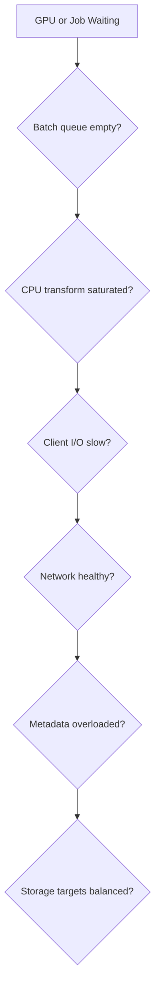

# Production Troubleshooting

Troubleshoot AI storage from the application backward and the storage system forward.

## Decision Tree

## Evidence

- application data-wait time;
- loader worker and queue metrics;
- CPU and memory pressure;
- client throughput and latency;
- network retransmits and link counters;
- filesystem metadata and target metrics;
- NVMe health and fill level;
- checkpoint duration and size;
- GPU utilization and idle periods.

## Common Incidents

| Symptom | Likely cause |
|---|---|
| Slow epoch start | cache warm-up or object listing |
| Low bandwidth with many files | metadata and open/close overhead |
| Checkpoint pauses | synchronized write burst or serialization |
| One slow node | client, NIC, NUMA, mount, or local disk difference |
| GDS no benefit | fallback, topology, alignment, or wrong bottleneck |

## Incident Method

Capture evidence before remounting or restarting. Compare a healthy client and path. Repair the lowest failed layer and rerun the same benchmark.
