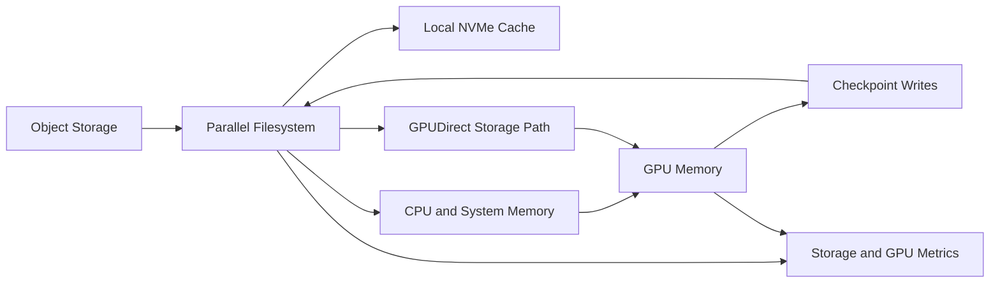

# Volume 15 — AI Storage

GPU performance depends on data arriving at the right time, in the right format, through a path that does not waste CPU, memory, network, or accelerator cycles. AI storage must serve large sequential reads, synchronized checkpoints, millions of small files, model artifacts, object datasets, metadata-heavy pipelines, and bursty inference services.

This volume develops the end-to-end data path from storage media to GPU memory. It covers local NVMe, GPUDirect Storage, Lustre, BeeGFS, object storage, checkpoint architecture, metadata, data loading, capacity economics, observability, and production troubleshooting.

| Volume field | Value |
|---|---|
| Difficulty | Advanced |
| Estimated reading time | 20–26 hours |
| Prerequisites | Volumes 01–14 |
| Primary focus | Data paths, parallel storage, and checkpoint operations |
| Outcome | Design, benchmark, and troubleshoot production AI storage |

## Big Picture

**Figure 15.0.1 — AI storage is a pipeline, not a capacity number.** The slowest media, metadata, network, client, or data-loader stage determines delivered throughput.

## Chapters

1. [Why AI Storage Is Different](./chapter-01-why-ai-storage-is-different)
2. [The AI Data Path from Storage to GPU](./chapter-02-the-ai-data-path-from-storage-to-gpu)
3. [Local NVMe and Data Staging](./chapter-03-local-nvme-and-data-staging)
4. [GPUDirect Storage Architecture](./chapter-04-gpudirect-storage-architecture)
5. [Lustre for AI and HPC](./chapter-05-lustre-for-ai-and-hpc)
6. [BeeGFS for GPU Clusters](./chapter-06-beegfs-for-gpu-clusters)
7. [Object Storage and Dataset Pipelines](./chapter-07-object-storage-and-dataset-pipelines)
8. [Checkpoint Architecture and Recovery](./chapter-08-checkpoint-architecture-and-recovery)
9. [Metadata, Small Files, and Data Loading](./chapter-09-metadata-small-files-and-data-loading)
10. [Capacity, Performance, and Cost Planning](./chapter-10-capacity-performance-and-cost-planning)
11. [Production Troubleshooting](./chapter-11-production-troubleshooting)
12. [Volume 15 Summary](./chapter-12-volume-15-summary)

## Labs

- [Baseline an AI Storage Path](./labs/lab-01-baseline-an-ai-storage-path)
- [Benchmark Local NVMe and Shared Storage](./labs/lab-02-benchmark-local-nvme-and-shared-storage)
- [Validate a GPUDirect Storage Design](./labs/lab-03-validate-a-gpudirect-storage-design)
- [Troubleshoot Checkpoint and Data-Loading Bottlenecks](./labs/lab-04-troubleshoot-checkpoint-and-data-loading-bottlenecks)
