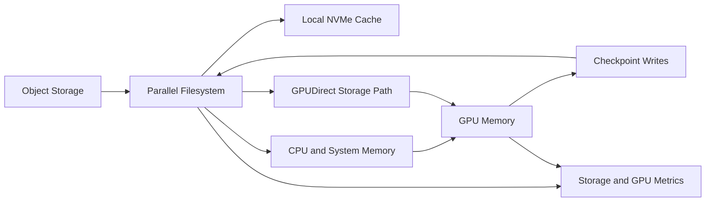

# Volume 15 — AI Storage

GPU performance depends on data arriving at the right time, in the right format, through a path that does not waste CPU, memory, network, or accelerator cycles. AI storage must serve large sequential reads, synchronized checkpoints, millions of small files, model artifacts, object datasets, metadata-heavy pipelines, and bursty inference services.

This volume develops the end-to-end data path from storage media to GPU memory. It covers local NVMe, GPUDirect Storage, Lustre, BeeGFS, object storage, checkpoint architecture, metadata, data loading, capacity economics, observability, and production troubleshooting.

| Volume field | Value |
|---|---|
| Difficulty | Advanced |
| Estimated reading time | 20–26 hours |
| Prerequisites | Volumes 01–14 |
| Primary focus | Data paths, parallel storage, and checkpoint operations |
| Outcome | Design, benchmark, and troubleshoot production AI storage |

## Big Picture

**Figure 15.0.1 — AI storage is a pipeline, not a capacity number.** The slowest media, metadata, network, client, or data-loader stage determines delivered throughput.

## Chapters

1. Why AI Storage Is Different
2. The AI Data Path from Storage to GPU
3. Local NVMe and Data Staging
4. GPUDirect Storage Architecture
5. Lustre for AI and HPC
6. BeeGFS for GPU Clusters
7. Object Storage and Dataset Pipelines
8. Checkpoint Architecture and Recovery
9. Metadata, Small Files, and Data Loading
10. Capacity, Performance, and Cost Planning
11. Production Troubleshooting
12. Volume 15 Summary

## Labs

- Baseline an AI Storage Path
- Benchmark Local NVMe and Shared Storage
- Validate a GPUDirect Storage Design
- Troubleshoot Checkpoint and Data-Loading Bottlenecks
