# Lab 01 — Baseline an AI Storage Path

**Objective:** Create a reproducible, searchable inventory of a GPU node's storage path covering network, filesystem, CPU topology, and GPU connectivity. This baseline becomes your reference for diagnosing slow training runs.

**Time:** 30 minutes

**Prerequisites:** SSH access to a GPU node; no active training jobs.

## Architecture: The Path We're Measuring

```mermaid
flowchart LR
    Storage["Storage Array<br/>(Lustre, BeeGFS, etc.)"]
    Fabric["Network Fabric<br/>(NIC, switch)<br/>Measure: Link speed, latency, errors"]
    ClientFS["Client Filesystem<br/>(kernel driver)<br/>Measure: Mount options, cache, RPC depth"]
    CPU["CPU and NUMA<br/>(memory hierarchy)<br/>Measure: Affinity, bandwidth"]
    PCIe["PCIe Fabric<br/>(CPU-GPU interconnect)<br/>Measure: Generation, bandwidth"]
    GPU["GPU and HBM<br/>(device memory)<br/>Measure: Capacity, bandwidth"]

    Storage -->|"Latency: 100 μs"| Fabric
    Fabric -->|"Latency: 10–100 μs"| ClientFS
    ClientFS -->|"Latency: 50–500 μs"| CPU
    CPU -->|"Latency: 50–100 ns"| PCIe
    PCIe -->|"Latency: 1–10 μs"| GPU
```



**Why each layer matters:**
- **Storage:** Is it healthy? Full? One target slow?
- **Network:** Link speed, errors, MTU, ring buffers?
- **Filesystem:** Mount options optimized? RPC depth sufficient?
- **CPU/NUMA:** Loader thread on right NUMA node?
- **PCIe:** GPU paired with fastest NIC/storage path?
- **GPU:** Enough HBM for batch + activations?

## Lab Steps

### Step 1: Network and Topology Inventory

```bash
#!/bin/bash
# Collect network and topology baseline

OUTPUT_FILE="baseline-$(hostname)-$(date +%Y%m%d-%H%M%S).txt"

echo "=== NETWORK CONFIGURATION ===" | tee $OUTPUT_FILE

# Network interfaces
echo "Network interfaces and status:" >> $OUTPUT_FILE
ip -s link >> $OUTPUT_FILE

# NIC configuration (link speed, ring buffer)
echo -e "\nNIC detailed config (eth0 as example):" >> $OUTPUT_FILE
ethtool eth0 >> $OUTPUT_FILE
echo "Ring buffer settings:" >> $OUTPUT_FILE
ethtool -g eth0 >> $OUTPUT_FILE

# CPU topology
echo -e "\n=== CPU TOPOLOGY ===" >> $OUTPUT_FILE
lscpu >> $OUTPUT_FILE
echo -e "\nNUMA layout:" >> $OUTPUT_FILE
numactl --hardware >> $OUTPUT_FILE

# PCIe topology and distances
echo -e "\n=== PCIe AND GPU TOPOLOGY ===" >> $OUTPUT_FILE
lspci -tv | grep -E "NVIDIA|Tesla|NIC" >> $OUTPUT_FILE
echo -e "\nGPU-to-NIC distance matrix:" >> $OUTPUT_FILE
nvidia-smi topo -m >> $OUTPUT_FILE

# GPU details
echo -e "\n=== GPU DETAILS ===" >> $OUTPUT_FILE
nvidia-smi -i 0 -q | grep -E "Product Name|Memory|Driver" >> $OUTPUT_FILE

echo "✓ Network and topology baseline saved to: $OUTPUT_FILE"
```

**Expected output and interpretation:**
```
Network interfaces and status:
eth0: <BROADCAST,MULTICAST,UP,LOWER_UP> mtu 9000  ← MTU 9000 is good (jumbo frames enabled)
      RX packets 123456 bytes 987654  RX errors 0  ← Should be 0 errors

NIC detailed config:
Speed: 25000Mb/s  ← 25 Gbps link, expected for high-speed storage networks
Duplex: Full

Ring buffer settings:
RX: 4096, TX: 4096  ← Good for high-speed I/O; if <512, increase

NUMA layout:
node 0 cpus: 0-31
node 1 cpus: 32-63  ← Two NUMA nodes, 32 CPUs each

GPU-to-NIC distance matrix:
GPU0  GPU1  NIC0  NIC1
 X    NV2   PHB   PHB   ← GPU0 and GPU1 linked (NV2), but both at PHB from NICs
                          (Not ideal for GDS, but OK)

GPU details:
Product Name: A100 PCIe
Memory: 40960 MiB (40 GB)
Driver Version: 535.29
```

### Step 2: Storage and Filesystem Inventory

```bash
#!/bin/bash
# Collect storage and filesystem baseline

OUTPUT_FILE="baseline-storage-$(hostname)-$(date +%Y%m%d-%H%M%S).txt"

echo "=== MOUNT POINTS ===" | tee $OUTPUT_FILE
mount | grep -E "lustre|beegfs|nfs|/mnt" >> $OUTPUT_FILE
echo -e "\nFilesystem details:" >> $OUTPUT_FILE
findmnt -D >> $OUTPUT_FILE

# Lustre-specific (if applicable)
if command -v lfs &> /dev/null; then
    echo -e "\n=== LUSTRE CONFIGURATION ===" >> $OUTPUT_FILE
    lfs df -h >> $OUTPUT_FILE
    echo -e "\nLustre client stats baseline:" >> $OUTPUT_FILE
    lctl get_param llite.*.stats | grep -E "^[^ ]|^  open|^  close|^  getattr" | head -20 >> $OUTPUT_FILE
fi

# BeeGFS-specific (if applicable)
if command -v beegfs-ctl &> /dev/null; then
    echo -e "\n=== BEEGFS CONFIGURATION ===" >> $OUTPUT_FILE
    beegfs-ctl --listtargets >> $OUTPUT_FILE
fi

# Storage device health
echo -e "\n=== LOCAL STORAGE ===" >> $OUTPUT_FILE
lsblk -o NAME,MODEL,SIZE,ROTA,TYPE >> $OUTPUT_FILE

# NVMe health (if applicable)
if command -v nvme &> /dev/null; then
    echo -e "\nNVMe device status:" >> $OUTPUT_FILE
    nvme list >> $OUTPUT_FILE
    # Check each NVMe for health
    for nvme in /dev/nvme*n1; do
        echo "Health for $nvme:" >> $OUTPUT_FILE
        smartctl -a $nvme 2>/dev/null | grep -E "Temperature|Errors|Power|Unsafe" >> $OUTPUT_FILE || true
    done
fi

echo "✓ Storage baseline saved to: $OUTPUT_FILE"
```

### Step 3: Measure Path Latency and Throughput

```bash
#!/bin/bash
# Measure actual I/O performance

OUTPUT_FILE="baseline-perf-$(hostname)-$(date +%Y%m%d-%H%M%S).txt"

echo "=== NETWORK THROUGHPUT ===" | tee $OUTPUT_FILE

# Test direct link to storage server
echo "Testing network bandwidth to storage (10 sec test):" >> $OUTPUT_FILE
iperf3 -c storage.example.com -t 10 >> $OUTPUT_FILE

# Test storage read performance
echo -e "\n=== STORAGE READ PERFORMANCE ===" >> $OUTPUT_FILE
echo "Testing 1 GB read from storage:" >> $OUTPUT_FILE
time dd if=/lustre/test.file bs=1M count=1000 of=/dev/null iflag=direct 2>> $OUTPUT_FILE

# Test with fio (controlled)
echo -e "\n=== STRUCTURED BENCHMARK (fio) ===" >> $OUTPUT_FILE
echo "Sequential read, 1M block size, 4 parallel jobs:" >> $OUTPUT_FILE
fio --name=seq-read --ioengine=libaio --rw=read --bs=1M --size=10G \
    --direct=1 --iodepth=32 --numjobs=4 \
    --filename=/lustre/test.file --output-format=normal >> $OUTPUT_FILE

# Metadata rate baseline
echo -e "\n=== METADATA RATE ===" >> $OUTPUT_FILE
echo "Measuring open calls per second:" >> $OUTPUT_FILE
(time find /lustre/test-dir -type f -name "*.dat" | wc -l) 2>> $OUTPUT_FILE
# Or, for Lustre:
echo "Lustre open rate baseline:" >> $OUTPUT_FILE
lctl get_param llite.*.stats 2>/dev/null | grep "^  open:" | tail -1 >> $OUTPUT_FILE

echo "✓ Performance baseline saved to: $OUTPUT_FILE"
```

**Expected values to look for:**
```
Network bandwidth:        20–25 Gbps on a 25 Gbps link (80–100% utilization expected)
Storage read latency:     ~1 GB/s to ~3 GB/s (depends on link and OST count)
Metadata open rate:       <50K ops/sec is healthy; >100K is saturated
Latency for one operation: 2–5 ms is healthy; >20 ms is slow
```

### Step 4: CPU-NUMA-GPU Affinity Verification

```bash
#!/bin/bash
# Verify that GPUs, NICs, and CPU memory are affine

OUTPUT_FILE="baseline-affinity-$(hostname)-$(date +%Y%m%d-%H%M%S).txt"

echo "=== GPU-NUMA AFFINITY ===" | tee $OUTPUT_FILE
nvidia-smi topo -m >> $OUTPUT_FILE

echo -e "\n=== RECOMMENDED AFFINITY ===" >> $OUTPUT_FILE
echo "Based on topology above, recommended bindings:" >> $OUTPUT_FILE
echo "- Data loader should run on CPU cores close to GPU, same NUMA node" >> $OUTPUT_FILE
echo "- Example: GPU0 (affinity 0-31) → loader on cores 0-7" >> $OUTPUT_FILE
echo "- Example: GPU1 (affinity 32-63) → loader on cores 32-39" >> $OUTPUT_FILE

# Test an actual binding
echo -e "\n=== AFFINITY TEST ===" >> $OUTPUT_FILE
echo "Test: Compare throughput with and without NUMA affinity" >> $OUTPUT_FILE
echo "Without affinity:" >> $OUTPUT_FILE
time dd if=/lustre/test.file bs=1M count=1000 of=/dev/null iflag=direct 2>> $OUTPUT_FILE

echo "With affinity (NUMA node 0):" >> $OUTPUT_FILE
time numactl -N 0 -m 0 dd if=/lustre/test.file bs=1M count=1000 of=/dev/null iflag=direct 2>> $OUTPUT_FILE

echo "✓ Affinity verification saved to: $OUTPUT_FILE"
```

### Step 5: Memory and Cache Status

```bash
#!/bin/bash
# Capture current memory and cache state

OUTPUT_FILE="baseline-memory-$(hostname)-$(date +%Y%m%d-%H%M%S).txt"

echo "=== MEMORY STATUS ===" | tee $OUTPUT_FILE
free -h >> $OUTPUT_FILE

echo -e "\n=== PAGE CACHE ===" >> $OUTPUT_FILE
cat /proc/meminfo | grep -E "Cached|Buffers|MemAvailable|MemFree" >> $OUTPUT_FILE

echo -e "\n=== GPU MEMORY ===" >> $OUTPUT_FILE
nvidia-smi -i 0 -q | grep -E "Memory.Used|Memory.Total|Memory.Free" >> $OUTPUT_FILE

echo "✓ Memory baseline saved to: $OUTPUT_FILE"
```

## Validation: Sanity Checks

After collecting the baselines, verify each component:

```bash
# 1. Is the network link up and at rated speed?
grep "Speed:" baseline-*.txt | grep -E "25000|100000"  # Should show link speed

# 2. Are NICs configured for jumbo frames?
grep "mtu" baseline-*.txt | grep -v "127"  # Should show mtu 9000

# 3. Is there a Lustre or BeeGFS mount?
grep -E "lustre|beegfs" baseline-*.txt  # Should find mount points

# 4. Do GPU-to-NIC distances show good affinity?
grep -E "GPU.*NIC|PHB" baseline-*.txt  # Should show NV-Link if available, not all PHB

# 5. Is metadata baseline reasonable?
grep "open:" baseline-*.txt  # Should show <50K ops/sec
```

## Cleanup

```bash
# Remove large test files created during benchmarking
rm -f /lustre/test.file /lustre/test-*.tar
rm -f /local-nvme/test-*.bin  # If using NVMe cache

# Archive baseline files for future reference
mkdir -p ~/storage-baselines
mv baseline-*.txt ~/storage-baselines/

# Keep a summary
echo "Baseline captured on $(date)" > ~/storage-baselines/README.txt
echo "Node: $(hostname)" >> ~/storage-baselines/README.txt
echo "GPU: $(nvidia-smi -i 0 -q | grep 'Product Name')" >> ~/storage-baselines/README.txt
```

## Deliverable

By the end of this lab, you should have:
1. A file with network topology and link speeds
2. A file with storage mount and filesystem configuration
3. A file with measured throughput and latency (baseline)
4. A file documenting GPU-NUMA-CPU affinity
5. Understanding of which layer is your critical path
