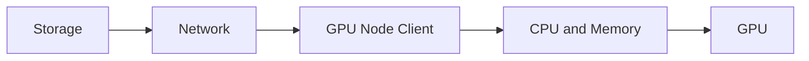

# Lab 01 — Baseline an AI Storage Path

## Objective

Create a reproducible inventory and baseline covering storage mount, network, client, local cache, CPU, PCIe, and GPU topology.

## Architecture



## Evidence

```bash
mount | sort
findmnt
ip -s link
lspci -tv
numactl --hardware
nvidia-smi topo -m
lsblk -o NAME,MODEL,SIZE,ROTA,FSTYPE,MOUNTPOINT
```

Collect filesystem-specific status where available.

## Validation

Run a small read test using an approved file and record throughput, latency, CPU, network, and GPU data-wait behavior.

## Failure Injection

Compare local and remote NUMA placement or a cold and warm cache. Explain the difference rather than changing the production mount.

## Cleanup

Remove test data and retain the baseline with node inventory.
