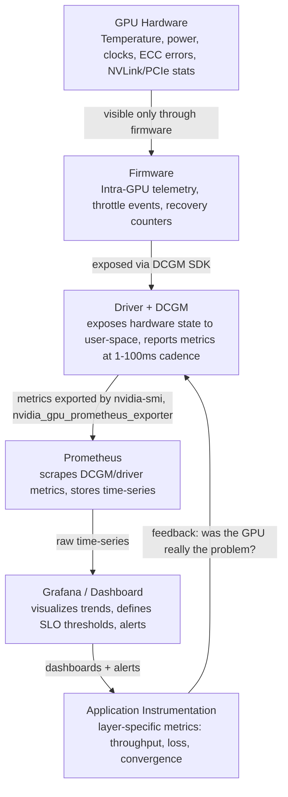

# Chapter 01 — Why GPU Observability Is Fundamentally Different

A CPU system sends clear signals: CPU time, memory pages, disk I/O, network frames. These signals directly explain what the system is doing and why. GPU systems send the same signals *plus* a set of novel ones that have no direct CPU equivalent. Misunderstanding which signals matter, or trying to apply CPU observability patterns to GPUs, is the root cause of most GPU blindness in production.

| Chapter metadata | Value |
|---|---|
| Volume | 16 — GPU Observability and Operational Health |
| Difficulty | Intermediate–Advanced |
| Estimated reading time | 50 minutes |
| Primary audience | DevOps, SRE, Platform, and Infrastructure Engineers; ML Ops; cluster operators |
| Core question | Why does a GPU cluster with perfectly healthy CPU metrics sometimes stall, and how do you see it coming? |

## Learning Objectives

You will be able to:
- Explain why CPU metrics alone are insufficient for GPU observability
- Distinguish between utilization and saturation for GPUs (they are not the same as CPUs)
- Read and interpret `nvidia-smi`, `dcgmi dmon`, and Prometheus GPU metrics
- Identify the difference between a GPU that is running efficiently, a GPU that is running but starved for data, and a GPU that is broken
- Use evidence to diagnose whether your bottleneck is the GPU, the CPU, the network, or the application logic
- Recognize the interview questions that separate GPU-aware engineers from CPU-only operators

## The Core Problem: GPU Metrics Are Not CPU Metrics

A CPU is designed to do one thing very fast: execute sequential instructions, make quick decisions, and switch between tasks. CPU observability tracks how many instructions you executed, how long you spent in system calls, and whether you swapped to disk. These are the right questions *for CPUs*.

A GPU is designed for something different: run the same instruction across thousands of cores in parallel, move enormous amounts of data very fast, and keep all cores busy on the same operation. A CPU doing nothing looks like 0% utilization; a GPU doing nothing also looks like 0% utilization. But a CPU at 80% utilization means "my workload is using 80% of CPU capacity"; a GPU at 80% utilization means... almost nothing without additional context.

**Real scenario:**

```
A training job shows:
- GPU utilization: 85% (looks healthy)
- GPU memory: 32GB / 40GB (looks healthy, 80% full)
- GPU temperature: 65°C (looks healthy)
- Training throughput: 2000 samples/second

Same job on the same hardware, different data:
- GPU utilization: 85% (identical)
- GPU memory: 32GB / 40GB (identical)
- GPU temperature: 65°C (identical)
- Training throughput: 150 samples/second

Query: "Why is throughput 13x lower with identical utilization?"
```

**The answer:** GPU utilization alone does not tell you whether you are compute-bound or memory-bound. The first job's GPU is waiting for data from memory constantly but still showing as "85% busy" because the GPU execution units are doing *something*. The second job is genuinely compute-bound — every cycle is useful.

This distinction matters because it changes everything about troubleshooting:
- A compute-bound GPU needs fewer prefetch threads; more data parallelism; better kernels
- A memory-bound GPU needs better memory bandwidth; lower-precision numerics; fused operations
- A GPU that looks 85% busy but is actually starved for data needs different fixes than a GPU that genuinely has nothing to do

## The Three Categories of GPU Signals

CPU observability has two main signal types: execution (CPU time, context switches, syscalls) and memory (pages, cache misses, swaps). GPU observability has three:

| Signal type | What it measures | Example metrics | Why it matters |
|---|---|---|---|
| **Execution** | Whether GPU cores are actually doing work on each clock cycle | Utilization, clocks throttling, SM occupancy | Tells you whether your kernel is instruction-limited or whether there's work starvation |
| **Memory** | How fast data moves to/from GPU cores, whether memory is full, whether you're spilling to slower tiers | Memory bandwidth used, memory clock throttling, cache hit rate, HBM utilization | Memory throughput is a separate limit from compute throughput; you can be memory-bound at high utilization |
| **Thermal/Power** | Temperature, clock throttling, power draw | Temperature, throttle events, power consumption, TDP utilization | Tells you whether you're hitting power or thermal limits *instead of* running out of work |

### Why this three-way view is mandatory

A CPU with high utilization and low memory traffic is probably doing well. A GPU with high utilization and low memory traffic is probably stuck: your kernel is compute-limited, waiting for data to arrive, but the GPU reports as "busy" because cores are spinning or doing redundant work.

Similarly, a CPU at 40% utilization with high memory traffic is suspect. A GPU at 40% utilization with high memory traffic *might* be perfectly healthy — it might mean you have 4 GPUs on a node and they're all load-balanced at 10% utilization each, or it might mean the training job is actually narrow (fewer than 512 active threads per SM) but memory-bandwidth-limited.

The CPU model "high utilization = good, low utilization = bad" does not transfer to GPUs.

## The Observability Stack for GPUs

GPU observability requires a vertical stack with no weak links:



Each layer is necessary:
- Without hardware visibility, you don't know if the GPU is thermally throttled or power-limited
- Without DCGM, you lose access to intra-GPU metrics like SM occupancy and cache hit rates
- Without Prometheus, you can only see snapshots; trends and correlation require time-series
- Without Grafana, you're reading raw time-series data; dashboards decode that into decisions
- Without application metrics, you can't distinguish "GPU is broken" from "workload is broken"

### Myth vs. Reality

**Myth:** "I can monitor GPUs with `nvidia-smi` sampled every second."
**Reality:** `nvidia-smi` is a polling tool, not a streaming export. It has microsecond-scale telemetry available from the kernel driver but exports only coarse aggregates. Sampling `nvidia-smi` every second will miss transient events (NVLink errors, brief thermal throttles, memory allocation stalls under 1 second) and doesn't scale beyond a handful of nodes. Use DCGM and Prometheus instead.

**Myth:** "GPU utilization above 80% means I'm using my GPU well."
**Reality:** Utilization >= 80% means a kernel is running. It tells you nothing about whether that kernel is compute-bound, memory-bound, or starved for input data. Without memory bandwidth, SM occupancy, and application-level metrics (throughput, loss, convergence), utilization is a false positive.

**Myth:** "GPU temperature above 70°C means the GPU is in trouble."
**Reality:** Modern NVIDIA GPUs are spec'd to run at 80-85°C continuously. A GPU at 75°C is cool. A GPU at 82°C is normal. A GPU thermally throttling (clock rate dropping to stay under thermal limit) is the actual signal, not the temperature number alone.

## Evidence: Reading GPU Health in One Command

`nvidia-smi` is the most common first tool; it's also the most commonly misunderstood. A single invocation:

```bash
nvidia-smi --query-gpu=index,name,uuid,driver_version,memory.total,memory.used,memory.free,temperature.gpu,clocks.current.graphics,clocks.max.graphics --format=csv
```

**Real sample output:**

```text
index,name,uuid,driver_version,memory.total,memory.used,memory.free,temperature.gpu,clocks.current.graphics,clocks.max.graphics
0,NVIDIA A100-PCIE-40GB,GPU-<uuid>,550.119.05,40960 MiB,28672 MiB,12288 MiB,68,1410,1980
1,NVIDIA A100-PCIE-40GB,GPU-<uuid>,550.119.05,40960 MiB,30000 MiB,10960 MiB,72,1410,1980
2,NVIDIA A100-PCIE-40GB,GPU-<uuid>,550.119.05,40960 MiB,2048 MiB,38912 MiB,45,300,1980
```

**What this tells you:**

| Field | GPU 0 | GPU 1 | GPU 2 | Interpretation |
|---|---|---|---|---|
| Memory used | 28672 MiB (70%) | 30000 MiB (73%) | 2048 MiB (5%) | GPU 0 and 1 are loaded; GPU 2 is idle or not assigned work |
| Memory free | 12288 MiB (30%) | 10960 MiB (27%) | 38912 MiB (95%) | GPUs 0 and 1 have little headroom for allocation; GPU 2 has plenty |
| Temperature | 68°C | 72°C | 45°C | GPUs 0 and 1 are warm but normal; GPU 2 is cool (idle or low utilization) |
| Clock rate | 1410 MHz | 1410 MHz | 300 MHz | GPUs 0 and 1 running at near-peak clocks; GPU 2 at idle clocks (clock gating enabled) |

**What it does NOT tell you:**

- Whether GPU 0 and 1 are actually producing useful output, or spinning inefficiently
- Whether GPU 2 is intentionally idle (no work assigned) or broken (driver not seeing work)
- Whether any GPU is in a background memory copy or migration operation
- Whether the kernel running on GPU 0 and 1 is compute-bound or memory-bound
- Whether clock throttling is about to happen (watch the thermal headroom, not the absolute temp)
- Whether NVLink is saturated or unused

## Worked Example: The Diagnosis Hierarchy

**Situation:** A training job expected to use 4 GPUs shows `nvidia-smi` reporting 4 GPUs loaded with 30GB each and temperatures around 70°C. Training loss is not decreasing as expected — the job looks "stuck."

**Immediate questions to ask in order:**

1. **Is this even a GPU problem?**
   - Check application logs for errors, NaN loss, convergence stall
   - Check training throughput: `nvidia-smi dmon` (live stream of utilization/memory/clock) or Prometheus graph of sample throughput
   - If throughput is steady but loss doesn't improve, this is a data/model/hyperparameter problem, not GPU hardware

2. **Is the GPU *actually* running?**
   - Check GPU utilization: if it's under 10%, the GPU isn't executing kernels; check if work is queued or if the job is hung in Python/framework initialization
   - Check clocks: if they're at idle speeds (300-500 MHz), the GPU is clock-gating and not running

3. **Is the GPU compute-bound or memory-bound?**
   - DCGM metric `GPU_MEMORY_BANDWIDTH_USED`: if it's above 80% of peak, GPU is waiting for memory, not compute
   - SM occupancy from `nvidia-smi -q` or DCGM `GPU_SM_OCCUPANCY`: if under 40%, kernel is not filled; scheduler is starved
   - Achieved throughput vs. peak throughput: a typical A100 should achieve 300+ TFLOP/s on FP32 matrix ops; if you're seeing 20 TFLOP/s with high utilization, memory bandwidth is the ceiling

4. **Is anything throttling?**
   - `nvidia-smi -q` shows thermal throttle count and power throttle count
   - DCGM exports `GPU_THERMAL_SLOWDOWN` and `GPU_POWER_SLOWDOWN` counters
   - If either is incrementing, performance is capped by limits, not by parallelism

5. **Is there an error the hardware is hiding?**
   - Check ECC error counters: `nvidia-smi -q | grep -i "ecc"` or DCGM `GPU_ECC_ERRORS_CORRECTED`
   - If ECC errors are present but not escalating, GPU is working but has bit-flip recoveries; this might explain slight loss stalls but shouldn't halt training
   - If ECC errors suddenly spike or uncorrectable errors appear, GPU is in distress

**The pattern:** you move down the hierarchy only when you've ruled out the level above. If utilization is under 10%, there's no point checking memory bandwidth. If ECC errors are spiking, there's no point optimizing the kernel.

## Interview Questions Worth Preparing

**Q: "How do you know if a GPU is actually healthy, not just reporting non-zero utilization?"**

A (spoken): "Utilization alone is a trap. I would look at three things in parallel: First, is the GPU *actually executing instructions*, or is it just not idle-gated? I check clocks — if clocks are at 1500+ MHz on an A100, work is happening; if they're at 300 MHz, the GPU is asleep. Second, is the GPU waiting for data? I look at memory bandwidth utilization and compare it to the theoretical peak for that operation. A matmul on an A100 should be pushing 1500+ GB/s if it's real work; if I'm seeing 200 GB/s with high utilization, the kernel is memory-starved. Third, am I actually getting useful output? That means application metrics: throughput, loss convergence, final accuracy. A GPU might be 85% utilized but computing garbage if the model is broken or the data isn't being read correctly."

**Q: "You have a training job that's slower than expected. How do you distinguish 'GPU hardware is broken' from 'data pipeline is broken' from 'model hyperparameters are wrong'?"**

A (spoken): "I separate the questions. First, are the GPUs saturated — that is, are they asking for more data than the data pipeline can supply, or are they sitting idle waiting for work? I use `nvidia-smi dmon` or a Prometheus dashboard to see utilization and memory clock trends over a few minutes. If utilization is steady at 80%+ and memory clocks are at peak, GPU is trying to do work. If utilization bounces between 5% and 95% every few seconds, data pipeline is starving the GPU. If utilization is consistently below 30%, no one is giving the GPU work at all.

Once I know the GPU wants work, I check whether it's actually getting the data it needs: is the data loader working, are we on the critical path for prefetch, is the model actually consuming the batches? That's in the application and data pipeline, not in the GPU hardware itself.

Only after I've ruled out 'GPU is stalled waiting for data' and 'application is wrong' do I look at hardware: is the GPU actually broken, or just slow?"

**Q: "What does it mean when `nvidia-smi` reports 85% utilization but profiling shows the kernel is memory-bound?"**

A (spoken): "That's completely normal, and it's the exact situation I'd expect for many real workloads. The GPU is running a kernel that's fundamentally limited by memory throughput, not by compute capacity. The execution units are executing *something* every cycle, which is why utilization is high, but that something is 'wait for the next cache miss to resolve' a lot of the time. It means the job would get faster if you either increased memory bandwidth, reduced precision to lower bandwidth demand, or fused operations to reuse data. But the GPU isn't broken — it's saturated at a different constraint than compute."

## Key Takeaways

1. GPU observability is not CPU observability transplanted. Utilization, memory, and thermodynamics have different meanings for GPUs.
2. A single metric never tells the whole story. You need execution, memory, and thermal metrics together to diagnose GPU health.
3. The observability stack must not break: hardware → firmware → DCGM → Prometheus → dashboard. Missing any layer means missing visibility.
4. `nvidia-smi` is a snapshot tool, not sufficient for production monitoring. Use DCGM + Prometheus for continuous observability.
5. "GPU is busy" ≠ "GPU is working efficiently." Always pair utilization with throughput and specific profiling evidence.

## Cross-References

- Volume 04: GPU execution model and memory hierarchy (understand what the metrics are measuring)
- Volume 06: CUDA kernels and libraries (understand what "compute-bound" and "memory-bound" mean)
- **Next:** Chapter 02 explores the three signal types in depth and how to collect them
