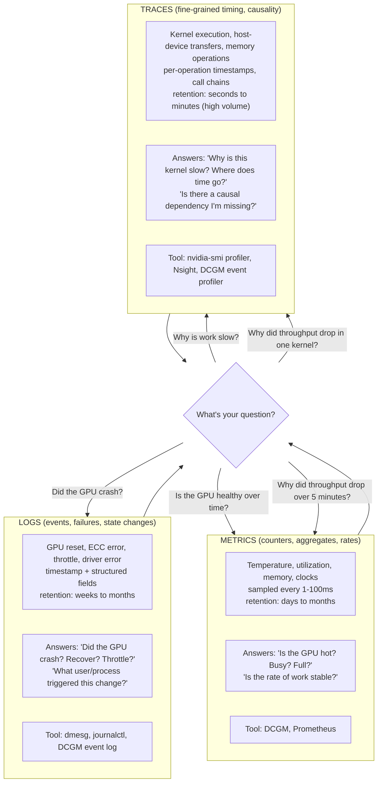
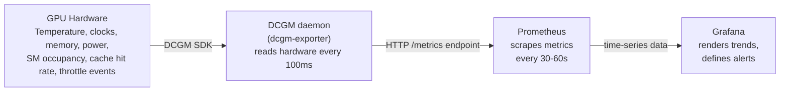

# Chapter 02 — Signals, Metrics, Logs, Traces, and Evidence

Observability is not "collect everything and hope you find the answer." Observability is "collect the specific signals that disambiguate the specific failure you're investigating." GPU systems produce three distinct signal types. Each one answers different questions. Mixing them up is the root cause of most monitoring confusion.

| Chapter metadata | Value |
|---|---|
| Volume | 16 — GPU Observability and Operational Health |
| Difficulty | Intermediate |
| Estimated reading time | 45 minutes |
| Primary audience | DevOps, SRE, Platform Engineers |
| Core question | How do you know what to look at when something goes wrong? |

## Learning Objectives

You will be able to:
- Distinguish between metrics, logs, and traces, and when each one is useful
- Collect GPU metrics continuously using DCGM and Prometheus
- Read and interpret GPU event logs from DCGM and kernel drivers
- Understand what a trace tells you that metrics alone cannot
- Set up a minimal observability pipeline that covers all three signal types
- Recognize when you're blind in one dimension (e.g., logging but not metrics, or metrics but not traces)

## Three Signal Types, Three Purposes



### Metrics: "What is the steady state?"

Metrics are aggregates: utilization (%), memory used (MB), temperature (°C), clocks (MHz), bandwidth (GB/s). They answer "what is happening on average over this sample window?"

**When to use metrics:**
- Dashboards: trends over hours or days
- Alerting: "is the GPU too hot?" "is memory usage above 90%?" "has utilization been below 5% for 10 minutes?"
- Capacity planning: "how much of our GPU bandwidth are we using?" "is temperature headroom shrinking?"
- Correlation: "did throughput drop when temperature rose?"

**When metrics are not enough:**
- A GPU at 85% utilization for 1 hour is healthy. A GPU at 85% utilization with 0.1% memory bandwidth used for 1 hour is broken (spinning).
- A GPU temperature at 72°C averaged over 1 minute is fine. A GPU that hit 90°C for 1 millisecond and thermally throttled is not visible in the 1-minute average.
- Metrics tell you *what* the average is, not *why* the outliers happened.

### Logs: "What went wrong?"

Logs are discrete events: GPU reset, ECC error, thermal throttle, driver error, timeout, recovery. They are usually low-volume and high-value: "something exceptional happened, here's the context."

**When to use logs:**
- Incident investigation: "when did the GPU fail?" "what was the error message?" "did we recover?"
- Root cause: "did the application timeout, or did the GPU reset?" (these need different fixes)
- Compliance/audit: "did ECC errors occur during this training run?" "did any hardware errors go uncorrected?"

**When logs are not enough:**
- Logs are event-based. A GPU that's steadily degrading (temperature creeping up, throughput slowly dropping) won't trigger an event log; you only see it in metrics over time.
- Logs after-the-fact. If your GPU crashes, the logs tell you *that* it crashed, but not *why* the workload queued so much work on it that it crashed.

### Traces: "Why is this kernel slow?"

Traces are fine-grained per-operation timing: "kernel X started at timestamp T, ran for Δt, stalled on memory for Δt2, completed." They answer causality questions: "where did the time go? What is the dependent chain?"

**When to use traces:**
- Profiling: "why is this model slower than expected?" "which kernel is the bottleneck?"
- Optimization: "is this kernel memory-bound or compute-bound?" "is data dependency blocking parallelism?"
- Validation: "did I fuse these operations correctly?" "is the GPU scheduling order sensible?"

**When traces are not enough:**
- Traces are high-volume: one GPU running a typical model might generate gigabytes of trace data per second. You can't keep traces for days.
- Traces answer "why is this job slow?" but not "why did all jobs on all nodes get slow at 3am yesterday?"
- A single trace of a single job tells you local optimization opportunities, not global health.

## The Observability Stack: How to Collect All Three

### Level 1: Metrics via DCGM + Prometheus

DCGM (NVIDIA Data Center GPU Manager) is the sensor. Prometheus is the time-series database. Together, they give you the backbone of GPU health monitoring.

**How it works:**



**Setting up the metrics pipeline — step by step:**

```bash
# 1. Verify DCGM is installed and the daemon is running
dcgmi diag -r 1
# Output will show all GPUs and basic health status

# 2. Export metrics via DCGM exporter
docker run -d --gpus all --net=host nvidia/dcgm-exporter:latest
# This exposes http://localhost:9400/metrics in Prometheus format

# 3. Verify metrics are flowing
curl http://localhost:9400/metrics | head -20
```

**Real sample output:**

```text
# HELP DCGM_FI_DEV_GPU_TEMP GPU temperature (in C).
# TYPE DCGM_FI_DEV_GPU_TEMP gauge
DCGM_FI_DEV_GPU_TEMP{gpu="0",uuid="GPU-<uuid>"} 68
DCGM_FI_DEV_GPU_TEMP{gpu="1",uuid="GPU-<uuid>"} 72

# HELP DCGM_FI_DEV_FB_FREE Framebuffer memory free (in MB).
# TYPE DCGM_FI_DEV_FB_FREE gauge
DCGM_FI_DEV_FB_FREE{gpu="0",uuid="GPU-<uuid>"} 12288
DCGM_FI_DEV_FB_FREE{gpu="1",uuid="GPU-<uuid>"} 10960

# HELP DCGM_FI_DEV_FB_USED Framebuffer memory used (in MB).
# TYPE DCGM_FI_DEV_FB_USED{gpu="0",uuid="GPU-<uuid>"} 28672
DCGM_FI_DEV_FB_USED{gpu="1",uuid="GPU-<uuid>"} 30000

# HELP DCGM_FI_DEV_GPU_UTIL GPU utilization (%).
# TYPE DCGM_FI_DEV_GPU_UTIL gauge
DCGM_FI_DEV_GPU_UTIL{gpu="0",uuid="GPU-<uuid>"} 85
DCGM_FI_DEV_GPU_UTIL{gpu="1",uuid="GPU-<uuid>"} 78
```

**Interpretation:**
- `DCGM_FI_DEV_GPU_TEMP`: If either GPU stays above 80°C, alert (thermal headroom is shrinking)
- `DCGM_FI_DEV_FB_FREE`: If either GPU drops below 2GB free, you're near OOM
- `DCGM_FI_DEV_GPU_UTIL`: Trending behavior matters more than absolute value (is it stable or oscillating?)

### Level 2: Logs via DCGM Events and Kernel Logs

DCGM has a built-in event log for hardware errors and state changes. The kernel also logs GPU events to `dmesg` or `journalctl`.

**Collecting DCGM events:**

```bash
# Set up DCGM to log events to a local file
dcgm-exporter --enable-field-group-all --log-level=info &
# or query the event log directly
dcgmi topo --format=json  # Shows GPU topology and any errors

# For more detailed event inspection
dcgmi diag -r 5  # Runs a 5-minute diagnostic and reports any anomalies
```

**Sample DCGM diagnostic output showing an error:**

```text
$ dcgmi diag -r 1
Diagnostic Level 1 (Quick)
For GPU 0 [A100-PCIE-40GB]:
  Power Limit: 250W, Power Draw: 185W ✓
  Thermal Limit: 85°C, Current Temp: 72°C ✓
  Memory: 40GB, Used: 28GB, Free: 12GB ✓
  SM Clock: 1410 MHz (max: 1980 MHz) ✓
  Throttling: None detected ✓

For GPU 1 [A100-PCIE-40GB]:
  Power Limit: 250W, Power Draw: 195W ✓
  Thermal Limit: 85°C, Current Temp: 78°C ✓
  Memory: 40GB, Used: 30GB, Free: 10GB ✓
  SM Clock: 1410 MHz (max: 1980 MHz) ✓
  Throttling: None detected ✓

For GPU 2 [A100-PCIE-40GB]:
  Power Limit: 250W, Power Draw: 50W ⚠ (Low — GPU may be idle or underutilized)
  Thermal Limit: 85°C, Current Temp: 45°C ✓
  Memory: 40GB, Used: 2GB, Free: 38GB ✓
  SM Clock: 300 MHz (idle clock gating) — GPU is NOT running
  Throttling: None ✓

For GPU 3 [A100-PCIE-40GB]:
  Power Limit: 250W, Power Draw: 0W ✗ ERROR: GPU is powered off or disconnected
  Thermal Limit: 85°C, Current Temp: N/A
  Memory: N/A
  ECC Status: DISABLED (GPU is offline)
```

**Interpretation:**
- GPU 0, 1: Normal operation, work is happening, good thermal headroom
- GPU 2: Idle (no work assigned), not an error but should be investigated if work was expected
- GPU 3: CRITICAL — GPU is offline; either hardware failure or driver issue

**Kernel logs for GPU events:**

```bash
dmesg -T | grep -i -E "nvidia|gpu|cuda|ecc"
# or
journalctl -k --since '-1 hour' | grep -i -E "nvidia|gpu"
```

**Sample kernel log with GPU event:**

```text
[Wed Jul 30 14:23:45 2026] NVIDIA: module initialization
[Wed Jul 30 14:23:50 2026] nvidia-uvm: Loaded the UVM driver, major device number 510
[Wed Jul 30 14:25:12 2026] nvidia 0000:17:00.0: GPU: 0 A100-PCIE-40GB at PCI 17:00.0
[Wed Jul 30 14:25:13 2026] nvidia-uvm: Loaded the UVM driver in UVM-Lite mode
[Wed Jul 30 15:40:22 2026] NVRM: GPU at PCI:0000:17:00.0 has fallen off the bus.
[Wed Jul 30 15:40:22 2026] nvidia 0000:17:00.0: ERROR: GPU has stopped responding
[Wed Jul 30 15:40:23 2026] NVRM: Xid (PCI:0000:17:00.0): 94, GPU has fallen off the bus.
```

**This log sequence means:**
1. GPU driver initialized normally
2. GPU was working
3. GPU stopped responding (Xid 94 is "GPU fell off bus" — usually a PCIe link issue or GPU hardware failure)
4. This GPU is now offline until manually recovered or server is rebooted

### Level 3: Traces for Deep Profiling

Traces require active profiling and are usually enabled only when investigating a specific problem, not continuously.

**Using `nvidia-smi` with profiling:**

```bash
# Start a persistent trace (captures next 60 seconds of GPU activity)
nvidia-smi -pm 1  # Enable persistence mode first (prevent clock throttling between jobs)
nvidia-smi -i 0 -q -a  # Continuous query mode; quit with Ctrl+C

# or use Nsight for more detailed profiling
nsys profile -t cuda,cudnn,cublas --gpu-metrics-device all python train.py
# Generates report: report1.nsys-rep (can be analyzed in Nsight UI or CLI)
```

**Real sample trace output (simplified):**

```
Kernel: matmul_kernel_fp32
  Duration: 12.3 ms
  SM Occupancy: 85% (good utilization of streaming multiprocessors)
  Memory Bandwidth: 1200 GB/s / 1500 GB/s peak (80% of peak)
  Stall Cycles: Data dependency (45%), L2 miss (30%), L1 miss (15%), Instruction issue (10%)
  
Recommendation: Kernel is 80% memory-bandwidth saturated.
  - Expected performance: 1.5 TFLOP/s from 1200 GB/s
  - Actual: 1.4 TFLOP/s
  - Verdict: Memory-bound, further compute optimization unlikely to help
  - Next: Consider fusing with upstream ops to improve data reuse
```

**Interpretation:** The kernel is using memory efficiently (80% of peak BW). Adding more parallelism or increasing compute density won't help because the bottleneck is *moving data*, not executing instructions. Solutions: fuse operations, use lower precision (FP16 or TF32 move less data), or restructure the algorithm.

## Combining Signals: The Diagnosis Workflow

When something goes wrong, you move through all three signal types in order:

1. **Check metrics first** (quick orientation): Is the GPU hot? Busy? Out of memory?
2. **Check logs second** (context): Did something exceptional happen (crash, reset, throttle)?
3. **Check traces third** (fine-grained cause): Is this specific kernel slow, or is the whole job slow?

### Worked Example: "Training Job Is Slower Than Yesterday"

**Step 1: Check metrics over the last 6 hours**
```
Query Prometheus: max(DCGM_FI_DEV_GPU_UTIL) over last 6h
Result: 65% yesterday, 52% today
Diagnosis: GPU utilization dropped 13 percentage points
Next question: Why is the GPU less busy?
```

**Step 2: Check logs for events in that window**
```
$ journalctl --since '6 hours ago' | grep -i gpu
Result: No GPU errors, resets, or throttles
Diagnosis: No hardware anomaly
Hypothesis: Application or scheduler issue, not GPU failure
```

**Step 3: Check traces of a sample batch**
```
Run the training job with profiling enabled:
$ nsys profile python train.py
Result:
  - Data loader time: 45% of batch time (was 10% yesterday)
  - Kernel execution: 40% (same as yesterday)
  - Host-device transfer: 15% (was 15% yesterday)
Diagnosis: Data pipeline is much slower
Next: Check data store, network, CPU cores available for preprocessing
```

**Conclusion:** GPU is fine (no hardware issues, no thermal throttling). Problem is data pipeline is saturated, so GPU is waiting for data, thus lower utilization.

## Key Takeaways

1. **Metrics** answer "is the GPU healthy?" Use them for dashboards, alerting, and trending.
2. **Logs** answer "did something break?" Use them for incident investigation and compliance.
3. **Traces** answer "why is this kernel slow?" Use them for optimization and root cause of specific workloads.
4. **Use all three together:** Metrics alone will miss transient failures. Logs alone won't tell you the GPU is degrading. Traces alone are too noisy to keep continuously.
5. **Pipeline must not break:** Hardware → DCGM → Prometheus → Dashboard. Missing any layer creates a blind spot.

## Cross-References

- Chapter 01: Why GPU observability is fundamentally different
- **Next:** Chapter 03 dives deep into each GPU metric (utilization, memory, temperature, clocks, throttling)
