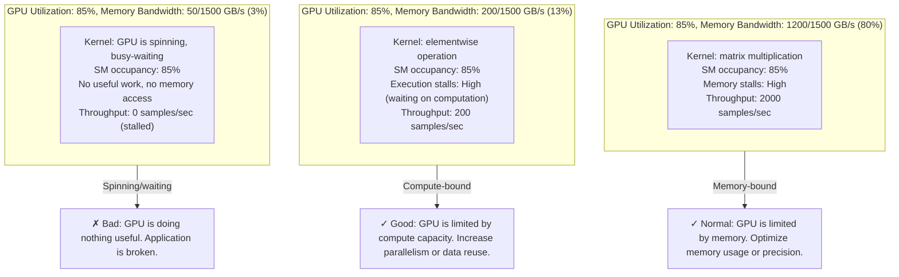
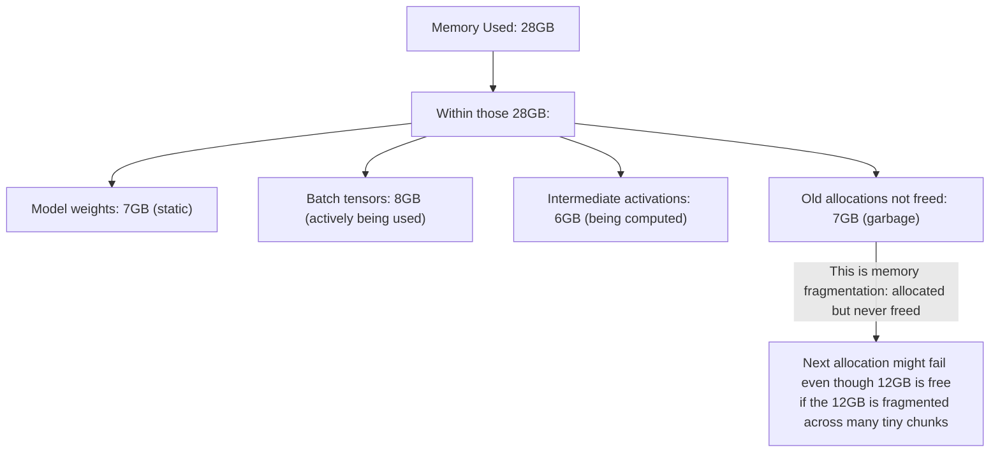
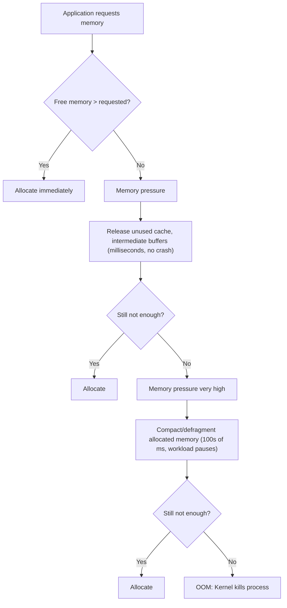
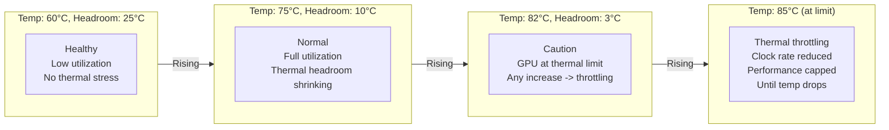
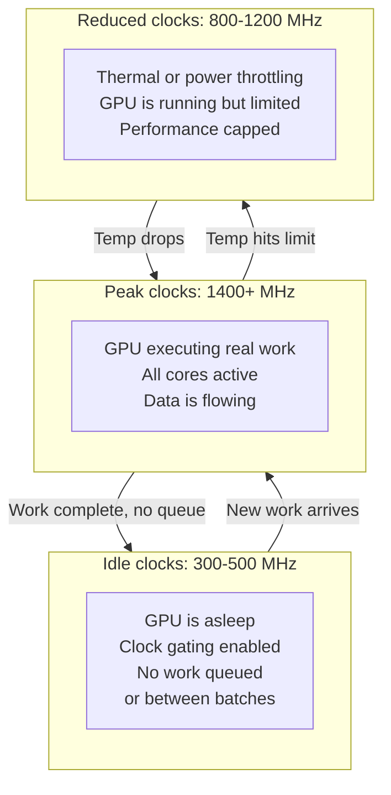
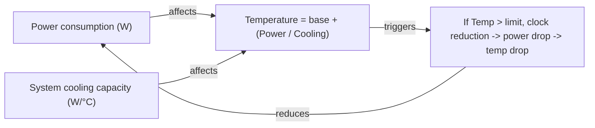

# Chapter 03 — Core GPU Metrics and Interpretation

GPU metrics are deceptive. A single number (utilization, memory, temperature) can mean radically different things depending on what you're actually measuring. A GPU at 80% utilization might be computing efficiently or wasting clocks. Memory at 90% full might be healthy or about to crash. This chapter teaches you the hidden layers of interpretation.

| Chapter metadata | Value |
|---|---|
| Volume | 16 — GPU Observability and Operational Health |
| Difficulty | Intermediate–Advanced |
| Estimated reading time | 55 minutes |
| Primary audience | DevOps, SRE, Platform Engineers, ML Ops |
| Core question | What does this number actually mean, and what is it hiding? |

## Learning Objectives

You will be able to:
- Measure and interpret GPU utilization correctly (it is not the same as efficiency)
- Distinguish "memory allocated" from "memory actively used" from "available free memory"
- Read and act on clock frequencies (when peak clocks mean good things and when they mean bad things)
- Predict thermal throttling and power throttling before it happens
- Correlate temperature and clocks with utilization to diagnose root causes
- Set alert thresholds that won't fire false positives or miss real problems

## Metric 1: GPU Utilization

**Definition:** The percentage of time that at least one SM (Streaming Multiprocessor) is executing a warp (group of 32 threads).

**What it measures:** Whether the GPU has work to do right now.

**What it does NOT measure:** Whether that work is useful, whether the GPU is compute-bound or memory-bound, or whether the workload is getting anywhere.

### The Three Utilization Scenarios



### Reading GPU Utilization Correctly

**Real scenario from production:**

```text
A training job reports:
  GPU 0: 85% utilization, 2048 samples/sec
  GPU 1: 85% utilization, 180 samples/sec
  
Question: "Why is GPU 1 13x slower than GPU 0?"
```

**First check — are they really at the same utilization?**

```bash
# Get detailed utilization breakdown
nvidia-smi -l 1  # Update every 1 second
nvidia-smi -q -d UTILIZATION  # One-shot detailed query
```

**Real `nvidia-smi -q` output:**

```text
GPU 0: A100-PCIE-40GB
  Utilization
    Gpu                      : 85%
    Memory                   : 82%

GPU 1: A100-PCIE-40GB
  Utilization
    Gpu                      : 85%
    Memory                   : 12%
```

**Interpretation:**
- GPU 0: 85% SM utilization + 82% memory bandwidth utilization = memory-bound kernel
- GPU 1: 85% SM utilization + 12% memory bandwidth utilization = GPU is spinning, not accessing memory, doing nothing useful

**What to do:**
- GPU 0: Normal; optimize data reuse or use lower precision
- GPU 1: CRITICAL BUG; the GPU is executing a kernel that doesn't move data (possibly a synchronization barrier or deadlocked code path); check application logs, kernel code, and thread block configuration

### Utilization Over Time: Steady vs. Oscillating

A single snapshot is worthless. Trend matters.

```bash
# Collect utilization trend for 10 minutes
for i in {1..600}; do
  nvidia-smi --query-gpu=timestamp,index,utilization.gpu,utilization.memory \
    --format=csv >> gpu_util.csv
  sleep 1
done
```

**Scenario 1: Steady Utilization**

```
Time    GPU_Util  Mem_Util
00:00   85%       78%
00:01   84%       79%
00:02   86%       77%
...
09:59   85%       78%
```

**Interpretation:** GPU is consistently loaded. This is what you want for training jobs. Throughput should be constant.

**Scenario 2: Oscillating Utilization**

```
Time    GPU_Util  Mem_Util
00:00   90%       85%
00:01   5%        2%
00:02   92%       88%
00:03   4%        1%
```

**Interpretation:** GPU is being starved for data, executing work, running out, then waiting. This is classic data-pipeline starvation. Data loader is the bottleneck, not the GPU.

### Alert Thresholds for Utilization

**BAD alerts (will fire false positives):**
- Alert on `GPU utilization < 50%` (GPUs below this might be in I/O, communication, or intentionally load-balanced)
- Alert on `GPU utilization > 90%` (GPUs over this might be fine and just fully loaded)

**GOOD alerts (will catch real problems):**
- Alert on `GPU utilization < 10% for 5+ minutes` (GPU not being used when it should be)
- Alert on `GPU utilization oscillating between 5% and 95% every 10 seconds` (data pipeline starvation)
- Alert on `GPU utilization = 100% AND temperature rising AND clocks throttling` (GPU overheating under load)

## Metric 2: Memory

**Definition:** Total memory capacity, used memory, free memory, and reserved-but-not-used memory.

**The trap:** "Memory used" is not the same as "memory actively being accessed."

### Three Memory Numbers You Need

```bash
nvidia-smi --query-gpu=memory.total,memory.used,memory.free --format=csv
```

**Real output:**

```text
40960 MiB, 28672 MiB, 12288 MiB
```

**What each means:**

| Metric | Value | Interpretation |
|---|---|---|
| `memory.total` | 40960 MiB (40 GB) | GPU's physical HBM capacity |
| `memory.used` | 28672 MiB (28 GB) | Memory allocated by CUDA/frameworks (includes loaded models, batch tensors, intermediate activations) |
| `memory.free` | 12288 MiB (12 GB) | Unallocated HBM (available for new allocations) |

### The Hidden Layer: Fragmentation and Allocation Stalls



**How to detect memory fragmentation:**

```bash
# Check allocation patterns over time
python3 -c "
import torch
print(f'GPU memory allocated: {torch.cuda.memory_allocated() / 1e9:.2f} GB')
print(f'GPU memory reserved: {torch.cuda.memory_reserved() / 1e9:.2f} GB')
print(f'GPU memory available: {torch.cuda.get_device_properties(0).total_memory / 1e9:.2f} GB')
"
```

**Sample output:**

```text
GPU memory allocated: 28.4 GB (actually using)
GPU memory reserved: 30.2 GB (allocated but maybe not using)
GPU memory available: 40.0 GB (total capacity)
Free: 40.0 - 30.2 = 9.8 GB
```

**Interpretation:**
- 28.4 GB actively in use
- 1.8 GB reserved but not actively used (overhead, caches, allocator fragmentation)
- 9.8 GB free and available
- Safe zone: if next batch needs < 9.8 GB, it will fit; beyond that, OOM

### Memory Pressure and the Reclaim Path

As memory fills up, the GPU follows a reclaim path similar to CPUs:



### Alert Thresholds for Memory

**BAD alerts:**
- Alert on `memory used > 90%` (normal for large models, not always OOM)
- Alert on `memory free < 2GB` (might be fine if no new allocations are coming)

**GOOD alerts:**
- Alert on `memory used > 95% AND allocation latency > 100ms` (GPU is in compaction, workload is stalling)
- Alert on `memory used rising steadily over 10 minutes` (possible memory leak)
- Alert on `memory free < 500MB AND running workload` (very little headroom, next batch might fail)

## Metric 3: Temperature

**Definition:** Core temperature of the GPU die.

**Rated specs:** Modern NVIDIA GPUs are spec'd to run at 80-85°C continuously. This is not a danger zone.

### Temperature Vs. Thermal Throttling

**Temperature alone is not the signal.** Thermal throttling is.

```bash
# Check if throttling is happening
nvidia-smi -q | grep -A2 "Throttle"
```

**Real output (healthy):**

```text
Throttle Reason
    Idle                     : Throttle Reason Idle
    Power                    : No throttling
    Thermal                  : No throttling
```

**Real output (degrading):**

```text
Throttle Reason
    Idle                     : Throttle Reason Idle
    Power                    : No throttling
    Thermal                  : Active — GPU clocks are being reduced to stay under thermal limit
```

### Temperature Trends and Headroom



**What to do at each level:**

| Temperature | Action | Urgency |
|---|---|---|
| < 60°C | Nothing; GPU has ample thermal headroom | Low |
| 60-75°C | Monitor; ensure cooling is adequate | Low |
| 75-82°C | Watch closely; alert if rising; check for unusual workloads | Medium |
| 82-85°C | Alert; GPU is at throttle threshold; may be about to throttle | High |
| > 85°C | CRITICAL; thermal throttling is active or imminent; GPU performance is capped | Critical |

### Detecting Thermal Throttling in Metrics

```bash
# Real-time monitor with thermal state
nvidia-smi dmon -s pucvmet
# p: Power (mW), u: GPU Util (%), c: clocks (MHz), v: video encode, m: memory util, e: ECC, t: Temperature
```

**Sample output (healthy):**

```
    gpu   pwr  gpu  mem   enc   dec  mclk  pclk   fb    bar1  sbecc dbecc
      0  185W   85%  12%    0%    0%  1410  1410   28G    0M     0     0  68C
      1  195W   84%  11%    0%    0%  1410  1410   30G    0M     0     0  72C
      2   50W    5%   1%    0%    0%   300   300    2G    0M     0     0  45C
```

**Interpretation:** GPUs 0, 1 running at peak clocks (1410 MHz), temps 68-72°C, no throttling.

**Sample output (throttling):**

```
    gpu   pwr  gpu  mem   enc   dec  mclk  pclk   fb    bar1  sbecc dbecc
      0  210W   88%  14%    0%    0%  1200  1200   28G    0M     0     0  85C
      1   20W   10%   2%    0%    0%   300   300   30G    0M     0     0  60C
```

**Interpretation:** GPU 0 is thermally throttled (clocks reduced from 1410 to 1200 MHz to stay at 85°C). GPU 1 has backed off clocks and utilization to compensate for heat from GPU 0 or system thermal limit. Performance is capped.

## Metric 4: Clock Frequencies

**Definition:** The frequency (MHz) at which the GPU's execution units are running.

**Max clock:** Typically 1500-2000 MHz for modern data-center GPUs (depends on model)
**Idle clock:** 300-500 MHz (clock gating enabled to save power when idle)

### Clock Rates Tell You What's Happening



### Alert Thresholds for Clocks

**GOOD alerts:**
- Alert on `clocks < 50% of max for > 10 minutes while utilization > 50%` (throttling is happening; diagnose why)
- Alert on `clocks at idle while utilization > 10%` (something is wrong; GPU should be running)

**BAD alerts:**
- Alert on `clocks < 100% of max` (clocks vary naturally; this fires constantly)
- Alert on `clocks at idle` (normal between batches; not an error)

## Metric 5: Power Consumption

**Definition:** Instantaneous power draw from the wall or power supply, in watts.

**Capacity:** Data-center GPUs typically have 250-700W TDP (Thermal Design Power)

### Power and Thermal Interaction

Power directly drives temperature. A GPU drawing 200W will heat up faster than one drawing 100W.



**Real scenario:**

```
GPU 0: 240W power draw, 82°C (high, but within limit)
GPU 1: 220W power draw, 85°C (at throttle threshold)

System cooling capacity: 3 W/°C

GPU 1 needs 5°C cooler. Options:
1. Reduce power draw: lower clocks, reduce batch size, use lower precision
2. Improve cooling: increase fan speed, check for blockages
3. Reduce ambient or system heat: move GPU, check overall rack temperature
```

## Putting It Together: Multi-Metric Diagnosis

**Scenario: A training job is running slower than expected**

```
Metrics snapshot:
  GPU Util: 65% (was 85% yesterday)
  Memory Used: 28GB (no change)
  Temperature: 68°C (no change)
  Clocks: 1410 MHz (peak)
  Power: 150W (down from 210W)
  Throughput: 800 samples/sec (was 2000 samples/sec)
```

**Diagnosis hierarchy:**

1. **Not a thermal issue** (temperature and clocks are normal; no throttling)
2. **Not a memory issue** (memory usage unchanged)
3. **Not a GPU capacity issue** (clocks are at peak)
4. **Utilization dropped:** GPU is not getting work
   - Question: Is data pipeline slow? Run data loader in isolation and measure throughput
   - Question: Is the job hung in Python? Check application logs and CPU thread activity
   - Question: Is the cluster overloaded? Check other nodes' resource usage

**Conclusion:** GPU hardware is fine. Problem is upstream (data, CPU preprocessing, application state).

## Key Takeaways

1. **Utilization alone is meaningless.** Pair with memory bandwidth, clocks, and temperature to interpret.
2. **Memory "used" ≠ "actively accessed."** Check reserved vs. allocated vs. free to detect fragmentation and OOM risk.
3. **Temperature and thermal throttling are different signals.** Temperature < 85°C is normal; thermal throttling is the red flag.
4. **Clocks tell you what the GPU is doing.** Peak clocks = working; idle clocks = not running; reduced clocks = throttled.
5. **Alert on trends and combinations, not single numbers.** "utilization < 10% for 10 min" is better than "utilization < 50%."

## Cross-References

- Chapter 01: Why GPU observability is fundamentally different
- Chapter 02: Signals, metrics, logs, traces
- Volume 04: GPU memory hierarchy and bandwidth (understanding the bottleneck)
- **Next:** Chapter 04 covers the DCGM + Prometheus architecture and how to set up continuous monitoring
