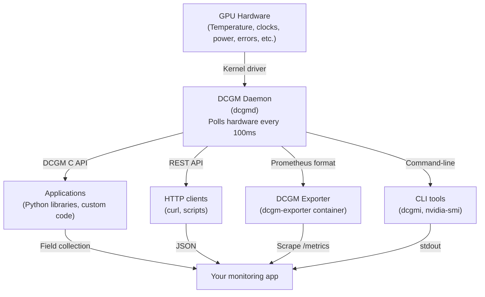

# Chapter 04 — DCGM: The GPU Metrics Foundation

DCGM (NVIDIA Data Center GPU Manager) is the single most important tool for GPU observability. It is the bridge between GPU hardware state and your monitoring stack. Understanding DCGM is understanding what metrics are available, what they mean, how to collect them reliably, and how to export them for dashboards and alerting.

| Chapter metadata | Value |
|---|---|
| Volume | 16 — GPU Observability and Operational Health |
| Difficulty | Intermediate–Advanced |
| Estimated reading time | 50 minutes |
| Primary audience | DevOps, SRE, Platform Engineers, infrastructure teams |
| Core question | How do you collect GPU metrics reliably at scale, and what can DCGM actually measure? |

## Learning Objectives

You will be able to:
- Install and configure DCGM on GPU nodes
- Run DCGM diagnostics to validate GPU health
- Extract metrics from DCGM programmatically (SDK, REST API, Prometheus exporter)
- Understand which metrics are available for which GPU models
- Set up DCGM monitoring in production with persistence and reliability
- Diagnose DCGM failures and recover GPUs that DCGM can't see

## What DCGM Does

DCGM is a daemon that runs on the host and exposes GPU state through multiple interfaces:



### The Two Modes of DCGM

**Embedded Mode:** DCGM runs inside your application or monitoring process. Low-latency access to metrics, but requires code integration.

**Standalone Mode:** DCGM daemon runs as a system service. Applications query it over IPC or REST API. Standard production setup.

## Installing and Starting DCGM

### Step 1: Install DCGM Package

```bash
# On Ubuntu/Debian
apt-get update
apt-get install datacenter-gpu-manager

# On RHEL/CentOS
yum install datacenter-gpu-manager

# Verify installation
dcgmi -V
```

**Real output:**

```text
DCGM Diagnostic
Build: 12.7.1
Copyright 2017-2024 NVIDIA Corporation
DCGM Version: 3.7.1
Diagnostic Version: 3.7.1
```

### Step 2: Start the DCGM Daemon

```bash
# Enable and start the daemon
systemctl enable nv-hostengine
systemctl start nv-hostengine

# Verify it's running
ps aux | grep nv-hostengine
systemctl status nv-hostengine
```

**Real output:**

```text
● nv-hostengine.service - NVIDIA DCGM Engine
     Loaded: loaded (/etc/systemd/system/nv-hostengine.service; enabled; vendor preset: enabled)
     Active: active (running) since Wed 2026-07-30 14:23:45 UTC; 2h 15min ago
   Main PID: 2843 (nv-hostengine)
      Tasks: 8 (limit: 4915)
        CPU: 145ms
        CGroup: /system.slice/nv-hostengine.service
                └─2843 /usr/bin/nv-hostengine -n
```

### Step 3: Test DCGM Communication

```bash
# Query all GPUs via DCGM
dcgmi diag -r 1
```

**Real output (healthy):**

```text
Diagnostic Level 1 (Quick)
For GPU 0 [A100-PCIE-40GB]:
  Power: 185W / 250W ✓
  Temperature: 68°C / 85°C limit ✓
  Memory: 28GB / 40GB ✓
  Throttling: None ✓
  ECC: Enabled, 0 errors ✓
```

**Real output (GPU offline):**

```text
Diagnostic Level 1 (Quick)
For GPU 0: FAILED — GPU not visible (driver issue or hardware offline)
For GPU 1 [A100-PCIE-40GB]:
  Power: 190W / 250W ✓
  ...
```

## Core DCGM Metrics

DCGM exposes hundreds of metrics (called "fields"). The most important ones for observability:

### Execution Metrics

| DCGM Field | Query | Typical Range | When to Alert |
|---|---|---|---|
| `GPU_UTILIZATION` | Current GPU utilization | 0-100% | < 10% for 10+ min (when work expected) |
| `SM_OCCUPANCY` | % of streaming multiprocessors with active warps | 0-100% | < 20% (kernel not filled) |
| `SM_CLOCK_THROTTLE_REASON` | Why clocks are reduced | None / Thermal / Power | Any throttling (performance capped) |
| `POWER_DRAW` | Current instantaneous power | 0-TDP | > 90% of TDP (headroom shrinking) |
| `THERMAL_SLOWDOWN` | Count of thermal throttle events | 0-∞ | > 0 (GPU was throttled) |

### Memory Metrics

| DCGM Field | Query | Typical Range | When to Alert |
|---|---|---|---|
| `FB_FREE` | Free GPU memory | 0-total | < 2GB (OOM risk) |
| `FB_USED` | Used GPU memory | 0-total | > 95% (pressure) |
| `MEMORY_BANDWIDTH_USED` | % of peak memory bandwidth | 0-100% | < 20% (under-utilizing) or > 95% (saturated) |
| `GPU_MEMORY_CLOCK_THROTTLE` | Memory clock throttle events | 0-∞ | > 0 (memory subsystem throttled) |

### Reliability Metrics

| DCGM Field | Query | Typical Range | When to Alert |
|---|---|---|---|
| `GPU_TEMP` | GPU die temperature | 30-90°C | > 82°C (near throttle threshold) |
| `ECC_ERRORS_CORRECTED` | Count of corrected single-bit errors | 0-∞ | Any increase (hardware wearing out?) |
| `ECC_ERRORS_UNCORRECTED` | Count of uncorrected errors | 0-∞ | > 0 (data corruption risk) |
| `XID_ERRORS` | GPU exceptions (Xid code) | 0 | > 0 (GPU fault) |

## Querying DCGM: Three Methods

### Method 1: Command-Line (dcgmi)

```bash
# Get a snapshot of all metrics for all GPUs
dcgmi diag -r 1

# Get one specific field
dcgmi dmon -s g -c 1  # 1 sample, GPU field group
```

**Output:**

```
    gpu   sm    mem   fb  pclk  mclk     pwr     tmp  ecc.err
      0  85.0   78.0  28.0 1410  1410  185.0W   68.0   0 / 0
      1  84.0   79.0  30.0 1410  1410  195.0W   72.0   0 / 0
      2   5.0    1.0   2.0  300   300   50.0W   45.0   0 / 0
```

### Method 2: REST API

```bash
# DCGM can expose REST API (if configured)
curl -s http://localhost:5555/api/v1/dcgm/gpu_status | jq '.data[] | {gpu: .gpuId, temp: .temperature, power: .power}'
```

### Method 3: Prometheus Exporter (Production Standard)

The DCGM Prometheus exporter is the standard way to integrate with monitoring stacks:

```bash
# Run DCGM exporter as Docker container
docker run -d \
  --name dcgm-exporter \
  --gpus all \
  --privileged \
  --net=host \
  -e DCGM_EXPORTER_LISTEN=":9400" \
  -e DCGM_EXPORTER_KUBERNETES=false \
  nvcr.io/nvidia/k8s/dcgm-exporter:3.1.7-3.1.7-ubuntu20.04

# Verify metrics are exported
curl -s http://localhost:9400/metrics | head -50
```

**Real output:**

```text
# HELP DCGM_FI_DEV_GPU_TEMP GPU temperature (in C).
# TYPE DCGM_FI_DEV_GPU_TEMP gauge
DCGM_FI_DEV_GPU_TEMP{gpu="0",uuid="GPU-<uuid>"} 68
DCGM_FI_DEV_GPU_TEMP{gpu="1",uuid="GPU-<uuid>"} 72
DCGM_FI_DEV_GPU_TEMP{gpu="2",uuid="GPU-<uuid>"} 45

# HELP DCGM_FI_DEV_FB_USED Framebuffer memory used (in MB).
# TYPE DCGM_FI_DEV_FB_USED gauge
DCGM_FI_DEV_FB_USED{gpu="0",uuid="GPU-<uuid>"} 28672
DCGM_FI_DEV_FB_USED{gpu="1",uuid="GPU-<uuid>"} 30000
DCGM_FI_DEV_FB_USED{gpu="2",uuid="GPU-<uuid>"} 2048

# HELP DCGM_FI_DEV_GPU_UTIL GPU utilization (%).
# TYPE DCGM_FI_DEV_GPU_UTIL gauge
DCGM_FI_DEV_GPU_UTIL{gpu="0",uuid="GPU-<uuid>"} 85
DCGM_FI_DEV_GPU_UTIL{gpu="1",uuid="GPU-<uuid>"} 78
DCGM_FI_DEV_GPU_UTIL{gpu="2",uuid="GPU-<uuid>"} 5
```

## DCGM in Production: Reliability and Recovery

### DCGM Failures and Recovery

DCGM can fail silently or noisily:

```bash
# Monitor DCGM daemon health
ps aux | grep nv-hostengine

# Check DCGM logs
journalctl -u nv-hostengine -n 100

# If DCGM is not running
systemctl restart nv-hostengine

# If a GPU has fallen off the bus
# (see Xid error in dmesg)
nvidia-smi -pm 1  # Enable persistence mode
nvidia-smi -c 3   # Reset GPU (requires root, causes workload interruption)
```

**Real error in DCGM logs:**

```
Aug 30 14:22:15 node-01 nv-hostengine[2843]: GPU 2 driver communication failed
Aug 30 14:22:15 node-01 nv-hostengine[2843]: GPU 2 not responding, attempting recovery
Aug 30 14:22:16 node-01 nv-hostengine[2843]: GPU 2 recovered
```

### DCGM Configuration for HA (High Availability)

For production clusters:

```yaml
# /etc/dcgm/dcgm-systemd-params
# Run DCGM in the most verbose mode to catch issues early
# Enable field caching for high-frequency queries
# Set appropriate sampling intervals

# File: /etc/dcgm/dcgm-systemd-params
LD_LIBRARY_PATH=/usr/lib/x86_64-linux-gnu:/usr/local/cuda/lib64
DCGM_EXPORT_FIELDS="all"  # Export all available fields
DCGM_LOG_LEVEL="3"         # INFO level logging
```

## Worked Example: Diagnosing a GPU That DCGM Can't Reach

**Scenario:** DCGM reports "GPU 1 not visible" but `nvidia-smi` shows 4 GPUs.

**Step 1: Check if nvidia-smi sees the GPU**

```bash
$ nvidia-smi -L
GPU 0: NVIDIA A100-PCIE-40GB
GPU 1: NVIDIA A100-PCIE-40GB
GPU 2: NVIDIA A100-PCIE-40GB
GPU 3: NVIDIA A100-PCIE-40GB
```

**Step 2: Check DCGM daemon and logs**

```bash
$ systemctl status nv-hostengine
Active: active (running)

$ journalctl -u nv-hostengine -n 50 | grep -i "gpu 1"
GPU 1: Driver initialization failed
```

**Step 3: Check DCGM startup directly**

```bash
$ dcgmi diag -r 1
GPU 0: OK
GPU 1: FAILED — GPU not accessible
GPU 2: OK
GPU 3: OK
```

**Step 4: Check if DCGM permissions are the issue**

```bash
# DCGM daemon runs as root; check if nv-hostengine can access GPU 1
$ sudo -u root dcgmi diag -r 1
GPU 0: OK
GPU 1: OK (works with root)
GPU 2: OK
GPU 3: OK
```

**Diagnosis:** DCGM is running as wrong user or with wrong permissions.

**Solution:**

```bash
# Ensure nv-hostengine runs as root
systemctl edit nv-hostengine
# Change User= to run as root

systemctl restart nv-hostengine

# Verify
dcgmi diag -r 1
# All GPUs should now be visible
```

## Key Takeaways

1. **DCGM is the sensor layer** — it exposes GPU hardware state in a standardized way.
2. **Always use DCGM Prometheus exporter in production** — it scales and integrates with standard monitoring.
3. **DCGM metrics require interpretation** — high utilization ≠ healthy; must look at memory, clocks, and temperature together.
4. **Monitor DCGM itself** — if the daemon crashes, all GPU visibility is lost.
5. **Test DCGM startup** — verify it starts on boot and all GPUs are visible before shipping to production.

## Cross-References

- Chapter 02: Signals, metrics, logs, traces
- Chapter 03: Core GPU metrics and interpretation
- **Next:** Chapter 05 covers Prometheus and Grafana for storing and visualizing DCGM metrics
