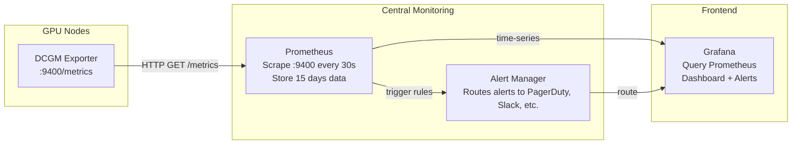
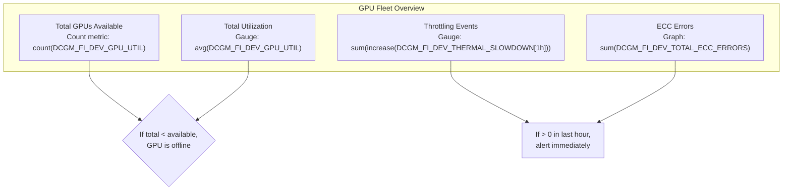

# Chapter 05 — Prometheus, Grafana, and Observability Dashboards

DCGM collects metrics. Prometheus stores them. Grafana makes them visible and actionable. This chapter walks through the full pipeline: configuring Prometheus to scrape GPU metrics, building Grafana dashboards that decode metrics into decisions, and setting alert thresholds that catch real problems without false positives.

| Chapter metadata | Value |
|---|---|
| Volume | 16 — GPU Observability and Operational Health |
| Difficulty | Intermediate |
| Estimated reading time | 45 minutes |
| Primary audience | DevOps, SRE, Platform Engineers |
| Core question | How do you turn raw DCGM metrics into dashboards that tell you "the GPU is healthy" or "something is wrong"? |

## Learning Objectives

You will be able to:
- Configure Prometheus to scrape DCGM metrics from multiple nodes
- Build Grafana dashboards that show GPU health at a glance
- Write Prometheus alert rules that catch real problems (not false positives)
- Correlate metrics on dashboards to diagnose failures
- Set up SLO-based alerting for GPU clusters

## The Prometheus + DCGM Pipeline



## Configuring Prometheus for GPU Metrics

### Step 1: Add DCGM Scrape Config

Create `/etc/prometheus/prometheus.yml`:

```yaml
global:
  scrape_interval: 30s
  scrape_timeout: 10s
  evaluation_interval: 30s

scrape_configs:
  - job_name: 'dcgm'
    static_configs:
      - targets: ['localhost:9400']
        labels:
          node: 'gpu-node-01'
          cluster: 'production'
  
  - job_name: 'dcgm-multi-node'
    static_configs:
      - targets:
          - 'gpu-node-01:9400'
          - 'gpu-node-02:9400'
          - 'gpu-node-03:9400'
          - 'gpu-node-04:9400'
        labels:
          cluster: 'production'
```

### Step 2: Verify Metrics Are Flowing

```bash
# Restart Prometheus
systemctl restart prometheus

# Query Prometheus (usually http://localhost:9090)
# In the Prometheus UI, search for: DCGM_FI_DEV_GPU_UTIL
# Should show time-series data points for each GPU on each node
```

**Real query result:**

```text
DCGM_FI_DEV_GPU_UTIL{gpu="0", node="gpu-node-01", uuid="GPU-xxxx"}  = 85
DCGM_FI_DEV_GPU_UTIL{gpu="1", node="gpu-node-01", uuid="GPU-yyyy"}  = 78
DCGM_FI_DEV_GPU_UTIL{gpu="0", node="gpu-node-02", uuid="GPU-zzzz"}  = 5
```

## Building Effective GPU Dashboards in Grafana

### Dashboard 1: GPU Fleet Health (Cluster-Level)

Panels to include:



**Panel 1: Active GPUs**

```
Query: count(DCGM_FI_DEV_GPU_UTIL > 0)
Type: Stat
Alert: < (total expected)
```

**Panel 2: Average Utilization (Gauges per Node)**

```
Query: avg by (node) (DCGM_FI_DEV_GPU_UTIL)
Type: Gauge (0-100%)
Color: Green (> 70%), Yellow (40-70%), Red (< 40%)
Alert: < 20% for 30 min
```

**Panel 3: Temperature Distribution**

```
Query: DCGM_FI_DEV_GPU_TEMP
Type: Graph (line)
Alert: > 82°C
Annotation: Thermal limit at 85°C (red line)
```

**Panel 4: Throttle Events (Last 1 Hour)**

```
Query: sum(rate(DCGM_FI_DEV_THERMAL_SLOWDOWN[1h]))
Type: Stat (count)
Alert: > 0 (any throttle event)
Color: Red if > 0
```

### Dashboard 2: Individual GPU Deep Dive (Per-GPU)

When you see a problem, drill into a single GPU:

```bash
# Dashboard variables (Grafana template variables)
- ${node}      # Dropdown of all nodes
- ${gpu_id}    # Dropdown of GPUs on that node
```

**Panels:**

| Panel | Metric | Interpretation |
|---|---|---|
| Utilization | `DCGM_FI_DEV_GPU_UTIL` | 0-100%, trending |
| Memory Used | `DCGM_FI_DEV_FB_USED` | In MB, alert if > 95% total |
| Memory Bandwidth | `DCGM_FI_DEV_MEMORY_BANDWIDTH_USED` | % of peak, shows compute vs memory bound |
| Temperature | `DCGM_FI_DEV_GPU_TEMP` | °C, alert if > 82°C |
| Clocks (Graphics) | `DCGM_FI_DEV_SM_CLOCK` | MHz, should be stable at peak |
| Power Draw | `DCGM_FI_DEV_POWER_USAGE` | Watts, alert if > 90% TDP |
| ECC Errors | `DCGM_FI_DEV_TOTAL_ECC_ERRORS` | Count, any increase is concerning |

**Grafana JSON (simplified):**

```json
{
  "dashboard": {
    "title": "GPU Detail: ${node} GPU ${gpu_id}",
    "panels": [
      {
        "title": "GPU Utilization",
        "targets": [
          {
            "expr": "DCGM_FI_DEV_GPU_UTIL{node=\"${node}\", gpu=\"${gpu_id}\"}"
          }
        ],
        "yaxes": [{"min": 0, "max": 100, "format": "percent"}]
      },
      {
        "title": "Temperature vs Throttle Threshold",
        "targets": [
          {"expr": "DCGM_FI_DEV_GPU_TEMP{node=\"${node}\", gpu=\"${gpu_id}\"}"},
          {"expr": "85"}  # Constant line for thermal limit
        ],
        "yaxes": [{"min": 30, "max": 90, "format": "celsius"}]
      }
    ]
  }
}
```

## Alert Rules for GPUs

Create `/etc/prometheus/alerts-gpu.yml`:

```yaml
groups:
  - name: gpu_health
    interval: 30s
    rules:
      # GPU Offline
      - alert: GPUOffline
        expr: |
          count by (node, gpu) (DCGM_FI_DEV_GPU_UTIL) == 0
        for: 5m
        annotations:
          summary: "GPU {{ $labels.gpu }} on {{ $labels.node }} is offline"
          description: "No metrics from GPU {{ $labels.gpu }} for 5 minutes"
      
      # Thermal Throttling
      - alert: GPUThermalThrottle
        expr: |
          increase(DCGM_FI_DEV_THERMAL_SLOWDOWN[1h]) > 0
        for: 1m
        annotations:
          summary: "GPU {{ $labels.gpu }} on {{ $labels.node }} is thermally throttled"
          description: "Thermal throttling detected; GPU performance is capped"
      
      # Memory Pressure
      - alert: GPUMemoryPressure
        expr: |
          (DCGM_FI_DEV_FB_USED / DCGM_FI_DEV_FB_FREE) > 0.95
        for: 10m
        annotations:
          summary: "GPU {{ $labels.gpu }} on {{ $labels.node }} is at 95% memory"
          description: "GPU memory usage is {{ $value | humanizePercentage }}; OOM risk"
      
      # Data Starvation (Utilization Oscillation)
      - alert: GPUDataStarvation
        expr: |
          (max_over_time(DCGM_FI_DEV_GPU_UTIL[5m]) > 80) AND
          (min_over_time(DCGM_FI_DEV_GPU_UTIL[5m]) < 20)
        for: 5m
        annotations:
          summary: "GPU {{ $labels.gpu }} on {{ $labels.node }} shows data starvation pattern"
          description: "Utilization is oscillating (80%->20%->80%...); data pipeline is starving GPU"
      
      # ECC Error Spike
      - alert: GPUECCErrorSpike
        expr: |
          increase(DCGM_FI_DEV_TOTAL_ECC_ERRORS[1h]) > 100
        for: 1m
        annotations:
          summary: "GPU {{ $labels.gpu }} on {{ $labels.node }} has ECC error spike"
          description: "{{ $value }} ECC errors in the last hour; GPU hardware may be failing"
```

**Deploy alerts:**

```bash
# Update prometheus config to include alert rules
echo 'rule_files:
  - "alerts-gpu.yml"' >> /etc/prometheus/prometheus.yml

systemctl reload prometheus

# Verify alerts are loaded
curl -s http://localhost:9090/api/v1/rules | jq '.data.groups[] | select(.name=="gpu_health")'
```

## Real Dashboard Screenshots (Scenarios)

### Scenario 1: Healthy GPU Cluster

```
Dashboard: GPU Fleet Health
├─ Total GPUs: 16 (all available)
├─ Avg Utilization: 82% (green)
├─ Max Temperature: 72°C (well below 85°C limit)
├─ Throttle Events: 0 (none in last hour)
└─ ECC Errors: 0 (none ever)

Conclusion: ✓ All healthy
```

### Scenario 2: One GPU Idle (Possible Problem)

```
Dashboard: GPU Fleet Health
├─ Total GPUs: 16 (expected 16)
├─ Avg Utilization: 84% (looks fine because average)
├─ But GPU 2 on gpu-node-01: 3% utilization (anomaly!)
├─ GPU 2 memory: 2GB / 40GB (very low)
├─ GPU 2 clocks: 300 MHz (idle clocks)

Drill-down: GPU Detail gpu-node-01 GPU 2
├─ Kernel: No work queued
├─ Process: No CUDA work
├─ CPU: CPU 0 (core for GPU 2) is idle
└─ Conclusion: Work not scheduled to GPU 2; check scheduler

Action: Check cluster scheduler (Kubernetes, job queue) — why isn't work being distributed to GPU 2?
```

### Scenario 3: Data Starvation (Classic Problem)

```
Dashboard: GPU Fleet Health
├─ Total GPUs: 4
├─ Avg Utilization: 45% (low!)
├─ Oscillating pattern every 5 seconds:
│  ├─ 00:00 — 90% utilization (GPU processing queued work)
│  ├─ 00:05 — 5% utilization (queue empty, GPU waiting)
│  ├─ 00:10 — 90% utilization (new batch arrives)
│  └─ (repeat)

Conclusion: GPU is starved for data
Next: Check data loader, prefetch threads, dataset locality
```

## Key Takeaways

1. **Prometheus scrapes DCGM metrics every 30s** — store for weeks/months for trending.
2. **Build dashboards with context, not just raw metrics** — show utilization + memory + temperature together.
3. **Alerts should prevent fires, not announce them** — alert on throttling, not on absolute temperature.
4. **Template your dashboards** — one "GPU Detail" dashboard for all nodes/GPUs, not 16 separate dashboards.
5. **Correlate metrics** — utilization + memory + clocks together tell the story that any single metric hides.

## Cross-References

- Chapter 04: DCGM and metrics foundation
- **Next:** Chapter 06 covers distributed observability for multi-GPU and multi-node systems
