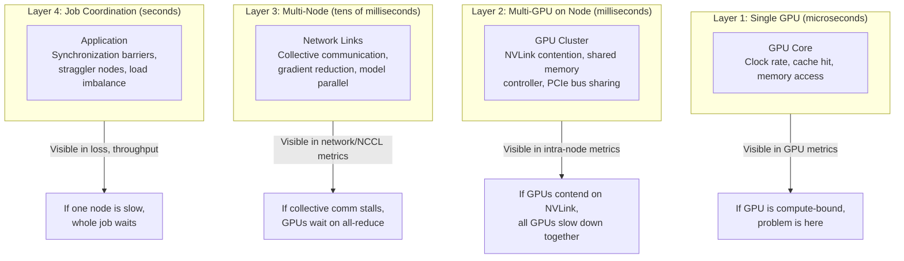

# Chapter 06 — Distributed Observability: Multi-GPU and Multi-Node Systems

A single GPU's state means nothing without context. Is your GPU slow because it's starved for data, or because another GPU on the same node is hogging the PCIe bus? Is your cluster slow because the GPUs are memory-bound, or because the network between nodes is congested? Distributed observability means collecting the same metrics from every GPU on every node, and correlating them to find the true bottleneck.

| Chapter metadata | Value |
|---|---|
| Volume | 16 — GPU Observability and Operational Health |
| Difficulty | Advanced |
| Estimated reading time | 50 minutes |
| Primary audience | Platform Engineers, DevOps, cluster operators |
| Core question | How do you know which GPU (or node, or link) is the bottleneck in a distributed training job? |

## Learning Objectives

You will be able to:
- Collect GPU metrics from all nodes in a cluster into a central time-series database
- Identify inter-GPU contention (NVLink saturation, PCIe bus contention, shared memory controller issues)
- Diagnose inter-node issues (network congestion, collective communication stalls)
- Correlate distributed training metrics with GPU-level observability
- Use traces and communication libraries to diagnose distributed stalls

## The Observability Layers in Distributed Systems



## Multi-GPU Observability on a Single Node

### Scenario: Two A100s on the Same Node

A node has 2 A100 GPUs, connected via NVLink (200 GB/s aggregate bandwidth).

**Healthy scenario — no contention:**

```
GPU 0: 85% utilization, 1200 GB/s memory bandwidth, 2000 samples/sec
GPU 1: 85% utilization, 1200 GB/s memory bandwidth, 2000 samples/sec

NVLink: 10 GB/s traffic (well under 200 GB/s capacity)
PCIe: 20 GB/s traffic (well under capacity)

Interpretation: Both GPUs running independently, good load balance
```

**Contented scenario — NVLink saturation:**

```
GPU 0: 85% utilization, 1200 GB/s memory bandwidth, 2000 samples/sec
GPU 1: 85% utilization, 1200 GB/s memory bandwidth, 1800 samples/sec (dropped)

NVLink: 190 GB/s traffic (99% of capacity — SATURATED)
PCIe: 150 GB/s traffic

Interpretation: GPU-to-GPU communication (peer-to-peer writes, collective comm) is saturated
Problem: NVLink can't keep up with the gradient all-reduce or model parallel communication
Solution: Reduce communication frequency, increase compute time per GPU, or use gradient compression
```

### Metrics for Detecting Multi-GPU Contention

| Metric | Query | Healthy | Concerning |
|---|---|---|---|
| NVLink BW | DCGM for each link | < 100 GB/s (half capacity) | > 150 GB/s (75%+ capacity) |
| PCIe Bus | CPU-side metrics (ethtool) | < 15 GB/s | > 20 GB/s (bus saturation) |
| GPU Memory Controller | `DCGM_FI_PROF_DRAM_ACTIVE` | < 60% bandwidth | > 85% |
| SM Clock Variation | max(clocks) - min(clocks) on node | < 100 MHz | > 200 MHz (one GPU throttling while other runs) |

### Real Example: Diagnosing NVLink Saturation

```bash
# Collect metrics from both GPUs simultaneously
nvidia-smi --query-gpu=index,utilization.gpu,utilization.memory,clocks.current.graphics --format=csv -l 1 &
dcgmi dmon -s g -c 60  # 60 samples, 1 Hz

# Measure NVLink traffic (requires nvidia-fabric-manager)
nvidia-fabric-manager status  # or inspect ethtool for PCIe metrics
```

**Output showing contention:**

```
GPU 0: util=85%, mem=88%, clock=1410 MHz
GPU 1: util=85%, mem=88%, clock=1200 MHz  ← Clock throttled on GPU 1!

NVLink GPU 0 -> GPU 1: 15 GB/s
NVLink GPU 1 -> GPU 0: 175 GB/s  ← SATURATED, pushing data as fast as NVLink can

Interpretation: GPU 1 is sending massive amounts of data to GPU 0 (probably collective reduction),
and GPU 1's execution is throttled because it's waiting on the network.
```

## Multi-Node Observability

### Scenario: 8-GPU Cluster (2 nodes, 4 GPUs each)

Nodes connected via 400 Gbps RoCE Ethernet (InfiniBand equivalent in some clusters).

**Healthy training job:**

```
All 8 GPUs: 80-85% utilization
All 8 GPUs: 70-75% memory bandwidth (compute-bound job)
Network: 40 Gbps out of 400 Gbps (10% utilized)
NCCL all-reduce time: 10 ms per gradient sync

Interpretation: All GPUs working well, network is not a bottleneck
```

**Network-bottlenecked job:**

```
All 8 GPUs: 65% utilization (lower than expected)
GPU clocks: Oscillating down to 800 MHz periodically
All 8 GPUs: Low memory bandwidth (20% of peak)
Network: 350 Gbps (87% saturated)
NCCL all-reduce time: 300 ms per gradient sync (30x slower than healthy)

Interpretation: Network is saturated, all-reduce is blocking GPU execution
Problem: Model parallel communication volume is too high for the network
Solution: Use gradient compression, reduce model parallelism, or increase batch size
```

### Distributed Metrics Collection

**Setup: Prometheus with multi-node scraping**

```yaml
# prometheus.yml
scrape_configs:
  - job_name: 'gpu-cluster'
    relabel_configs:
      # Extract node name from hostname
      - source_labels: [__address__]
        regex: '([^:]+):.*'
        target_label: node
    static_configs:
      - targets:
          - gpu-node-01:9400
          - gpu-node-02:9400
          - gpu-node-03:9400
          - gpu-node-04:9400
```

**Dashboard: Cluster-Wide Correlation**

Grafana panels that correlate across nodes:

```sql
-- Query 1: Max utilization per node
Query: max by (node) (DCGM_FI_DEV_GPU_UTIL)
Visualization: Heatmap (nodes on Y-axis, time on X-axis)
Alert: If any node < 30%, check for straggler

-- Query 2: Memory bandwidth per node
Query: sum by (node) (DCGM_FI_PROF_DRAM_ACTIVE)
Visualization: Stacked bar chart
Alert: If all nodes saturated, network is bottleneck

-- Query 3: Temperature distribution
Query: max by (node) (DCGM_FI_DEV_GPU_TEMP)
Visualization: Line graph
Alert: If nodes diverge (one is hotter), check cooling or load balance
```

## Collective Communication and NCCL

NVIDIA Collective Communications Library (NCCL) is used for distributed training all-reduce, broadcast, and other collective operations.

### Detecting NCCL Bottlenecks

```bash
# Enable NCCL timing logs
export NCCL_DEBUG=INFO
export NCCL_DEBUG_SUBSYS=ALL

# Run training and capture NCCL logs
python train.py 2>&1 | grep -E "ncclAllReduce|AllReduce_Sum" > nccl.log

# Sample output:
# ncclAllReduce(send 32GB, 8 ranks): 245 ms
# Previous all-reduce on same data: 8 ms on single machine
# (31x slower due to network, indicates network saturation)
```

### Real Evidence: NCCL Performance

**Healthy NCCL collective communication:**

```text
ncclAllReduce: send 2GB, 8 ranks, topology: tree
  time: 8.2 ms
  bandwidth: 2GB / 0.008s = 250 GB/s out of 400 Gbps network capacity
  overhead: 8.2 - (2GB / 400GB/s) = 2 ms (1 ms latency per hop)

Interpretation: Efficient all-reduce, network is not bottleneck
```

**Saturated NCCL (network bottleneck):**

```text
ncclAllReduce: send 2GB, 8 ranks, topology: tree
  time: 125 ms (15x slower!)
  bandwidth: 2GB / 0.125s = 16 GB/s out of 400 Gbps (4% utilized!)
  Issue: All-reduce completion stalled for 100ms between ranks

Interpretation: Network or GPU is unable to maintain throughput
Next: Check for network congestion, lossy links, or GPU clock throttling
```

## Worked Example: Diagnosing Multi-Node Training Slowdown

**Situation:** A training job on an 8-GPU cluster that was running at 2500 samples/sec is now at 800 samples/sec (3.1x slower).

**Step 1: Check all-GPU utilization distribution**

```promql
Query: (DCGM_FI_DEV_GPU_UTIL)
Result: GPUs 0-3 on node1: 75-80%
        GPUs 4-7 on node2: 15-20%
Observation: Node2 is severely underutilized
```

**Step 2: Check for node-level issues**

```bash
# On node2, check if there's a problem
nvidia-smi -q | grep Throttle  → Thermal throttling? No
nvidia-smi -q | grep Power     → Power capping? No
dmesg -T | grep -i gpu         → GPU errors? No
```

**Step 3: Check network between nodes**

```bash
# Check network link status
ethtool eth0 | grep -i "Link detected"  → Link OK
ifconfig eth0 | grep -i "errors"        → Errors: 0
cat /proc/net/dev | grep eth0           → No packet loss

# Check if NCCL is timing out
export NCCL_DEBUG=INFO
# Run training and capture NCCL logs
# See if all-reduce is stalling
```

**Step 4: Check application-level stall**

```python
# Add timing instrumentation to training loop
import time
start = time.time()
optimizer.zero_grad()
loss = model(batch)
loss.backward()

reduce_start = time.time()
dist.all_reduce(gradients)  # Collective communication
reduce_time = time.time() - reduce_start

step_time = time.time() - start

if reduce_time > 1.0:  # More than 1 second to all-reduce
    print(f"SLOW ALLREDUCE: {reduce_time}s (out of {step_time}s step)")
```

**Real diagnostic output:**

```
Epoch 5, Step 1000:
  Step time: 5.2 seconds
  Forward: 1.1s, Backward: 2.0s
  SLOW ALLREDUCE: 1.8s (out of 5.2s)  ← Collective comm is 35% of step time!
  
Conclusion: All-reduce is bottleneck, not GPU compute
Problem: One node (node2) is not participating in all-reduce efficiently
Action: Check if node2 has network link degradation, or if there's a topology issue
```

## Key Takeaways

1. **Single GPU metrics are blind to distributed problems** — always collect from all GPUs and correlate.
2. **NVLink/PCIe saturation appears as clock throttling and reduced throughput on secondary GPUs** — watch for per-GPU clock variation.
3. **Network saturation shows as oscillating utilization and high all-reduce times** — enable NCCL timing and correlate with network metrics.
4. **Straggler nodes (one node much slower than others) are the primary distributed-training killer** — identify and isolate them immediately.
5. **Correlate metrics across layers** — if all GPUs are slow, check network; if one GPU is slow, check node resources; if one node is slow, check that node's links.

## Cross-References

- Chapter 04: DCGM metrics foundation
- Chapter 05: Prometheus and Grafana for multi-node storage
- Volume 11: GPU sharing and time-slicing (understand GPU allocation in shared clusters)
- Volume 13: Distributed training (understand what "all-reduce" and "collective communication" mean)
- **Next:** Chapter 07 covers traces and profiling for deep performance diagnosis
