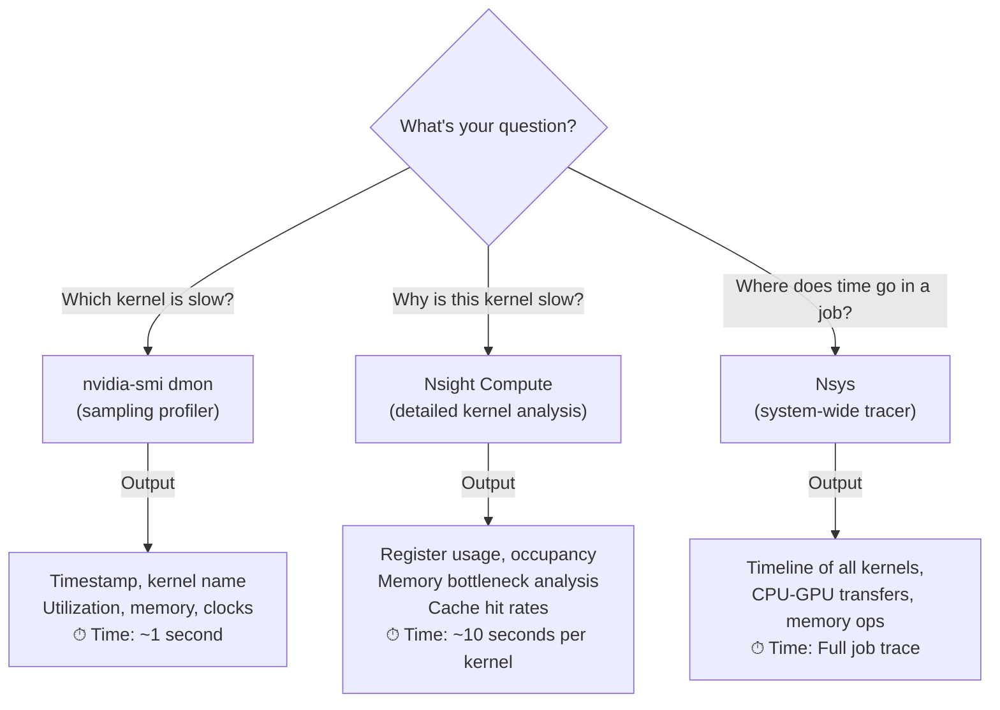

# Chapter 07 — Traces, Profiling, and Deep Performance Diagnosis

Metrics tell you the steady-state: "utilization is 85%." Traces tell you the story: "kernel A ran for 5 ms, was memory-bound, blocked on cache miss, then kernel B ran for 2 ms." When something is slow, traces are your best tool for understanding causality. This chapter walks through profiling tools, interpreting their output, and using traces to optimize GPU workloads.

| Chapter metadata | Value |
|---|---|
| Volume | 16 — GPU Observability and Operational Health |
| Difficulty | Advanced |
| Estimated reading time | 55 minutes |
| Primary audience | Performance engineers, ML engineers, DevOps architects |
| Core question | Why is this specific kernel slow, and what is actually blocking progress? |

## Learning Objectives

You will be able to:
- Use `nvidia-smi` profiling mode to capture GPU execution traces
- Interpret Nsight Compute and Nsys output to identify bottlenecks
- Measure kernel-level metrics (occupancy, memory efficiency, register pressure)
- Identify the difference between compute-bound, memory-bound, and instruction-bound kernels
- Use profiling to diagnose and fix performance regressions

## Three Profiling Tools and When to Use Them



## Method 1: nvidia-smi Profiling (Quick Orientation)

`nvidia-smi` can profile GPU execution if you enable persistence mode:

```bash
# Enable persistence mode (GPUs don't clock down between jobs)
nvidia-smi -pm 1

# Run your job with monitoring
nvidia-smi dmon -s pucvmet -c 600  # Monitor for 600 seconds
# p: Power, u: GPU Util, c: clocks, v: video encode, m: memory util, e: ECC, t: Temp
```

**Real output during training:**

```text
    gpu   pwr  gpu  mem   enc   dec  mclk  pclk   fb    bar1  sbecc dbecc  temp
      0  210W   88%  85%    0%    0%  1410  1410   28G    0M     0     0  75C
      1  200W   85%  80%    0%    0%  1410  1410   27G    0M     0     0  74C
      2  205W   87%  82%    0%    0%  1410  1410   29G    0M     0     0  76C
      3  198W   84%  78%    0%    0%  1410  1410   26G    0M     0     0  73C
```

**Interpretation:**
- All GPUs at 84-88% utilization → balanced load
- All GPUs at 78-85% memory utilization → significant data movement
- Clocks steady at 1410 MHz → no throttling
- **Verdict:** All GPUs are working hard and balanced; not a GPU problem at this level

## Method 2: Nsight Compute (Detailed Kernel Analysis)

For deep analysis of a single kernel:

```bash
# Run a single iteration with Nsight Compute profiling
ncu --set full --export profile.ncu-rep python train.py --num-steps 1

# or profile an already-compiled CUDA binary
ncu profile.ncu --set full mycuda_app input.dat
```

**Real Nsight Compute report output (simplified):**

```text
Kernel: matmul_kernel_fp32
GPU: A100-PCIE-40GB

Performance Metrics:
  Utilization: 85%
  SM Occupancy: 78% (active warps / max warps per SM)
  Memory Bandwidth: 1200 GB/s / 1500 GB/s peak (80%)
  
Roofline Model:
  FLOPs: 1.4 TFLOP/s achieved
  Peak compute: 2.4 TFLOP/s (A100 FP32)
  Achieved / Peak: 58% (underutilizing compute)
  
Memory Subsystem:
  L1 Cache Hit Rate: 45%
  L2 Cache Hit Rate: 78%
  Register Pressure: High (255 regs/thread, spilling to local memory)
  
Bottleneck Analysis:
  Primary Limiter: Memory dependency chain (60%)
  Secondary Limiter: Instruction issue rate (25%)
  Other: 15%
  
Recommendation: Kernel is memory-bandwidth limited. Increase data reuse via shared memory.
```

**Interpretation:**

| Metric | Value | Meaning |
|---|---|---|
| SM Occupancy 78% | Good | Most of the hardware is occupied; scheduling is efficient |
| Memory BW 80% | Saturated | Using 80% of peak memory throughput |
| L1 Hit Rate 45% | Low | Many accesses missing L1, going to L2/HBM |
| Register Pressure High | 255 regs | High register count per thread; trades off occupancy for speed |
| Memory dependency 60% | Dominant | GPU is waiting for memory, not compute |

**The Fix:** Increase data reuse in shared memory to reduce L1 misses, or use tensor operations (NCCL, cuBLAS) that have higher arithmetic intensity.

### Real Example: Comparing Two Kernels

**Kernel A (original):**

```text
Achieved Throughput: 800 samples/sec
Nsight Compute:
  Memory BW: 400 GB/s (27% of peak)
  L1 Hit: 10% (poor)
  Occupancy: 60% (suboptimal)
  
Verdict: Very inefficient; GPU has lots of idle capacity
```

**Kernel B (optimized with shared memory):**

```text
Achieved Throughput: 2200 samples/sec (2.75x faster!)
Nsight Compute:
  Memory BW: 1200 GB/s (80% of peak)
  L1 Hit: 85% (excellent)
  Occupancy: 85% (good)
  
Verdict: Efficient; GPU is well-utilized and memory is being reused
```

**What changed:** Kernel B loads data into shared memory once, reuses it 16x locally before going back to HBM. This dramatically increased L1 hits and reduced off-chip memory traffic.

## Method 3: Nsys (System-Wide Tracing)

For understanding the full picture of a training job:

```bash
# Trace a full training step
nsys profile -t cuda,cudnn,cublas,nccl \
  --gpu-metrics-device all \
  --output timeline \
  python train.py --num-steps 100

# Generate timeline report
nsys export --type timeline timeline.nsys-rep
```

**Real Nsys timeline output (simplified):**

```text
Time (ms)  Duration (ms)  Event                           GPU    Details
0          5.2           Forward pass (data load)          0-3    CUDA kernels loading training batch
5.2        50.0          cuDNN convolution                 0-3    Batch norm, conv, activation
55.2       25.0          Loss computation                  0-3    Cross entropy loss kernel
80.2       100.0         Backward pass                     0-3    Gradient computation
180.2      150.0         All-reduce (NCCL)                0-7    Gradient synchronization across 8 GPUs
330.2      10.0          Optimizer step                    0-3    Parameter update

Total step time: 340 ms
Critical path: Backward (100 ms) + All-reduce (150 ms) + Optimizer (10 ms) = 260 ms
```

**Interpretation:**

| Phase | Duration | % of step | Bottleneck? |
|---|---|---|---|
| Forward | 55 ms | 16% | No (fast) |
| Backward | 100 ms | 29% | Maybe (significant) |
| All-reduce | 150 ms | 44% | **YES** (nearly half the step!) |
| Optimizer | 10 ms | 3% | No |

**Finding:** All-reduce is the bottleneck, consuming 44% of step time. With 8 GPUs, gradient synchronization across the network is the limiting factor.

**Solutions:**
1. Reduce communication frequency: accumulate gradients over N steps, then sync
2. Use gradient compression: reduce data volume in all-reduce
3. Overlap communication: start all-reduce before backward is complete

## Interpreting Memory-Bound vs. Compute-Bound

### Memory-Bound Kernel

```text
Nsight Compute Report:
  Achieved FLOPs: 500 GFLOP/s (out of 2400 GFLOP/s possible)
  Memory BW: 1200 GB/s (out of 1500 GB/s peak)
  SM Occupancy: 75%
  
Q: Why only 20% compute utilization when SM occupancy is 75%?
A: The kernel is waiting on memory. Cores are sitting idle for 80% of their cycle time.

Fix: Reuse data in caches, fuse operations, or use lower precision (FP16 needs less memory BW)
```

### Compute-Bound Kernel

```text
Nsight Compute Report:
  Achieved FLOPs: 2200 GFLOP/s (out of 2400 GFLOP/s peak)
  Memory BW: 200 GB/s (out of 1500 GB/s peak)
  SM Occupancy: 65%
  
Q: Why only 13% memory utilization when cores are at 92% utilization?
A: The kernel is compute-bound. GPUs are fully occupied doing math, not waiting on data.

Fix: Increase parallelism, vectorize operations, or split the computation differently
```

### Instruction-Bound Kernel

```text
Nsight Compute Report:
  Achieved FLOPs: 100 GFLOP/s
  Memory BW: 50 GB/s
  SM Occupancy: 20%
  Issue Rate: Low (not enough instructions in flight)
  
Q: Both memory and compute are low utilization?
A: Kernel is instruction-bound; not enough parallelism per thread.

Fix: Increase block size, increase grid size, or increase work per thread
```

## Profiling Workflows

### Workflow 1: Identifying Regressions

```bash
# Baseline: profile the reference version
git checkout main
nsys profile --output baseline.nsys-rep python train.py --num-steps 10
nsys export --type timeline baseline.nsys-rep > baseline.txt

# Current: profile your changes
git checkout feature/my-optimization
nsys profile --output current.nsys-rep python train.py --num-steps 10
nsys export --type timeline current.nsys-rep > current.txt

# Compare
diff baseline.txt current.txt
# Look for:
# - Change in kernel execution time
# - Change in all-reduce time
# - New kernels appearing or old ones disappearing
# - Clocks throttling differently
```

**Real regression detection:**

```text
Baseline:
  Forward: 50 ms
  Backward: 100 ms
  All-reduce: 150 ms
  Total: 300 ms

Current (after optimization):
  Forward: 50 ms
  Backward: 85 ms ← Improved!
  All-reduce: 180 ms ← REGRESSION! (was 150 ms)
  Total: 315 ms (overall slower!)

Verdict: Backward optimization worked but increased communication volume in all-reduce.
Next: Investigate what backward change affects all-reduce; optimize communication separately.
```

### Workflow 2: Profiling Under Load

```bash
# Profile a representative training job with multiple steps
nsys profile -t cuda,cudnn,cublas,nccl \
  --gpu-metrics-device all \
  --sample=cpu \
  --output job_profile.nsys-rep \
  python train.py --num-steps 100 --batch-size 256 2>&1 | tee train.log

# Look for patterns in the timeline
# - Do all-reduces get longer over time?
# - Do GPUs get hotter and clock down over time?
# - Is there a consistent pattern or random variation?
```

## Key Takeaways

1. **`nvidia-smi dmon` is for quick orientation** — see utilization, memory, clocks in real time; identifies obvious problems (one GPU idle, thermal throttling).
2. **Nsight Compute is for kernel-level diagnosis** — understand why a specific kernel is slow (memory-bound vs. compute-bound, register pressure, cache misses).
3. **Nsys is for understanding job-level behavior** — see where time is spent across kernels, CPU-GPU transfers, and collective communication.
4. **Memory-bandwidth-limited kernels need data reuse, not more parallelism** — optimize for cache hits and reduce off-chip memory traffic.
5. **Compare baselines, not absolutes** — what matters is "is this regression from my changes" or "is this improvement from the optimization."

## Cross-References

- Chapter 03: Core GPU metrics and interpretation (understand what "memory-bound" means)
- Chapter 04: DCGM and metrics (understanding steady-state performance)
- Volume 06: CUDA kernels and optimization (implementing the fixes traces suggest)
- **Next:** Chapter 08 covers production troubleshooting and common failure modes
