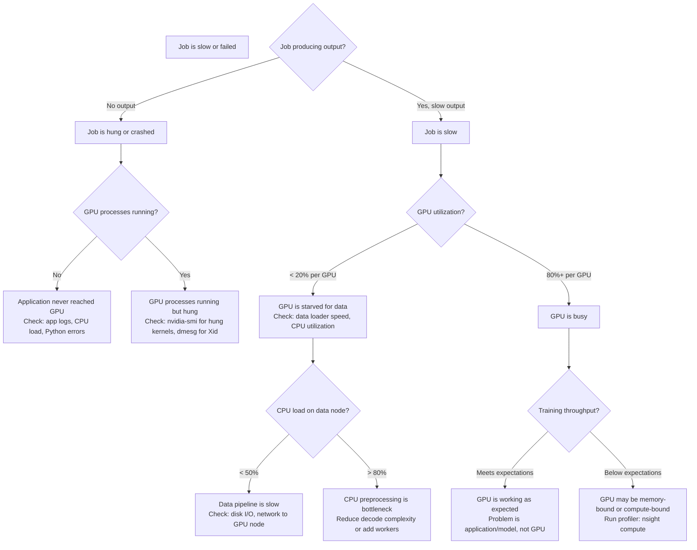
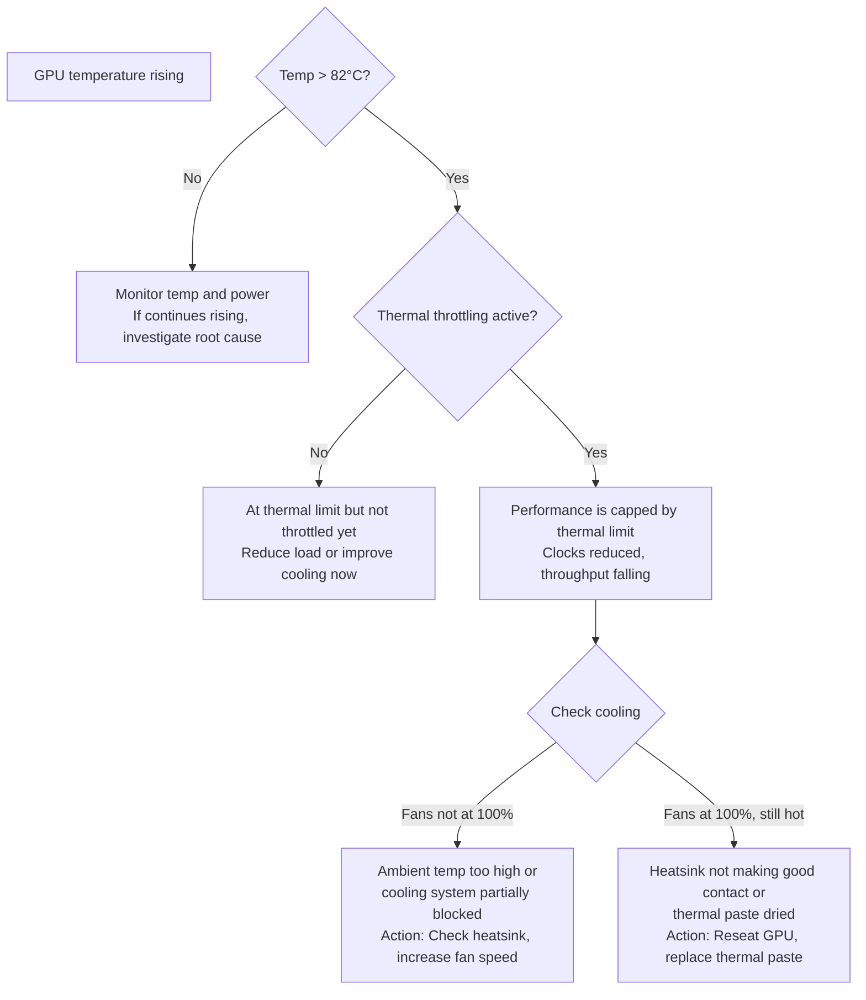
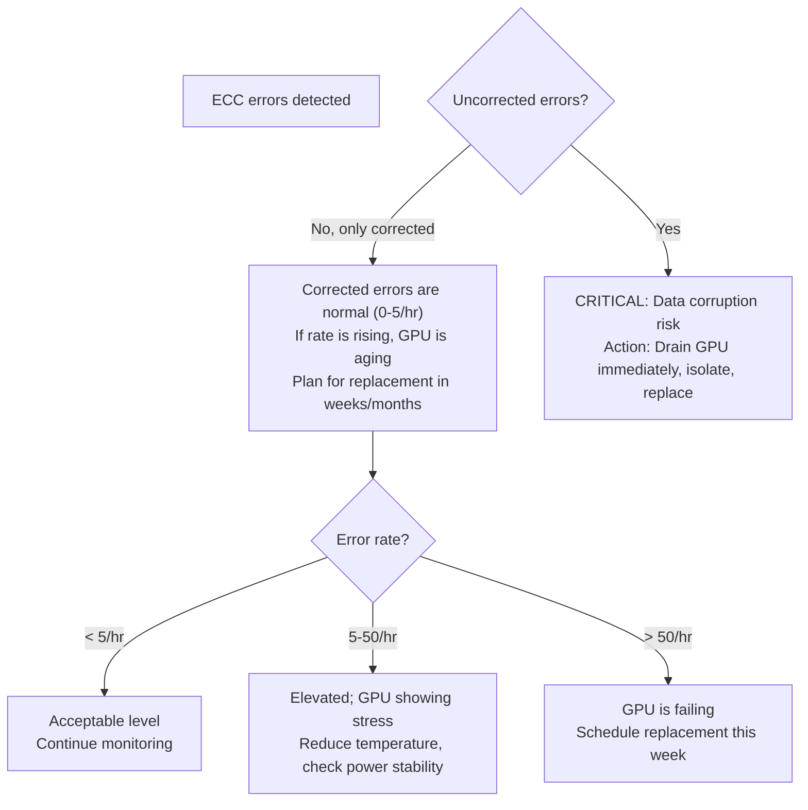
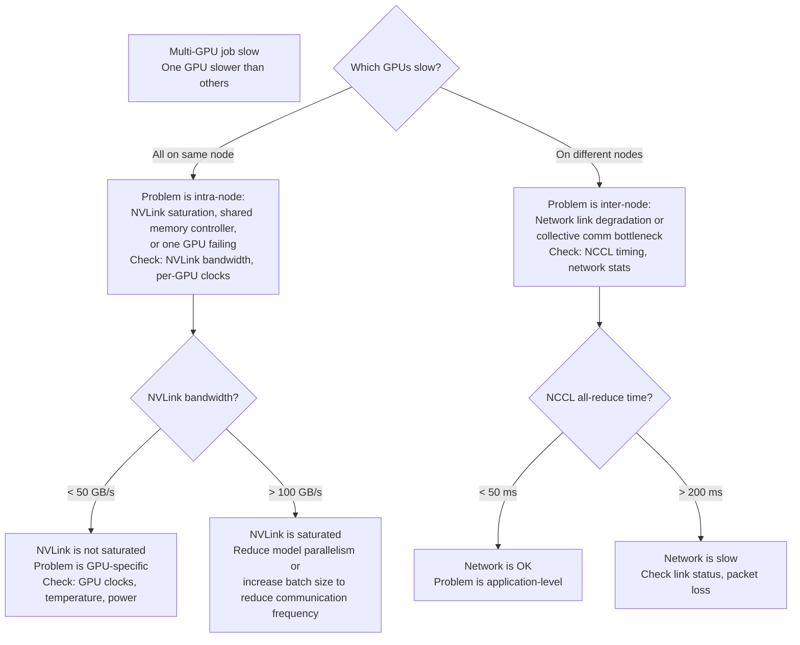

# Chapter 10 — Production Troubleshooting Frameworks

Production failures demand speed. This chapter distills troubleshooting into decision trees: given a symptom, follow the tree to root cause without wasting time on false hypotheses.

| Chapter metadata | Value |
|---|---|
| Volume | 16 — GPU Observability and Operational Health |
| Difficulty | Advanced |
| Estimated reading time | 45 minutes |
| Primary audience | On-call engineers, SRE, incident responders |
| Core question | Given "the training job is slow," what's the fastest path to root cause? |

## Learning Objectives

You will be able to:
- Apply decision trees to GPU problems
- Distinguish GPU problems from data pipeline, network, or application problems
- Perform root cause analysis under time pressure
- Know which commands to run first (highest signal)
- Recognize anti-patterns that waste time

## Framework 1: GPU Job Slow/Failed



**How to use this tree:**

1. **Start at the root** with your observation: "job is slow"
2. **Answer each question** with a command
3. **Follow the branch** to root cause
4. **Stop at the leaf** and apply the fix

### Real Example: Slow Training Job

**Observation:** Training throughput dropped from 2500 samples/sec to 600 samples/sec overnight.

**Step 1: Is job producing output?**
```bash
$ tail -f training.log
[Step 1000] loss=2.34, throughput=600 samples/sec
[Step 1001] loss=2.35, throughput=598 samples/sec
```
→ Yes, producing output (but slow) — go to "Slow" branch

**Step 2: GPU utilization?**
```bash
$ nvidia-smi -l 1 | grep -E "GPU|Util" | head -10
GPU 0: Utilization: 42%
GPU 1: Utilization: 38%
GPU 2: Utilization: 40%
GPU 3: Utilization: 39%
```
→ All GPUs < 50% utilization — go to "Starvation" branch

**Step 3: CPU load on data node?**
```bash
$ top -n 1 | grep -E "us|sy|id" | head -1
%Cpu(s):  5.2 us, 2.1 sy, 92.7 id
```
→ CPU is idle (id = 92.7%) — data pipeline is not CPU-bound; go to "Data Pipeline" branch

**Step 4: Diagnose data pipeline**
```bash
# Check data loader performance
python -c "
from data_loader import DataLoader
dl = DataLoader(batch_size=256)
import time
start = time.time()
for batch in dl:
    elapsed = time.time() - start
    throughput = len(batch) / elapsed
    print(f'Batch throughput: {throughput} samples/sec')
    break
"
# Output: 150 samples/sec (very slow!)
```

**Root cause found:** Data loader is only achieving 150 samples/sec, but job needs 2500/4 = 625 samples/sec per GPU. Data pipeline is the bottleneck.

**Solution:** Investigate data source (disk I/O to storage, network to remote cache, etc.)

## Framework 2: GPU Temperature Rising



## Framework 3: ECC Errors Appearing



## Framework 4: Multi-GPU Job Stall (One GPU Slow)



## Key Commands in Order of Frequency

Run these in order; stop when you find the problem:

```bash
# 1. What's the job state right now?
nvidia-smi -l 1

# 2. Are processes running?
ps aux | grep python | grep -v grep

# 3. GPU metrics trend (last 5 min)?
dcgmi dmon -s pucvmet -c 300  # 300 samples at 1Hz = 5 minutes

# 4. Recent errors in kernel?
dmesg -T | tail -20

# 5. DCGM daemon alive?
systemctl status nv-hostengine

# 6. Specific job diagnostics?
strace -p <pid>  # See what process is blocked on
perf record -F 99 -p <pid> -g -- sleep 30  # CPU profile if available
```

## Anti-Patterns (Slow Paths)

Don't do these; they waste time:

| Anti-Pattern | Why It's Wrong | Right Approach |
|---|---|---|
| Start with Nsys/Nsight | Takes 1-10 minutes to run; slow when you need answer now | Start with `nvidia-smi dmon` and framework above |
| Check logs before metrics | Logs are event-based; you might miss transient issues | Check metrics first (continuous), then logs for context |
| Assume single root cause | Failures cascade; fixing one symptom might reveal another | Fix most urgent symptom first, then re-diagnose |
| Rely on `nvidia-smi` snapshot | One reading is noise; need trend | Run `nvidia-smi dmon` for sustained observation |
| Ignore application logs | GPU metrics alone can't tell you if the job is correct | Always check app logs in parallel with GPU metrics |

## Key Takeaways

1. **Use the decision trees** — they encode expert patterns; following them beats free-form guessing.
2. **Answer each question with a command** — don't assume; verify with evidence.
3. **Stop at the first leaf** — don't keep digging after you've found root cause.
4. **Time matters in production** — fast partial diagnosis beats slow perfect diagnosis.
5. **Correlate GPU metrics with application logs** — GPU is just one part of the system.

## Cross-References

- Chapter 08: Common GPU failure modes
- Chapter 09: Health checks and SLOs
- **Next:** Chapter 11 covers observability for inference workloads
