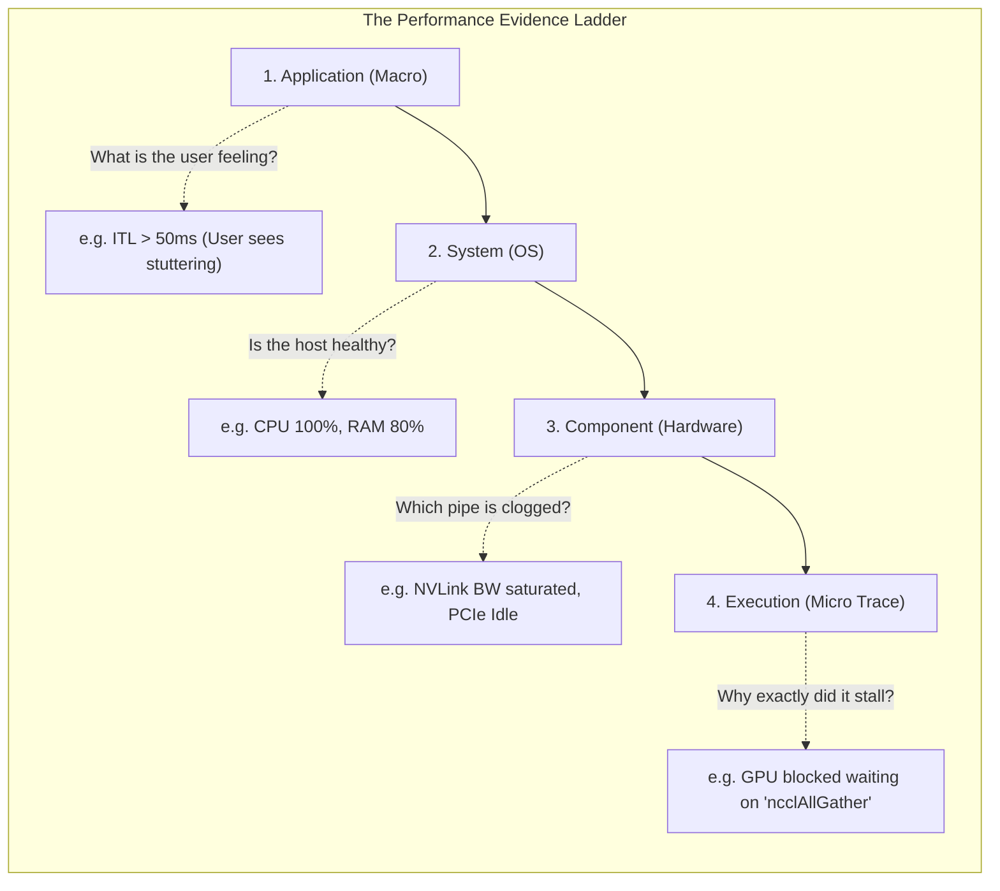

# Chapter 1 — Performance Engineering Fundamentals

| Chapter metadata | Value |
|---|---|
| Volume | 17 — Performance Engineering & Optimization |
| Difficulty | Foundation |
| Estimated reading time | 30 minutes |
| Primary audience | DevOps, SRE, Platform Engineers |
| Core question | How do you know whether an AI workload is actually performing well, and what specific mathematical evidence proves it? |

## Introduction

"The GPU is fast." 

To a Senior Architect, this statement is completely meaningless. Fast at what? Inference or Training? Are you measuring Time-to-First-Token (TTFT), Model Flops Utilization (MFU), or generic `nvidia-smi` utilization? 

Performance engineering is not about blindly applying configurations until a number goes up. It is a rigorous, scientific discipline. It begins with defining a strict mathematical baseline, formulating a hypothesis, and measuring the exact impact of a single variable change. If you optimize an AI cluster without establishing an Evidence Ladder first, you will invariably optimize the wrong component, wasting millions of dollars in compute time.

## Beginner's Primer: The Iron Triangle of AI

If you are new to Performance Engineering, you must first unlearn how you think about speed. In traditional software, "fast" just means low latency. In AI, "fast" is a constant tug-of-war between three forces:

1. **Latency:** How fast does a single user get an answer? (Example: 100ms Time-to-First-Token).
2. **Throughput:** How many total words can the server output per second across all users? (Example: 5,000 tokens/sec).
3. **Utilization:** How busy is the physical GPU hardware? (Example: 80% Tensor Core Activity).

**The Trap:** You cannot maximize all three at the same time. 
If you want perfect latency for User A, you give them a dedicated GPU. But now your Throughput and Utilization are terrible, and you are wasting $30,000. 
If you want perfect Utilization, you force 100 users to wait in a queue for 5 seconds so you can send all 100 requests to the GPU in one massive batch. Throughput and Utilization are amazing, but Latency is terrible, and the users all quit your app.

A Performance Engineer's job is not to make the GPU "fast." Their job is to find the exact mathematical balancing point in the Iron Triangle that satisfies the business SLA while minimizing hardware costs.

## 1. Measurement Precedes Optimization

The golden rule of performance engineering is: **Never optimize what you have not accurately measured.**

If an inference API is slow, junior engineers will immediately assume the GPU is the bottleneck and attempt to quantize the model to INT8. If the actual bottleneck was the Python JSON serialization parsing the incoming request, quantizing the model will result in zero speedup, but will introduce precision degradation and regression bugs.

**The Scientific Method of SRE:**
1.  **Define the Metric:** What exactly constitutes "good"? (e.g., P99 Latency < 100ms).
2.  **Establish the Baseline:** Run a reproducible load test against the current architecture. Record the results.
3.  **Identify the Bottleneck:** Use profiling tools to find the single slowest component.
4.  **Hypothesize & Execute:** Apply one specific optimization to address the bottleneck.
5.  **Verify:** Rerun the exact same load test. Did the metric improve? Did a different metric degrade?

## 2. Throughput, Latency, and Utilization (The Iron Triangle)

You cannot optimize all metrics simultaneously. Optimizing one metric almost always degrades another. You must choose what the business requires.

*   **Throughput:** The total volume of work completed over time (e.g., Requests Per Second, Tokens Per Second). 
    *   *To optimize:* Increase batch sizes. 
    *   *The trade-off:* Massive batch sizes force requests to sit in queues, destroying latency.
*   **Latency:** The time it takes to complete a single unit of work (e.g., Time-To-First-Token).
    *   *To optimize:* Set batch size to 1.
    *   *The trade-off:* Processing requests sequentially leaves 99% of the GPU compute cores idle, destroying throughput and wasting hardware ROI.
*   **Utilization:** The percentage of physical hardware capacity actively doing math. 
    *   *To optimize:* Keep the queues full.

*Architectural Mandate:* For training, you optimize exclusively for Throughput (MFU). For inference, you must balance Latency (to meet user SLAs) against Throughput (to keep the business profitable).

## 3. The Evidence Ladder

When diagnosing a performance issue, you must climb the Evidence Ladder. You do not start by looking at C++ CUDA kernel traces. You start at the macro level and drill down.

1.  **Application Level:** What is the end-user experiencing? (API Latency, Job completion time).
2.  **System Level (Macro):** What is the host server doing? (CPU `iowait`, network dropped packets, generic GPU utilization).
3.  **Component Level (Micro):** What is the specific sub-component doing? (PCIe bandwidth, NVLink bandwidth, NVMe IOPS).
4.  **Execution Level (Trace):** What is the exact sequence of events at the microsecond level? (Nsight Systems timelines).

## Customer Scenario (Senior Level)

**The Situation:**
A data science team requests 10 additional H100 GPUs for a new recommendation engine. The CFO asks the platform team if the current 10 GPUs are fully utilized. The platform team runs `nvidia-smi` and reports that GPU utilization is consistently at 85%. They approve the purchase request for $300,000 in new hardware.

**The Senior Architect Response:**
"The purchase request must be halted immediately. The platform team has committed a fundamental error in performance measurement by confusing active time with productive execution.

As we established in Volume 16, `nvidia-smi` utilization simply indicates that *a* kernel is active on the GPU. It does not prove that the massive parallel compute capabilities of the H100 are actually being used. 

We must climb the **Evidence Ladder**. 
We will bypass `nvidia-smi` and pull the deep hardware metrics using DCGM. We will specifically query the **Streaming Multiprocessor (SM) Activity** and **Tensor Core Activity**. 

It is highly probable that while the GPU is technically 'active' 85% of the time, it is executing poorly written, un-batched Python code. The actual Tensor Core utilization might be below 5%. The GPUs are not bottlenecked by a lack of hardware; they are bottlenecked by a lack of software batching. 

By implementing Triton Inference Server and enabling Dynamic Batching, we can group the incoming requests into massive matrices. This will push the Tensor Core utilization from 5% to 80%, instantly allowing the current 10 GPUs to handle 10x the throughput, completely eliminating the need to purchase $300,000 in new hardware."

## Interview Preparation

**Conceptual:** Why is increasing batch size generally detrimental to API latency? *(Hint: To build a large batch, the inference server must deliberately hold early requests in a queue while it waits for subsequent requests to arrive. This artificial queueing time directly adds to the end-to-end latency experienced by the user who submitted the first request).*

**Architecture:** Explain the "Evidence Ladder" in performance diagnosis. *(Hint: It is a structured approach to troubleshooting. You start with the macro, application-level symptoms (e.g., API timeouts). Then you check system-level metrics (e.g., CPU/RAM usage). Then you check component-level metrics (e.g., PCIe/NVLink bandwidth). Finally, you drop down to execution-level traces (e.g., Nsight Systems) to find the exact microsecond bottleneck. Skipping steps leads to false conclusions).*

## Architecture Summary

Performance engineering requires discarding vague subjective complaints ("the AI is slow") in favor of strict mathematical baselines. Engineers must navigate the "Iron Triangle" of Latency, Throughput, and Utilization, understanding that optimizing for one often degrades another. Diagnosis must follow an Evidence Ladder, progressing from high-level application metrics down to microsecond-level hardware traces.

