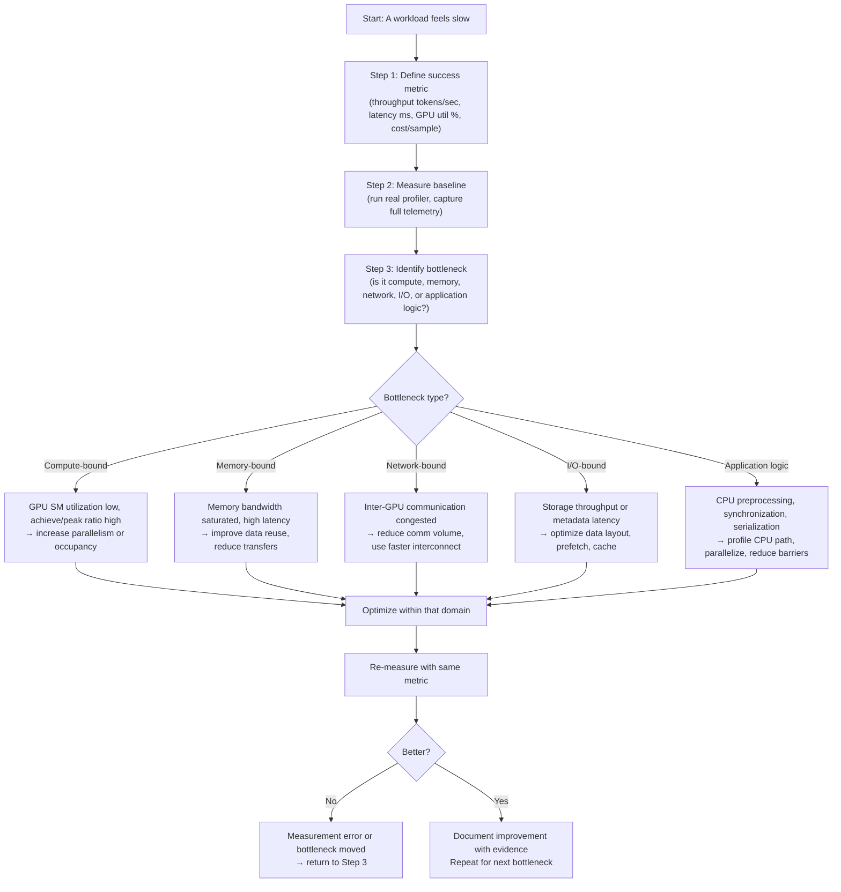

# Chapter 01 — Performance Engineering Fundamentals

| Chapter metadata | Value |
|---|---|
| Volume | 17 — Performance Engineering & Optimization |
| Difficulty | Foundation |
| Estimated reading time | 45 minutes |
| Primary audience | DevOps, SRE, Platform, Cloud and Infrastructure Engineers |
| Core question | How do you know whether an AI workload is actually performing well, and what evidence proves it? |

## Learning Objectives

After completing this chapter, you will be able to: distinguish performance measurement from performance optimization; identify the difference between throughput, latency, and utilization and why optimizing one can degrade another; read and interpret real profiling output from NVIDIA tools; build an evidence ladder for performance diagnosis; and explain why "fast GPU" is incomplete without asking "fast at what workload, measured how?"

## Big Picture

Performance engineering begins with measurement, not optimization. An engineer who assumes a workload is fast because a GPU shows 80% utilization without checking end-to-end throughput or latency will chase the wrong bottleneck. Performance work requires answering these questions in order:

1. What are you actually trying to optimize? (throughput? latency? cost? power?)
2. What does "good performance" look like in numbers, not adjectives?
3. How do you measure it without perturbing the workload?
4. What is actually the bottleneck right now — and how did you rule out the other five?



**Why this flow matters:** Skipping to optimization without measurement is the most common performance failure. A 20% GPU utilization increase that drops throughput by 50% is a step backward, not forward. Real measurement forces you to define "better" in terms that matter to users or business requirements.

## Deep Explanation

### Metrics: What You're Actually Optimizing For

AI workloads have conflicting performance metrics. Optimizing for one often degrades another:

| Metric | Measures | Why it matters | Common trap |
|---|---|---|---|
| Throughput | Items processed per unit time (samples/sec, tokens/sec, requests/sec) | Determines how many users/requests the system serves | High throughput at unacceptable latency loses interactive users |
| Latency | Time from request arrival to result (p50, p99, p100) | Determines user experience and interactivity | Optimizing p50 often makes p99 worse (tail latency matters more) |
| GPU utilization | Percentage of time GPU is executing work (not idle) | Indicates whether GPUs are working or wasted | 80% util can mean either "working hard" or "spinning inefficiently" |
| Memory bandwidth efficiency | Useful work per byte moved (FLOPS / bytes transferred) | Determines whether you're compute-bound or memory-bound | Can be high while absolute throughput is low if you're moving data slowly |
| Cost per task | Infrastructure cost to process one item | Determines business feasibility | Can be optimized by accepting latency, which loses users |

**Key insight:** A workload can show high GPU utilization (80%+) while being memory-bound, producing low throughput, and wasting money. You need multiple measurements, not one number.

### The Evidence Ladder: Measurement Depth

Building confidence in a performance claim requires evidence at multiple levels:

```
Level 1 (weakest):
  "GPU shows 80% utilization"
  └─ What does this prove? Only that some kernel was executing for 80% of the sampled window.
  └─ What doesn't it prove? Whether the kernel is doing useful work, or whether you're memory-starved.

Level 2:
  "GPU shows 80% util, throughput is 150 samples/sec"
  └─ Better. Now you have end-to-end performance.
  └─ Still weak: no baseline, no comparison, no evidence this is good or bad.

Level 3:
  "GPU shows 80% util, throughput 150 samples/sec, expected was 120 samples/sec (125% of target)"
  └─ Now you have a comparison to a defined target.
  └─ Still incomplete: doesn't explain where the 20% time loss is.

Level 4 (strong):
  "GPU shows 80% util, throughput 150 samples/sec (125% of target), 
   profiler shows 1200 GFLOPS achieved on 18000 GFLOPS peak (6.7% of peak),
   roofline shows memory bandwidth limit at 150 GFLOPS, actual at 1200 GFLOPS → compute-bound,
   blocking reason: low occupancy due to register pressure on 1024 threads/SM"
  └─ Now you have a mechanism: low occupancy → less parallelism → lower throughput.
  └─ This supports a specific optimization (reduce registers per thread, increase block size, etc.).
```

Real measurement in practice means using profilers that show the actual mechanism, not just aggregate numbers. The rest of this volume teaches those tools and techniques.

### Why "Fast GPU" Is Not A Performance Claim

A single sentence like "this GPU is fast" carries zero engineering value because it doesn't specify:

- **Fast at what?** Compute? Memory movement? A specific model? A specific precision?
- **Measured how?** Peak advertised performance? Real throughput on real data? Microbenchmark? Full end-to-end?
- **Compared to what?** CPU? An older GPU? The theoretical peak? Some business target?
- **Under what constraints?** Single precision or mixed? One model or many? Batch size 1 or 1024? Interconnect limited?

**Example of an evidence-based claim:**

> "An H100 GPU achieves 67 TFLOPS FP32 (CUDA core, dense) peak — not to be confused with its much higher Tensor Core numbers (~989 TFLOPS TF32 dense). Running a real transformer model at batch size 32 in FP32, we achieve 42 TFLOPS sustained (63% of peak), limited by HBM bandwidth at 3.35 TB/s. The model processes 256 tokens/second end-to-end, matching the 4x speedup we calculated from the roofline model for switching to a lower-precision (TF32 Tensor Core) execution path."

Notice what's in this claim:
- Specific hardware (H100)
- Specific workload (transformer, batch 32, precision specified)
- Both peak and real numbers
- Mechanism (bandwidth-limited, roofline model confirms it)
- End-to-end throughput
- Arithmetic check (4x improvement from roofline matches real speedup)

This is the level of specificity required for performance engineering claims in this volume.

## Production Troubleshooting

### Problem: "Our model is slow but nvidia-smi shows high GPU util"

This is one of the most common performance issues. High utilization is not proof of efficiency.

| Step | What to check | Real example | Interpretation |
|---|---|---|---|
| 1. Capture profiler data (not just nvidia-smi) | Run 100 iterations, capture Nsight Systems timeline for 10 iterations | Timeline shows continuous SM execution, but kernels have long memory stalls (indicated by green="computing" vs yellow="memory wait" colors) | GPU is executing kernels, but kernels are stalling on memory reads. Not truly parallel work. |
| 2. Calculate achieved FLOPS vs peak | `nvidia-smi -i 0 --query-gpu=compute_cap --format=csv` → compute 8.0 (H100), 67 TFLOPS FP32 peak. Profiler shows 15 TFLOPS sustained. | 15 / 67 = 22.4% of peak FLOPS | Severe underutilization of compute. This is the smoking gun. |
| 3. Check occupancy (active threads per SM) | Nsight Compute on representative kernel: Occupancy = 50% of max (e.g., 512 active threads per SM when max is 1024) | Register usage: 64 registers per thread × 512 threads = 32KB used, but SM has 99KB available → room to increase occupancy | Bottleneck: thread blocks too small, or synchronization barriers. Not memory pressure. |
| 4. Check memory BW utilization vs HBM saturation | `nvidia-smi dmon -s mu` during training: shows Memory Util 65%, but HBM BW is 1.5 TB/s of 2.0 TB/s available (75% of peak) | Profiler HBM latency histograms: p50=50ns, p99=400ns (normal); no memory stalls | Memory is reasonably utilized, not the bottleneck. |
| 5. Hypothesis check: is CPU starving the GPU? | Profile CPU thread during same test: `pidstat -u -p $PID 1 10` shows CPU thread at 85% utilization, I/O wait 0%, context switches normal | CPU is saturated, GPU is waiting for CPU to submit next kernel | Bottleneck: CPU preprocessing (tokenization, batching, model prep). GPU is idle part of the time. |
| **Verdict** | With evidence from steps 1-5: | Profiler + occupancy + memory BW + CPU profile paint a complete picture | **Root cause:** CPU bottleneck, not GPU inefficiency. Solution: offload preprocessing or increase batch size to reduce per-sample CPU overhead. Increasing GPU optimization won't help. |

**Key lesson:** A single "80% utilization" snapshot triggered wrong optimization (GPU kernel tuning) when the actual bottleneck was CPU-side preprocessing. This is why full profiler evidence is mandatory before any optimization attempt.

### Problem: "We optimized the kernel and throughput got worse"

| Signal | Root cause | Evidence |
|---|---|---|
| Kernel execution time down 20%, but end-to-end throughput down 5% | Another bottleneck shifted into place (CPU, network, I/O) | Profile full pipeline before/after: if GPU time improves but app latency doesn't, something else is now the limiter. Run full trace, not just kernel profile. |
| GPU utilization increased but model accuracy dropped | Precision loss or numerical instability from more aggressive optimization | Verify that test accuracy matches baseline. Numerical precision matters in ML; "faster" kernels using lower precision may fail validation. |
| Memory usage stayed the same but cache misses increased | Optimization traded memory footprint for cache efficiency poorly | Nsight Compute cache hit rates: if L1/L2 misses climbed while util went up, you traded parallelism for reuse that didn't pay off. |

## Interview Preparation

**Q: If a GPU shows 80% utilization during a training run, does that mean the GPU is being used efficiently?**

> A: No, and this is actually a common trap. 80% utilization only means a kernel was executing on the GPU for 80% of the sampled time window. It says nothing about whether that work is useful, whether the kernel is compute-bound or memory-bound, or whether throughput is good relative to peak. I'd want to see end-to-end throughput in samples/second, the roofline model showing whether we're compute- or memory-limited, and ideally Nsight Compute showing actual FLOPS achieved versus peak. High utilization can coexist with terrible throughput if the GPU is spinning on memory requests inefficiently. One number is never proof of efficiency.

**Q: Walk me through how you'd diagnose why a model inference is slow.**

> A: I'd start with measurement, not assumptions. First, define what "slow" means in numbers — are we measuring latency (milliseconds per request), throughput (requests per second), or something else? Second, measure the full pipeline: CPU preprocessing, GPU execution, result streaming back. I'd use a full profiler (Nsight Systems for timeline, Nsight Compute for kernel-level details) to capture where time is actually spent. Then I'd calculate the roofline model for that specific model and hardware: peak FLOPS, peak memory bandwidth, and the model's actual compute-to-memory ratio. If the model is memory-bound, optimizing compute kernels won't help — I'd focus on data reuse, precision reduction, or network optimization for distributed inference. If it's compute-bound, I'd look at occupancy, thread block size, and register pressure. The key is: profiler data → bottleneck identification → targeted optimization. Guessing which to optimize first is how teams waste months chasing the wrong path.

**Q: What does "memory-bound" mean and how would you prove it?**

> A: A kernel is memory-bound when the GPU is waiting on data from memory more often than it's doing useful compute. You prove it with the roofline model: calculate how many floating-point operations your kernel performs per byte of memory moved (the compute intensity), then compare it to the GPU's compute-to-memory-bandwidth ratio. An H100 SXM5 has 67 TFLOPS FP32 (CUDA core) peak and 3.35 TB/s HBM3 bandwidth. That ratio is 67/3.35 ≈ 20.0 FLOPS per byte. If your kernel has compute intensity less than ~20 FLOPS/byte, it's memory-bound — add one more memory access and you lose more throughput than you gain from the extra compute. Nsight Compute shows this directly: the profiler compares your kernel's "roofline efficiency" against the memory roof and compute roof. Real example: a matrix multiplication kernel with good compute intensity (200+ FLOPS/byte on H100) will be compute-bound, hitting the 67 TFLOPS ceiling. A convolution with poor data reuse (10 FLOPS/byte) will be memory-bound, limited by the 3.35 TB/s bandwidth, and running well under the compute ceiling regardless of how many cores are idle.

**Q: A colleague says "let's just make the batch size bigger to get better GPU utilization." What's your response?**

> A: That might help throughput, or it might not, and we need evidence. Bigger batches do often improve GPU utilization and reduce per-sample overhead. But they also increase memory pressure, which can increase latency unacceptably if we care about real-time inference, or can cause OOM failures if the model doesn't fit. We'd need to define what "better" means: if it's throughput (requests/sec), bigger batches might win. If it's latency (milliseconds per request), bigger batches usually lose, because the GPU queues more work and each request sits longer. And if we're model-serving in production with SLA targets, adding latency might be a step backward even if throughput improves. So the answer is: measure both throughput and latency before and after the change, and see whether we're hitting our actual business targets. GPU utilization is a clue, not a goal.

## Key Takeaways

1. **Measurement precedes optimization.** A profiler captures reality; intuition or a single metric can mislead.
2. **One number is never proof.** High GPU utilization coexists with terrible throughput. Throughput coexists with unacceptable latency. Use the evidence ladder: define target, measure baseline, identify bottleneck, optimize within that domain, re-measure.
3. **Different workloads have different bottlenecks.** Training often cares about throughput (samples/sec). Inference cares about latency (ms) and concurrency. Batch inference cares about cost per sample. Optimizing for the wrong metric sends you down the wrong path.
4. **Roofline model is your friend.** Peak FLOPS and peak memory bandwidth are the two ceilings. Any kernel is limited by one of them. Knowing which one means knowing what class of optimization to attempt.
5. **Real numbers and mechanisms matter in interviews.** "It's slow" is vague. "Roofline model shows memory-bound at 15 FLOPS/byte, achieved 20 TFLOPS vs 67 TFLOPS FP32 peak" is specific, measurable, and supports a clear fix.

## Cross References

- Volume 04 Chapter 1: GPU execution and memory mental model (foundational concepts)
- Chapter 02: Profiling fundamentals and tool landscape
- Chapter 03: GPU profiling with Nsight Compute and Nsight Systems
- Chapter 04: Roofline model and performance analysis
- Production Troubleshooting: Chapter 11
