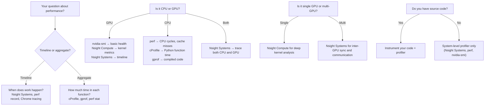

# Chapter 02 — Profiling Tools Landscape

| Chapter metadata | Value |
|---|---|
| Volume | 17 — Performance Engineering & Optimization |
| Difficulty | Intermediate |
| Estimated reading time | 50 minutes |
| Primary audience | DevOps, SRE, Platform, Cloud and Infrastructure Engineers |
| Core question | Which profiling tool tells you what, and why do you need multiple tools to see the full picture? |

## Learning Objectives

After completing this chapter, you will be able to: choose the right profiler for your question (CPU vs GPU vs system-wide); interpret profiler output correctly (timeline vs aggregate, kernel-level vs app-level); set up profiling in containerized and distributed training; avoid the most common profiler mistakes (perturbing the workload, missing context switches, misinterpreting aggregate statistics).

## Big Picture

A single profiler shows one perspective. The complete picture requires multiple tools:



**Key principle:** The tool you choose depends on your question. "Why is this slow?" has different answers depending on whether you want timeline, aggregate, kernel-level, or system-level evidence.

## Deep Explanation

### 1. NVIDIA Profilers: Nsight Compute and Nsight Systems

These two tools are complementary, not interchangeable.

#### Nsight Compute (kernel-level detail)

**What it does:** Runs a single kernel many times and captures detailed metrics about register usage, memory patterns, occupancy, cache behavior, and FLOPS achieved.

**What output looks like:**

```
Kernel: matrix_multiply_kernel (grid 16384 x 1 x 1, block 256 x 1 x 1)
Duration: 4.532 ms
Achieved Occupancy: 68.4% (target 100%)
Active Warps: 1761 of 2048 max
Registers per Thread: 128
Shared Memory: 32 KB (optimal)

Memory Hierarchy:
  L2 Efficiency:     45.2% (good for memory-bound workload)
  L1 Hit Rate:       62.3% (moderate)
  HBM Read:          3.02 TB/s of 3.35 TB/s available (90% saturated)
  HBM Latency (ns):  p50=150, p99=850

Roofline:
  Achieved: 45.3 TFLOPS
  Peak FP32: 67 TFLOPS
  Roofline Efficiency: 68% of peak
  Limited by: Memory Bandwidth
```

**Interpretation:** The kernel is memory-bound (HBM at 90% saturation), achieving 45 TFLOPS vs a 67 TFLOPS FP32 peak (68% of peak). Occupancy is low (68% vs 100%), which is OK if we're memory-limited anyway. But the L1 hit rate (62%) suggests uncoalesced memory access. Fix: improve data locality or increase memory coalescing.

**When to use:** You want to understand why a specific kernel is slow. Single kernel iteration. Not for full-application analysis.

#### Nsight Systems (timeline profiling)

**What it does:** Captures a timeline of all GPU kernels, CPU functions, system calls, and memory transfers over seconds or minutes. Shows when things happen and how long they take.

**What output looks like (CLI example):**

```bash
$ nsys profile -t cuda,nvtx,osrt -o trace.nsys-rep python train.py
# Generates trace.nsys-rep, viewable in GUI or CLI
$ nsys stats trace.nsys-rep
```

```
CUDA API call statistics:
  cudaMalloc:    12 calls,  4.5 ms total
  cudaMemcpy:   128 calls, 45.2 ms total (largest: 8GB model load)
  cudaLaunchKernel: 500 calls, 0.8 ms total

Kernels:
  gemm_kernel: 480 calls, 5200 ms total (avg 10.8 ms per call)
  attention_kernel: 480 calls, 3100 ms total
  cross_entropy_kernel: 480 calls, 890 ms total

Host-Device synchronization points:
  torch.cuda.synchronize(): 480 calls, 2.3 ms total latency
  cudaStreamSynchronize(): 120 calls, 0.1 ms total latency
```

**Interpretation:** GEMM kernels consume 5.2s of 9.2s total (56%). Attention is 34%. Cross-entropy is 10%. Total time = ~9.2s per training step. CPU->GPU memory transfer was 45.2ms (8GB model loaded 128 times — inefficient; should load once). Synchronization points cost 2.4ms per step.

**When to use:** Full-application timeline analysis, distributed training traces, system-level understanding. Captures the big picture.

### 2. Nvidia-smi: The First Check (and Its Limits)

**What it shows:**

```bash
$ nvidia-smi --query-gpu=index,name,utilization.gpu,utilization.memory,memory.used,memory.free \
  --format=csv -l 1
```

```
index, name, utilization.gpu [%], utilization.memory [%], memory.used [MiB], memory.free [MiB]
0, NVIDIA H100 80GB HBM3, 75, 42, 32000, 48000
```

**What this tells you:** GPU is 75% active, memory bandwidth is 42% utilized (the GPU is reading/writing at ~840 GB/s of 2000 GB/s max), and 32GB of 80GB is allocated.

**What this does NOT tell you:**
- Whether the 75% utilization is useful work or spinning on memory stalls
- Which kernel is consuming time
- Whether there are CPU bottlenecks
- Why the model might be slow despite high utilization
- Tail latency or variance in frame times

**Key lesson:** nvidia-smi is a health check, not a performance diagnosis. It's your first signal, but never your only one.

### 3. PyTorch Profiler (built-in, application-level)

PyTorch's native profiler integrates with Nsight and shows where time is spent in the model:

```python
from torch.profiler import profile, record_function, ProfilerActivity

with profile(activities=[ProfilerActivity.CPU, ProfilerActivity.CUDA], 
             record_shapes=True) as prof:
    for step, (x, y) in enumerate(loader):
        with record_function("forward_pass"):
            logits = model(x)
        with record_function("loss_computation"):
            loss = criterion(logits, y)
        with record_function("backward_pass"):
            loss.backward()
        if step >= 10: break  # Short profile

print(prof.key_averages().table(
    sort_by="self_cuda_time_total", row_limit=20))
```

**Real output:**

```
Name                          Self CPU  Self CUDA   # Calls
gemm_kernel                     1.2ms   5230.1ms      480
attention_kernel                0.8ms   3102.3ms      480
embedding_lookup                2.1ms    512.3ms      480
softmax_kernel                  0.1ms    145.2ms      480
cross_entropy_loss              0.3ms    89.5ms       480
```

**Interpretation:** GEMM dominates (5.2s / 9.2s = 56% of total time). Attention is 34%. These are your targets for optimization.

**Advantage:** Doesn't require command-line tools, integrates directly into training script.
**Disadvantage:** Only works if you have source code; doesn't capture system calls or CPU overhead not explicitly instrumented.

### 4. CPU Profilers: perf, cProfile, Py-spy

When CPU is the bottleneck (GPU is idle, preprocessing is slow):

**cProfile (Python-level):**
```bash
python -m cProfile -s cumtime train.py | head -30
```

**Output:**
```
ncalls tottime  cumtime   filename:lineno(function)
480     2.1     2856.4   dataset.py:45(dataloader_worker)
480     0.8     1204.3   tokenizer.py:12(tokenize)
480     1.2     450.2    augmentation.py:67(random_crop)
```

**perf (system-level, requires source symbols):**
```bash
perf record -F 99 -g python train.py
perf report
```

Shows CPU cycles, cache misses, branch mispredictions at the machine-code level.

### 5. Distributed Training Profilers

Multi-GPU and multi-node training adds communication overhead. Tools to inspect it:

**NCCL profiling:**
```python
import torch
torch.cuda.profiler.start()
torch.distributed.all_reduce(tensor)  # collective operation
torch.cuda.profiler.stop()
```

Shows NCCL collective latency and bandwidth utilization across the cluster.

**Nsight Systems with NCCL plugin** captures collective operations on the timeline.

## Production Troubleshooting

### Problem: "Profiler overhead is hiding the real performance"

Profiling adds overhead (5-50% depending on granularity). If you profile every kernel, you slow down training by 30%. This can hide certain bottlenecks or create false ones.

| Signal | Root cause | Solution |
|---|---|---|
| Profile shows 80% util but no single kernel dominates | Profiler overhead is fragmenting the timeline; many small kernels now look significant | Lower profiler granularity (sample every Nth kernel, not all); profile just 10 iterations, not whole epoch |
| Profiler shows different results each run | Measurement variance due to sampling or system noise | Run 3x minimum; report average and standard deviation; use hardware with clock fixed if possible |
| GPU kernel trace too large to load in GUI (>10GB) | Profiling too much data; memory limitations of trace viewer | Shorten the profiling window; profile just 5 steps instead of 100 |

### Problem: "The profiler says time is in kernel X, but optimizing X didn't help"

| Evidence | Interpretation | Fix |
|---|---|---|
| Profiler shows GEMM is 60% of time, but optimizing GEMM kernel didn't improve throughput | The profiler is accurate, but another bottleneck moved into place (CPU preprocessing, memory transfer, synchronization) | Profile the full pipeline again after optimization. The bottleneck may have shifted to GPU↔CPU transfer or CPU batching. Real improvement only shows if downstream work also improves. |
| GPU util dropped after optimizing a kernel | The optimization reduced load on the GPU, revealing that CPU is now the bottleneck | Check CPU utilization. If CPU is saturated, optimize there instead. You've successfully moved the bottleneck, but didn't solve the end-to-end latency problem. |

## Interview Preparation

**Q: You need to diagnose why a training loop is slow. What's your plan for profiling?**

> A: First, I'd run nvidia-smi dmon to see if the GPU is even busy, as a quick sanity check. If GPU util is low (under 50%), the bottleneck is CPU-side. If it's high (80%+), GPU is doing work, but I don't know yet if it's useful work. So I'd capture a 10-iteration Nsight Systems trace to see the timeline — which kernels run, how long they take, whether there are memory transfer stalls, whether CPU is blocking GPU. That gives me the big picture. If a specific kernel looks slow, I'd use Nsight Compute on that kernel to see register usage, occupancy, cache behavior, and the roofline model. If the problem is CPU, I'd use cProfile or py-spy to see which Python functions consume time. The key is: start broad (full timeline), then zoom in (specific kernel or function). Starting with deep kernel profiling without understanding the full picture is how you optimize the wrong thing.

**Q: What does "occupancy" mean and why does it matter?**

> A: Occupancy is the percentage of maximum possible threads actively running on each streaming multiprocessor (SM) at any given time. An SM on an H100 can run 2048 threads concurrently (across warps). If your kernel only manages to schedule 1024 threads per SM on average, occupancy is 50%. This matters because the GPU hides memory latency through parallelism — if a warp stalls on memory, another warp can execute while waiting. Low occupancy means fewer warps to hide behind, which means more visible memory stalls and lower throughput. I'd measure occupancy in Nsight Compute. If occupancy is low (under 50%), the fix is usually to increase block size, reduce registers per thread (by rewriting the kernel or enabling register spilling, though that's a last resort), or reduce shared memory usage to make room for more blocks per SM. If occupancy is already high (80%+) and performance is still poor, you're probably memory-bound and need to improve data reuse, not occupancy.

## Key Takeaways

1. **No single profiler answers all questions.** nvidia-smi shows health; Nsight Systems shows timeline; Nsight Compute shows kernel mechanics; CPU profilers show preprocessing bottlenecks.
2. **Timeline profilers (Nsight Systems) first, then zoom in.** Start with the full picture; see which kernels consume time. Then use kernel-level profilers only on the bottlenecks you've identified.
3. **Profiler overhead can hide real bottlenecks.** Profile a short window (5-10 iterations) to avoid fragmenting the timeline. Run multiple times; report average.
4. **Correlation is not causation.** High utilization doesn't mean fast. Low register count doesn't mean good occupancy. Always correlate with end-to-end throughput.
5. **Roofline model closes the loop.** A kernel's roofline efficiency tells you whether it's compute-bound or memory-bound, which determines what optimization to attempt.

## Cross References

- Chapter 01: Performance metrics and evidence ladder
- Chapter 03: Deep dive into Nsight Compute
- Chapter 04: Roofline model and analytical performance
- Chapter 05: Bottleneck identification strategies
