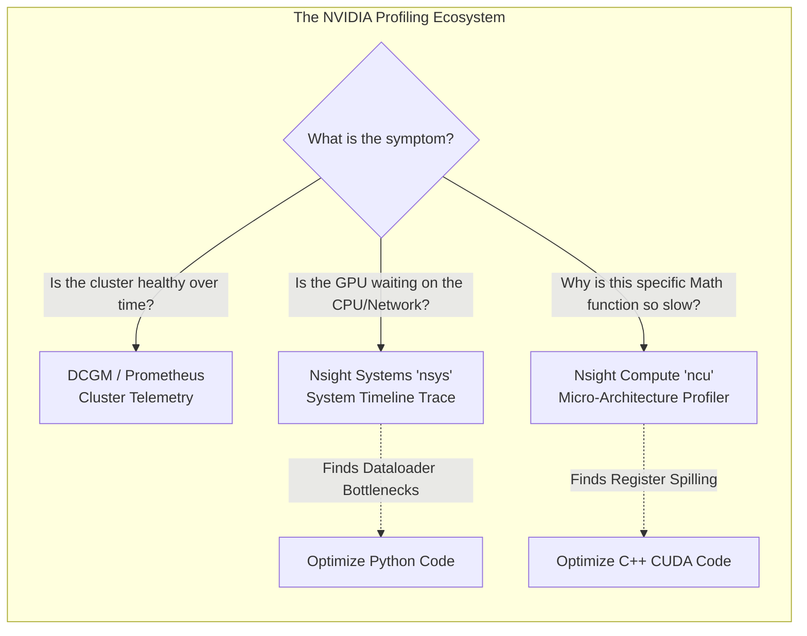

# Chapter 2 — Profiling Tools Landscape

| Chapter metadata | Value |
|---|---|
| Volume | 17 — Performance Engineering & Optimization |
| Difficulty | Advanced |
| Estimated reading time | 30 minutes |
| Primary audience | Performance Engineers, AI Platform Leads |
| Core question | If there are 10 different ways to profile a GPU, which tool do you use to diagnose a slow data pipeline versus a slow CUDA kernel? |

## Introduction

In modern medicine, a doctor doesn't use an MRI to check your temperature, and they don't use a thermometer to look for a broken bone. 

In AI performance engineering, using the wrong diagnostic tool is a massive waste of time. NVIDIA and the open-source community provide a vast array of profiling tools. A Senior Architect must know exactly which tool corresponds to which layer of the Evidence Ladder (Chapter 1).

If you use a deep kernel profiler to diagnose a network bottleneck, you will drown in gigabytes of irrelevant data while missing the actual problem entirely.

## Beginner's Primer: The NVIDIA Toolbelt

When an AI job is running slowly, the first instinct of a junior engineer is to change the Python code (e.g., increasing the batch size). But guessing is dangerous. You must use tools to prove where the delay is. 

Here is the toolbelt:
1. **DCGM / Prometheus (The Thermometer):** You use this to check the general health of the cluster over days or weeks. If GPU utilization drops from 90% to 10% every night at midnight, DCGM will show you that trend.
2. **Nsight Systems `nsys` (The Traffic Camera):** You use this to see the flow of data between the CPU, the Network, and the GPU. If the GPU is waiting for the CPU to send it data, `nsys` will show a massive gap of idle time on a visual timeline.
3. **Nsight Compute `ncu` (The Microscope):** You use this when the data is flowing perfectly, but the math itself is slow. It looks inside the physical silicon of the GPU and tells you if the memory bandwidth or the Tensor Cores are bottlenecking the math equation.
4. **PyTorch Profiler (The Translator):** This bridges the gap between Python and Hardware. It translates the low-level GPU execution blocks back into the exact Python code (e.g., `torch.nn.Linear`) that triggered them.

Start broad (Thermometer), narrow down the timeline (Traffic Camera), and only if necessary, use the microscope.

## 1. Macro-Level Telemetry (The Thermometer)

These tools run constantly in the background. They have near-zero overhead. You use them to detect that a problem exists.

*   **`nvidia-smi`:** The command-line basic check. Useful for seeing if the driver is loaded and if VRAM is completely full. (Not useful for deep performance diagnosis).
*   **DCGM (Data Center GPU Manager):** The enterprise standard. It runs continuously, extracting deep hardware metrics (Tensor Core usage, NVLink bandwidth, thermal throttling) and exports them to Prometheus. This provides the historical baseline.

## 2. System-Level Profiling (The X-Ray)

When DCGM tells you the GPU compute utilization is low, you must find out *why* it is low. Is it the CPU, the storage, or the PCIe bus? You need a system-wide view.

*   **NVIDIA Nsight Systems (`nsys`):** The undisputed king of system-level profiling. 
    *   *How it works:* It traces the entire node. It watches the CPU threads, OS file I/O, network transfers, and GPU kernel executions, mapping them all onto a single unified timeline.
    *   *When to use it:* When you suspect a Dataloader bottleneck, CPU starvation, PCIe transfer delays, or overlapping communication/compute issues in distributed training.

## 3. Kernel-Level Profiling (The Electron Microscope)

If Nsight Systems shows that the GPU is 100% active, but the epoch is still taking too long, the bottleneck is inside the specific math of the CUDA kernel itself. 

*   **NVIDIA Nsight Compute (`ncu`):** This is a microscopic tool. It does not look at the system. It looks at a *single, specific CUDA kernel execution*. 
    *   *How it works:* It replays the specific math operation over and over, analyzing the exact cache hit rates, memory bandwidth utilization, and instruction-level stalls occurring inside the silicon transistors.
    *   *When to use it:* When you are writing custom C++ CUDA kernels (like Triton or FlashAttention) and need to optimize the micro-architecture execution to hit theoretical maximum FLOPS. (Rarely used by standard PyTorch data scientists).

## 4. Application-Level Profiling

*   **PyTorch Profiler:** A Python-native tool built into PyTorch. It integrates with TensorBoard. It is excellent for data scientists who want to see which specific PyTorch Python function (`nn.Linear`, `nn.Conv2d`) is taking the most time, without having to drop down into the C++ CUDA layer.

## Customer Scenario (Senior Level)

**The Situation:**
A research team is writing a custom Triton C++ kernel for a new type of sparse matrix multiplication. They run the kernel on an H100. The kernel completes, but it is 4x slower than the standard PyTorch implementation. The researchers wrap the execution in `nsys profile` (Nsight Systems). They spend two days looking at the timeline, but they cannot figure out why the kernel is slow. The timeline simply shows one massive, slow blue block on the GPU row.

**The Senior Architect Response:**
"The researchers are using an X-Ray machine to diagnose a cellular disease. They have selected the wrong profiling abstraction layer.

**Nsight Systems (`nsys`)** is a system-level profiler. It is designed to show the interaction between the CPU, the PCIe bus, and the GPU. It correctly identified that the CUDA kernel was launched and that it ran slowly (the massive blue block). However, `nsys` is physically incapable of looking *inside* the execution of that specific block to tell you why the silicon struggled. 

To debug a custom C++ CUDA kernel, they must switch to **NVIDIA Nsight Compute (`ncu`)**. 

Nsight Compute will attach to that specific kernel execution. It will analyze the micro-architectural behavior of the H100's Streaming Multiprocessors (SMs). It will reveal exactly why the kernel is slow. For example, it might show severe 'Register Spilling' (where the kernel requires more fast registers than physically exist, forcing it to spill data into the much slower global VRAM), or it might show terrible L1 cache hit rates due to uncoalesced memory access patterns. Nsight Compute provides the exact line of C++ code causing the hardware stall."

## Interview Preparation

**Conceptual:** What is the primary difference in use-case between Nsight Systems (`nsys`) and Nsight Compute (`ncu`)? *(Hint: Nsight Systems provides a macro, system-wide timeline showing how the CPU, storage, network, and GPU interact; it is used to find system bottlenecks like CPU starvation. Nsight Compute provides a micro, kernel-level analysis of a single math operation running on the GPU; it is used to optimize custom CUDA C++ code at the transistor level).*

**Architecture:** If a PyTorch training job has extremely low GPU utilization because the Host CPU is taking too long to decompress JPEG images, which profiling tool will most clearly prove this? *(Hint: Nsight Systems. The `nsys` timeline will visually display the CPU threads pegged at 100% doing file I/O, followed by massive gaps of 'white space' (idle time) on the GPU execution row, definitively proving the CPU is starving the GPU).*

## Architecture Summary

Using the right tool for the right problem is the hallmark of a Senior Performance Engineer. DCGM provides cluster-wide trending alerts. Nsight Systems (`nsys`) provides a holistic system timeline to identify interactions between the CPU, Network, and GPU. Nsight Compute (`ncu`) is reserved for micro-optimizing specific CUDA kernels at the transistor level.

