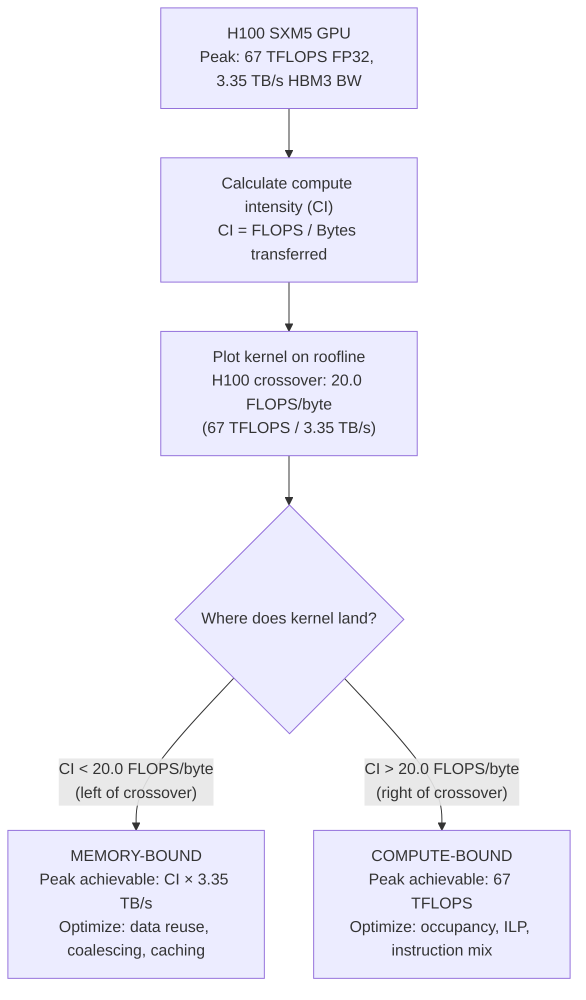

# Chapter 03 — Roofline Model and Analytical Performance

| Chapter metadata | Value |
|---|---|
| Volume | 17 — Performance Engineering & Optimization |
| Difficulty | Intermediate |
| Estimated reading time | 40 minutes |
| Primary audience | DevOps, SRE, Platform, Cloud and Infrastructure Engineers |
| Core question | How do you know whether a kernel is wasting compute or starving for data? |

## Learning Objectives

Build and use the roofline model to classify kernels as compute-bound or memory-bound; calculate compute intensity from code; measure hardware roofline and plot kernels on it; distinguish optimization strategies for each class; validate roofline predictions against real profiler data.

## Big Picture

The roofline model is a graph with two lines: one representing peak compute throughput (TFLOPS), one representing peak memory bandwidth (GB/s). A kernel's compute intensity (FLOPS per byte moved) determines which line limits its performance.



**Example:** Matrix multiplication has high compute intensity (~5000 FLOPS/byte for large tiles due to data reuse). It's compute-bound, limited by the 67 TFLOPS FP32 ceiling (or the much higher Tensor Core ceiling if using TF32/FP16). A reduction operation has low compute intensity (~1 FLOPS/byte). It's memory-bound, limited by bandwidth.

## Deep Explanation

### 1. Defining Compute Intensity

Compute intensity (CI) = total FLOPS performed / total bytes moved from/to HBM.

**Matrix multiply example (C = A × B, all NxN matrices in HBM):**
- Naive algorithm reads A (N² elements) + B (N² elements) + writes C (N² elements) = 3N² bytes
- Computation: N² × N multiply-accumulates = N³ FLOPS
- CI = N³ / (3N²) = N/3 FLOPS/byte

For N=1024: CI ≈ 341 FLOPS/byte (very high, compute-bound)
For N=16: CI ≈ 5.3 FLOPS/byte (low, memory-bound)

Same operation, different compute intensity based on data reuse!

**Real Nsight Compute output showing CI:**
```
Kernel: cutlass_gemm_kernel
Compute Intensity: 487 FLOPS/byte
Memory Roofline:  3.35 TB/s × 487 = 1631 TFLOPS (if only memory-bound)
Compute Roofline: 67 TFLOPS FP32 peak

Analysis: 487 FLOPS/byte >> 20.0 crossover → COMPUTE-BOUND
Expected peak achievable: min(1631, 67) = 67 TFLOPS
Actual achieved: 65.6 TFLOPS (97.9% of peak)
Verdict: Excellent — kernel is nearly perfectly compute-bound
```

### 2. Hardware Roofline: H100 and Other Accelerators

Different hardware has different rooflines:

| GPU | Peak FP32 (CUDA core, dense) | Peak FP16 Tensor Core (dense) | Peak TF32 Tensor Core (dense) | HBM BW | Crossover (FP32) |
|---|---|---|---|---|---|
| H100 SXM5 | 67 TFLOPS | 1979 TFLOPS | 989 TFLOPS | 3.35 TB/s | 20.0 FLOPS/B |
| L40S | 90.5 TFLOPS | 362 TFLOPS | 181 TFLOPS | 0.864 TB/s | 104.7 FLOPS/B |
| A100 80GB SXM | 19.5 TFLOPS | 312 TFLOPS | 156 TFLOPS | 2.0 TB/s | 9.75 FLOPS/B |
| V100 | 15.7 TFLOPS | 125 TFLOPS | N/A (pre-Ampere, no TF32) | 900 GB/s | 17.4 FLOPS/B |

*Figures are commonly-cited NVIDIA datasheet dense (non-sparsity) numbers; sparsity-accelerated Tensor Core throughput can be up to 2x higher on Ampere/Hopper. FP32 here means plain CUDA-core FP32 math, not TF32/FP16 Tensor Core math — these are different execution units with very different peak throughput.*

**Key insight:** A100 has a *lower* crossover point (9.75 vs 20.0) despite similar-order memory bandwidth. Why? The ratio of compute to memory bandwidth is lower on A100 than on H100. A kernel that's compute-bound on H100 might be memory-bound on A100.

### 3. Plotting Kernels on Roofline

Real example: H100 with several CUDA kernels:

```
Roofline (H100 SXM5, FP32):
TFLOPS (log scale)
  100 ┌─────────────────────────────────────── Compute roof (67 TFLOPS)
   50 │      
   20 │      ╱─────────────────────────────
   10 │     ╱
    5 │    ╱
    1 │   ╱
  0.2 └────┴──────────────────────────────
        1  5  10  50  100  500  1000
             Compute Intensity (FLOPS/byte)

Kernels plotted:
• Element-wise add: CI=0.25 FLOPS/B, achieved 0.8 TFLOPS (memory-bound) ✓
• Softmax: CI=1.5 FLOPS/B, achieved 5.0 TFLOPS (memory-bound) ✓
• Attention: CI=8 FLOPS/B, achieved 26.8 TFLOPS (memory-bound) ✓
• GEMM (batch 32): CI=400 FLOPS/B, achieved 64 TFLOPS (near compute roof) ✓
```

All kernels plot below the roofline or on it (as they must). Kernels on the left are bottlenecked by memory; on the right, by compute.

### 4. Validation Against Profiler Data

Nsight Compute confirms roofline predictions:

**Memory-bound kernel (Softmax):**
```
Predicted (roofline): CI × 3.35 TB/s = 1.5 × 3350 = 5.03 TFLOPS max
Actual (Nsight Compute): 4.7 TFLOPS
HBM utilization: 2.35 TB/s of 3.35 TB/s available (70% occupied, not saturated)
Latency per warp: 450 ns waiting on memory
Verdict: Matches roofline. Memory throughput is the limit.
```

**Compute-bound kernel (Batched GEMM):**
```
Predicted (roofline): Compute roof = 67 TFLOPS FP32
Actual (Nsight Compute): 65.6 TFLOPS
Occupancy: 88% (sufficient for compute-bound work)
SM utilization: 98% (nearly full)
Verdict: Matches roofline. Kernel is CPU-starved or launch-limited, not memory or hardware-starved.
```

## Production Troubleshooting

### Problem: "Our GEMM kernel achieves 45 TFLOPS on H100, but roofline says it should get 67"

| Evidence | Analysis | Action |
|---|---|---|
| Roofline predicts compute-bound (CI=500 FLOPS/B), kernel achieves 45 TFLOPS vs 67 TFLOPS FP32 peak | Either: (1) kernel isn't actually compute-bound despite high CI, or (2) something else is limiting (clock gating, L2 pressure, occupancy) | Run Nsight Compute: check L2 miss rate, occupancy, active warps. If occupancy < 50%, increase block size. If L2 misses high, kernel is thrashing cache. |
| Nsight Compute shows occupancy 95%, L2 hits normal, but TFLOPS still at 45 | Kernel is launching below peak clock speed; check for thermal throttling or power limits | Run nvidia-smi dmon during kernel: watch GPU clocks. If clocks drop during kernel, power limit or thermals are throttling. |
| Clock speed is 1.9 GHz (max boost is ~1.98 GHz), kernel still at 45 TFLOPS | HBM bandwidth contention from other processes or stale data in L2 | Check if other processes are running on the GPU. Nsight Compute shows if bandwidth to HBM is saturated (>95%). If so, you've hit actual memory limit, not compute limit — roofline analysis was correct, but your CI calculation was wrong. |

### Problem: "Roofline says memory-bound, but we can't make it faster with data reuse"

| Signal | Root cause | Solution |
|---|---|---|
| Kernel is genuinely memory-bound (roofline confirmed), optimizing data reuse doesn't help | Reuse optimization has diminishing returns; you've hit shared memory capacity or L1 cache line conflicts | Profile with Nsight Compute: check shared memory pressure, bank conflicts, cache line utilization. You may be past the point of reuse optimization. Switch strategy: vectorization, wider memory transactions, or accept that this kernel is memory-bound and focus on overlapping computation with I/O. |
| Roofline calculation assumed all memory is from HBM, but kernel reads from L1/L2 cached data | Your CI calculation was wrong; you're not actually moving as many bytes as you thought | Verify your CI calculation by measuring actual bytes transferred in Nsight Compute (Dram Throughput and L2/L1 stats). Update CI and replot on roofline. |

## Interview Preparation

**Q: How would you explain the roofline model to a junior engineer?**

> A: The roofline model tells you the fundamental limits of your hardware and whether a kernel is hitting one of them. Imagine a roof with two edges: one horizontal line representing the compute ceiling (67 TFLOPS FP32 for H100 SXM5), one diagonal line representing memory bandwidth (3.35 TB/s). A kernel's compute intensity — how much math you do per byte moved — determines which line it hits. If your kernel does lots of reuse (high CI, like matrix multiply), it hits the compute roof. If it barely reuses data (low CI, like elementwise operations), it hits the bandwidth roof. The roofline model tells you which one without needing to run profilers first. It's a quick, analytical way to know whether to optimize compute or memory, before you start coding.

**Q: A colleague says their kernel achieves 90% of the hardware's peak TFLOPS. Does that mean it's well-optimized?**

> A: Only if it's compute-bound. The roofline model shows that some kernels *can't* achieve peak TFLOPS because they're memory-bound. An element-wise operation might be memory-bound at 10 TFLOPS, which is 7% of peak, but that's expected and correct for that operation. The right question is: "Does the kernel achieve its roofline prediction?" If roofline predicts 15 TFLOPS and it achieves 14 TFLOPS, it's well-optimized. If roofline predicts 100 TFLOPS and it achieves 60, it's leaving performance on the table. So "90% of peak" only matters if the roofline says it should be able to hit peak.

## Key Takeaways

1. **Roofline model is analytical, not empirical.** You can predict performance from hardware specs and code structure before profiling.
2. **Compute intensity determines the bottleneck.** Calculate FLOPS / bytes moved, compare to hardware crossover point, and you know whether to optimize compute or memory.
3. **Same kernel, different CI at different problem sizes.** Matrix multiply is memory-bound for small matrices, compute-bound for large ones. Know the crossover.
4. **Roofline predictions must validate against profiler data.** If they don't, your CI calculation was wrong or something else is limiting (clocks, cache, occupancy).
5. **Different GPUs have different rooflines.** An A100 and H100 have different crossover points. A kernel's bottleneck might change between hardware generations.

## Cross References

- Chapter 01: Performance metrics and evidence
- Chapter 02: Profiling tools that measure roofline achievement
- Chapter 04: Bottleneck identification using roofline
- Chapter 05: Compute optimization strategies
- Chapter 06: Memory optimization strategies
