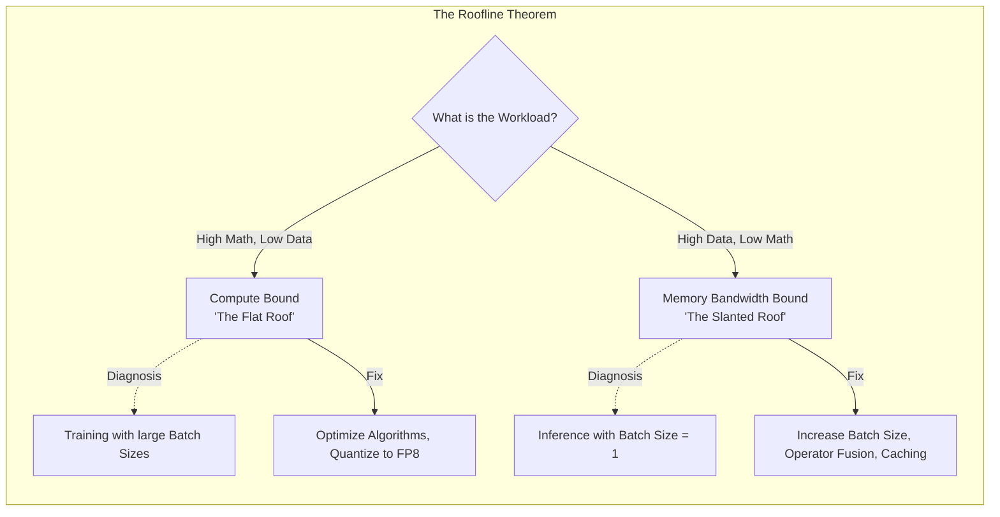

# Chapter 3 — Roofline Model and Analytical Performance

| Chapter metadata | Value |
|---|---|
| Volume | 17 — Performance Engineering & Optimization |
| Difficulty | Expert |
| Estimated reading time | 35 minutes |
| Primary audience | AI Performance Engineers, Solutions Architects |
| Core question | Without running a single profiler, how can you mathematically prove that buying a faster GPU will not speed up your specific AI model? |

## Introduction

Performance engineering is not guesswork. It is governed by hard physics. 

Every GPU has two absolute physical limits:
1.  **Peak Compute (FLOPS):** The maximum number of mathematical operations it can perform per second.
2.  **Peak Memory Bandwidth (GB/s):** The maximum speed at which data can be moved from VRAM into the compute cores.

Every AI model has a specific mathematical signature: **Arithmetic Intensity**. This is the ratio of how much math the model does versus how much data it needs to read from memory. 

By plotting the model's Arithmetic Intensity against the GPU's physical limits, you create the **Roofline Model**. The Roofline Model instantly, mathematically tells you if your code is bound by Compute or bound by Memory.

## Beginner's Primer: The Kitchen Analogy

The **Roofline Model** is the most important concept in AI performance engineering. Let's explain it using a restaurant kitchen.

Imagine a chef (the GPU's Compute Cores) making a complex soup.
- **Memory Bandwidth** is the waiter running to the pantry to grab ingredients (Data).
- **Compute (FLOPS)** is the chef chopping the ingredients (Math).

**Scenario 1: Memory-Bound (The Slanted Roof)**
The chef needs to make a simple salad. They need 100 different ingredients from the pantry, but they only have to chop each one in half. The chef finishes chopping instantly and spends 95% of their time standing around waiting for the waiter to run back and forth to the pantry. 
*Buying a faster chef (upgrading to an H100 GPU) will not speed up the salad. You are limited by the waiter's running speed (Memory Bandwidth).*
*Most AI Inference (like ChatGPT generating one word at a time) is Memory-Bound.*

**Scenario 2: Compute-Bound (The Flat Roof)**
The chef is making an intricate soup. The waiter brings them one carrot. The chef spends 10 minutes carefully carving the carrot into a swan. The waiter stands around bored.
*Buying a faster waiter (faster VRAM) will not speed up the soup. You are limited by the chef's chopping speed (FLOPS).*
*Most AI Training (like churning massive batches of data through a ResNet model) is Compute-Bound.*

The Roofline Model is a graph that mathematically proves whether your AI model is making a salad or carving a swan, telling you exactly how to fix it.

## 1. Arithmetic Intensity (The X-Axis)

Arithmetic Intensity is calculated as:
`Operations (FLOPs) / Bytes Read from Memory`

*   **High Arithmetic Intensity:** The model reads a tiny bit of data, but does massive amounts of complex math on it (e.g., large Matrix Multiplications with massive batch sizes).
*   **Low Arithmetic Intensity:** The model reads massive amounts of data, does a tiny bit of simple math, and writes it back (e.g., Layer Normalization, or LLM generation with a batch size of 1).

## 2. The Roofline Graph

Imagine a graph. 
*   The Y-axis is actual Performance (TFLOPS).
*   The X-axis is Arithmetic Intensity (FLOPs/Byte).

There are two "Roofs" (hard limits) on this graph:
1.  **The Slanted Roof (Memory Bound):** On the left side of the graph (low arithmetic intensity), performance is strictly limited by how fast the GPU can read VRAM. The GPU compute cores are mostly idle, waiting for data. 
2.  **The Flat Roof (Compute Bound):** On the right side of the graph (high arithmetic intensity), performance hits the absolute maximum TFLOPS the silicon can generate. The memory bandwidth is fine, but the compute cores are maxed out.

The point where the slanted roof hits the flat roof is the **Ridge Point**. 

## 3. Applying the Roofline Model

A Senior Architect uses the Roofline Model to dictate optimization strategy.

*   **If you are under the Slanted Roof (Memory Bound):** 
    Buying a GPU with faster Tensor Cores will do absolutely nothing. Your optimization strategy must be: reduce memory reads. You must implement **Kernel Fusion** (combining layers to keep data in fast cache), use **Quantization** (FP8/INT8 shrinks the data size, meaning less bytes to transfer), or implement **PagedAttention** to optimize KV Cache reads.
*   **If you are under the Flat Roof (Compute Bound):**
    Buying a GPU with faster VRAM (like HBM3e) will do absolutely nothing. Your optimization strategy must be: reduce the math. You must use sparsity, smaller model architectures, or upgrade to a GPU with more Tensor Cores.

## Customer Scenario (Senior Level)

**The Situation:**
A quantitative trading firm deploys a massive, multi-layer perceptron (MLP) for high-frequency trading prediction. The model must process a continuous stream of single data points (Batch Size = 1) at ultra-low latency. They are currently using NVIDIA A100 GPUs. They are unhappy with the latency. They propose spending $500,000 to upgrade the entire cluster to H100 GPUs, specifically citing the H100's massive 3x increase in Tensor Core FLOPS.

**The Senior Architect Response:**
"The proposed $500,000 upgrade is based on a fundamental misunderstanding of the Roofline Model and the physics of inference at a batch size of 1.

Because you are processing single data points sequentially (Batch Size = 1), your model's **Arithmetic Intensity** is extremely low. You are reading massive neural network weights from VRAM to perform a relatively tiny amount of matrix math against a single input vector. 

If we plot this on the Roofline Model, your workload is located far to the left, pinned firmly under the **Slanted Roof (Memory Bandwidth Bound)**. Your current A100 Tensor Cores are likely sitting 90% idle, starved waiting for the weights to arrive from VRAM. 

Upgrading to the H100 to acquire more Tensor Core FLOPS (raising the flat roof) will yield almost zero performance improvement, because your workload is nowhere near the compute ceiling. 

While the H100 *does* have faster memory bandwidth (raising the slanted roof slightly), the ROI of a full hardware replacement is terrible. Instead, we must shift the workload's position on the X-axis (Arithmetic Intensity). 

We will implement **TensorRT Quantization (INT8)**. By shrinking the 32-bit model weights down to 8-bit, we instantly reduce the number of bytes that must be read from VRAM by 75%. This mathematically quadruples your effective memory bandwidth, drastically lowering latency on your existing A100s without spending a dollar on new hardware."

## Interview Preparation

**Conceptual:** What does the 'Ridge Point' represent on a Roofline Model graph? *(Hint: It is the exact mathematical point of equilibrium for a specific GPU where a workload transitions from being Memory-Bandwidth Bound (the slanted roof) to Compute-Bound (the flat horizontal roof). It is calculated as Peak FLOPS / Peak Memory Bandwidth).*

**Architecture:** Why does deploying an LLM with a Batch Size of 1 almost always result in the GPU operating under the Memory-Bound (slanted) roof? *(Hint: At a batch size of 1, the GPU must read the entire massive model weight matrix from VRAM just to process a single token (very low math per byte read). This low Arithmetic Intensity forces the workload to be bottlenecked entirely by memory bandwidth, leaving the massive compute cores mostly idle).*

## Architecture Summary

The Roofline Model mathematically defines the absolute limits of an AI workload on a specific GPU. By calculating a workload's Arithmetic Intensity (FLOPS per Byte) and charting it against the GPU's memory bandwidth (the slanted roof) and compute capabilities (the flat roof), engineers can immediately determine whether optimization efforts should focus on reducing math (e.g., quantization) or reducing memory traffic (e.g., batching or operator fusion).

