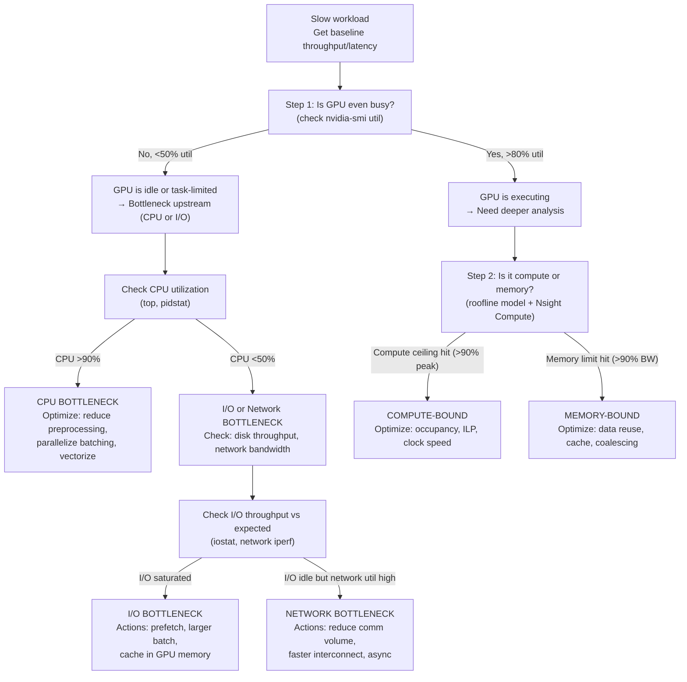

# Chapter 04 — Bottleneck Identification and Diagnosis

| Chapter metadata | Value |
|---|---|
| Volume | 17 — Performance Engineering & Optimization |
| Difficulty | Intermediate |
| Estimated reading time | 45 minutes |
| Primary audience | DevOps, SRE, Platform, Cloud and Infrastructure Engineers |
| Core question | Given a slow workload, how do you systematically rule out the five major bottleneck classes? |

## Learning Objectives

Use decision trees to identify bottleneck class (compute, memory, network, I/O, CPU); instrument workloads to isolate which layer is limiting; recognize when multiple bottlenecks exist simultaneously; measure improvement precisely after optimization; know when to stop optimizing one path and switch to another.

## Big Picture

Five major bottleneck classes exist in AI systems. Optimizing the wrong one wastes time. The decision tree eliminates each class in order:



## Deep Explanation

### Diagnosis Flow: Real Example

**Scenario:** Training loop reports 150 samples/sec throughput. Expected is 200 samples/sec on this hardware (H100, 8 GPUs, NVLink cluster).

**Step 1: GPU health check**
```bash
$ nvidia-smi --query-gpu=index,utilization.gpu,utilization.memory,memory.used \
  --format=csv -l 1
# Output across 8 GPUs during training
index,util.gpu,util.mem,mem.used
0,45,38,32000
1,48,42,34000
2,42,40,31000
...8 GPUs averaging ~45% utilization
```

**Analysis:** GPUs are 45% utilized, not 80%+. Bottleneck is upstream. Move to Step 2.

**Step 2: CPU check**
```bash
$ pidstat -u 1 5 | grep python
  CPU  %user %system
  0    18.2    2.3
  1    19.5    1.8
  2    17.8    2.1
# All CPUs at ~20% utilization, well below saturation
```

**Analysis:** CPU isn't bottleneck (would be >80% if true). Move to Step 3.

**Step 3: I/O and network check**
```bash
$ iostat -x 1 3 | grep nvme
Device     r_await w_await avgqu-sz %util
nvme0n1    0.4     2.1     0.8      8
# Low utilization, no I/O queue backlog

# Network check (on distributed training node)
$ iperf3 -c other_node -R
Receiving data from other_node
[ ID] Interval           Transfer     Bandwidth
[  5]   0.00-10.00 sec  0.42 GiB      36 MiB/s
# Expected NCCL collective: would be 100+ MiB/s for 8-GPU cluster training
```

**Analysis:** Network is only 36 MiB/s out of possible 100+ MiB/s. Not saturated, but the collective operations are using it. Not the primary bottleneck, but contributing. Move to Step 4.

**Step 4: Application-level profiling**
```python
from torch.profiler import profile, ProfilerActivity
with profile(activities=[ProfilerActivity.CPU, ProfilerActivity.CUDA]):
    for i in range(10):
        data = dataloader.next()  # <-- Time this
        model_out = model(data)   # <-- And this
        loss = criterion(out, target)
        loss.backward()
        optimizer.step()

# Result shows: dataloader.next() takes 120ms per iteration
# Model forward: 50ms, backward: 40ms, optimizer: 10ms
# Total: 220ms per iteration → 4.5 samples/sec
# But reported throughput is 150 samples/sec on batch size 32
# = 150/32 = 4.7 iterations/sec = 213ms per iteration

# 120ms dataloader / 213ms total = 56% of time spent in data loading!
```

**Verdict:** Data loading is the bottleneck (56% of iteration time). GPU is idle waiting for data. The diagnosis shows the problem is not GPU optimization, but data pipeline optimization.

### Interventions by Bottleneck Class

| Bottleneck | Primary evidence | Typical fixes |
|---|---|---|
| **Compute** | Roofline shows compute ceiling reached; occupancy >80%; HBM bandwidth &lt;50% utilized | Increase block size, reduce register pressure, enable higher clock speed |
| **Memory** | Roofline shows memory limit reached; HBM util >90%; L1/L2 miss rates high | Improve data reuse (tiling), increase cache line fill, coalescing, texture cache for reads |
| **I/O** | Data loading > 50% of iteration time; GPU idles between batches | Prefetch in background, increase batch size, cache in GPU memory, faster storage |
| **Network** | NCCL collectives > 20% of total time; network util >80% during allreduce | Reduce collective frequency (gradient accumulation), use ring topology, async SGD |
| **CPU** | CPU thread >90% utilization; GPU idle 30%+ of time | Parallelize dataloader workers, offload preprocessing, batch larger workloads |

## Production Troubleshooting

### Problem: "We optimized compute but throughput didn't improve"

| Evidence | Diagnosis | Action |
|---|---|---|
| Before: 45% GPU util, 150 samples/sec. After GPU compute optimization: 52% GPU util, 155 samples/sec. (3% improvement) | Bottleneck has shifted. Compute was not the limiting factor; data loading or something else absorbed the headroom. | Profile again with the same tool. Identify new bottleneck (likely data loading, CPU preprocessing, or synchronization). Real improvement comes when you hit the bottleneck that's blocking progress. Don't chain optimizations; diagnose → optimize → re-diagnose. |

### Problem: "Multiple bottlenecks simultaneously"

Real example: A distributed training job has 30% GPU idle time, 20% in NCCL collectives, 15% in data loading, and only 35% in actual model work.

**Decision:** You have multiple serial bottlenecks. Optimizing any single one will not double throughput. Priority order:
1. **NCCL (20%):** Reduce gradient frequency (larger accumulation) or use ring-based topology
2. **Data loading (15%):** Parallel prefetch, cache in GPU
3. **Compute efficiency (35%):** Only after the above, because improvements will be limited

After fixing 1 and 2, total GPU work goes from 35% to ~50%, and idle from 30% to ~15%. Then compute optimization can yield proportional gains.

## Interview Preparation

**Q: A training job runs at 150 samples/sec on 8 GPUs. You suspect a bottleneck. How would you diagnose it?**

> A: I'd start broad and narrow. First, nvidia-smi to see if all 8 GPUs are even busy — if they're under 50% utilization, something upstream is limiting. Then check CPU utilization (top, pidstat) — if CPU is under 50%, I know it's not CPU bottleneck. Then I'd check data loading latency with a simple test: time how long it takes to load one batch outside the model. If that's taking >100ms and the model iteration takes 200ms, I've found my bottleneck. If data looks fine, I'd use PyTorch profiler to timeline the whole iteration and see where time goes. Once I know which component is slow, I can decide whether to optimize it (if it's the limiter) or accept it (if something else is still slower). The key is: don't guess; measure each component first.

**Q: What's the difference between "GPU is busy" and "GPU is productive"?**

> A: GPU being busy (high utilization) means kernels are executing. GPU being productive means kernels are doing useful work that directly improves throughput or latency. A kernel can be busy executing but still be memory-starved, spinning inefficiently, or executing redundant work. Real productivity is measured end-to-end: does the throughput or latency improve when you make the kernel faster? If yes, it was productive. If no, you optimized the wrong thing. The roofline model helps distinguish: if a kernel is memory-bound and you increase occupancy slightly, GPU will report higher utilization but throughput won't improve. That's busy but not productive. Productive optimization comes from understanding which layer actually limits the end-to-end metric.

## Key Takeaways

1. **Bottleneck isolation is systematic, not intuitive.** Follow the decision tree: GPU util → CPU util → I/O → Roofline → profiler.
2. **Measure before and after every change.** One metric (throughput or latency) must improve, or the change was pointless.
3. **Multiple bottlenecks exist in production systems.** Optimizing the smallest one first is often wasteful. Fix the largest bottleneck until it's no longer the limiter, then move to the next.
4. **Context switches between bottleneck types.** As you optimize one, another becomes dominant. Keep profiling after each round of optimizations.
5. **Some bottlenecks are acceptable.** I/O bottleneck is OK if I/O is cheap and you're data-bound by design. Don't optimize past the point where it matters to your SLO.

## Cross References

- Chapter 03: Roofline model for compute vs memory diagnosis
- Chapter 02: Profilers for measuring each bottleneck class
- Chapter 05-07: Optimization strategies per bottleneck
- Chapter 10: System-level bottlenecks (network, cluster)
