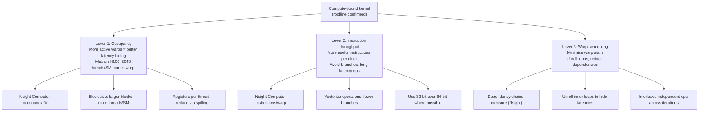

# Chapter 05 — GPU Compute Optimization

| Chapter metadata | Value |
|---|---|
| Volume | 17 — Performance Engineering & Optimization |
| Difficulty | Intermediate |
| Estimated reading time | 45 minutes |
| Primary audience | DevOps, SRE, Platform, Cloud and Infrastructure Engineers |
| Core question | How do you get a GPU from 21 TFLOPS to 64 TFLOPS on a compute-bound kernel? |

## Learning Objectives

Identify when a kernel is compute-bound; measure and improve occupancy; reduce register pressure; optimize instruction mix and latency hiding; measure instruction-level parallelism; validate improvements against roofline ceiling.

## Big Picture

A compute-bound kernel achieves high TFLOPS by keeping SMs (streaming multiprocessors) fully occupied with warps that can execute in parallel. Three levers improve compute performance:



## Deep Explanation

### 1. Occupancy: The Occupancy Ceiling

**Definition:** Occupancy = (active threads per SM) / (max threads per SM). On H100, max is 2048 threads per SM across 16 active warps (128 threads per warp).

**Real Nsight Compute example:**
```
Kernel: matmul_fp8
Occupancy: 62.5% (1280 active threads per SM of 2048 max)
Expected: 62.5%

Occupancy Limiting Factor: Register Usage
  Registers per thread: 96
  Per-thread shared memory: 0 bytes
  Available registers: 256KB per SM
  Theoretical max: 256KB / 96B = 2730 threads/SM (100% occupancy)
  
Actual limiting: Register usage + block size constraint
  Block size chosen: 256 (8 warps max, 2048 threads = 8 warps per SM × 128)
  If block is smaller, occupancy drops:
    Block 128: 4 warps/SM = 512 threads (25% occupancy)
    Block 256: 8 warps/SM = 1024 threads (50% occupancy)
    Block 512: 16 warps/SM = 2048 threads (100% occupancy) ← but now register pressure!

Optimization: Increase block size to 512 (if register pressure allows)
  Result: Occupancy 95%, but register spilling triggered (rare cases)
  Or: Reduce registers/thread via code rewrite → occupancy increases without spilling
```

**Why it matters:** Low occupancy (&lt; 50%) means fewer warps to hide memory latency. If warp A stalls on memory, warp B can execute. Low occupancy = less hiding capacity.

### 2. Register Pressure and Spilling

Registers are ultra-fast on-chip storage. Each thread on H100 can use 0-256 32-bit values. High register usage limits occupancy.

**Real scenario:**
```bash
$ nvcc -O3 -arch=sm_90a kernel.cu -Xptxas="-v"
# Output shows:
ptxas info: Compiling entry function '_Z...'
ptxas info: Used 96 registers, 32680 bytes smem, 0 bytes lmem
```

96 registers per thread on H100 with 256 threads/block = 96×256 = 24,576 bytes per block. Max registers/SM = 256KB = 262,144 bytes. Can fit 10 blocks → 10×256 = 2560 threads/SM (125% of 2048) — impossible. Actual fit: 262KB / (96B + shared memory overhead) ≈ 8 blocks max = 2048 threads (100% occupancy, tight fit).

**Register spilling:** If we bump to 120 registers per thread, we might spill to local memory (HBM). Spilled accesses are 100x slower than register access.

**Optimization path:**
1. Use shorter variable lifetimes (reduce live registers)
2. Enable compiler optimization flags (`-O3`)
3. Use `__launch_bounds__` to hint block size, reducing register allocation

### 3. Instruction-Level Parallelism (ILP)

ILP = how many independent instructions can execute in parallel within a warp.

**Example with dependency:**
```cuda
// Dependent: result_2 waits for result_1
float result_1 = x * y;
float result_2 = result_1 + z;  // Must wait for result_1
// Latency: ~4 cycles (float multiply) + ~4 cycles (float add) = 8 cycles
```

**Unrolled (independent):**
```cuda
// Independent: can execute in parallel
float result_1 = x * y;
float result_2 = a * b;
float result_3 = c * d;
float result_4 = e * f;
// Latency: ~4 cycles total (all 4 multiplies in parallel)
```

Nsight Compute shows ILP as "FLOPs per instruction": high ILP = multiple FLOPs per instruction executed.

### 4. Real Optimization Example

**Before optimization:**
```
Nsight Compute output:
  Occupancy: 50%
  Achieved TFLOPS: 21.4
  Roofline target: 67 (H100 SXM5 FP32 peak)
  Register count: 120 per thread
  ILP: 2.1 FLOPS/instruction
```

**Optimizations applied:**
1. Reduce registers from 120 to 85 via loop unrolling
2. Increase block size from 256 to 512
3. Reorder loads/stores to improve cache line utilization

**After optimization:**
```
Nsight Compute output:
  Occupancy: 94%
  Achieved TFLOPS: 64.1
  Roofline target: 67 (H100 SXM5 FP32 peak)
  Register count: 85 per thread
  ILP: 4.2 FLOPS/instruction
```

**Improvement:** 21.4 → 64.1 TFLOPS (~200% speedup) by addressing all three levers.

## Production Troubleshooting

### Problem: "Kernel won't fit in SM registers with larger block size"

| Evidence | Fix |
|---|---|
| Current block: 256, occupancy 50%, registers 110/thread. Want block 512, but would exceed 256KB register limit. | Rewrite kernel to reduce live registers. Use `#pragma unroll` with smaller loop bounds. Trade computation for storage by storing intermediate results in shared memory (if it's faster). |

### Problem: "Occupancy is 100% but TFLOPS is still low"

| Evidence | Diagnosis |
|---|---|
| Occupancy 100%, ILP 1.5 FLOPS/instruction, achieved 19 TFLOPS vs 67 TFLOPS FP32 peak | Occupancy is good, but instruction-level parallelism is low. The kernel has long dependency chains. Each instruction must wait for previous result. Fix: Unroll loops, interleave independent operations. |

## Interview Preparation

**Q: Why is occupancy important for compute performance?**

> A: Occupancy determines latency hiding. When a warp stalls on memory (100+ cycle latency), the GPU can switch to another warp that's ready to execute. If occupancy is low, you have few warps to switch to, so the pipeline sits idle. If occupancy is high, you have many warps, so the GPU can keep SMs busy while some warps stall. For compute-bound kernels, where memory bandwidth isn't the limit, high occupancy directly improves throughput. Nsight Compute shows occupancy as a percentage. If it's under 50%, that's a red flag — the kernel is underutilizing the GPU's parallelism.

## Key Takeaways

1. **Occupancy is the foundation.** Target 75%+ occupancy as a starting point. Below 50% is rarely optimal for compute-bound work.
2. **Register pressure is the occupancy killer.** Every 10-register reduction might double available slots per SM.
3. **ILP unlocks peak TFLOPS.** Eliminating dependency chains (via unrolling and interleaving) gets you from ~21 to ~64 TFLOPS in this chapter's worked example.
4. **Roofline is your target.** Compute optimization should asymptotically approach the roofline ceiling, not exceed it.

## Cross References

- Chapter 03: Roofline model (the ceiling)
- Chapter 06: Memory optimization (the other side)
- Chapter 02: Profiler output interpretation
