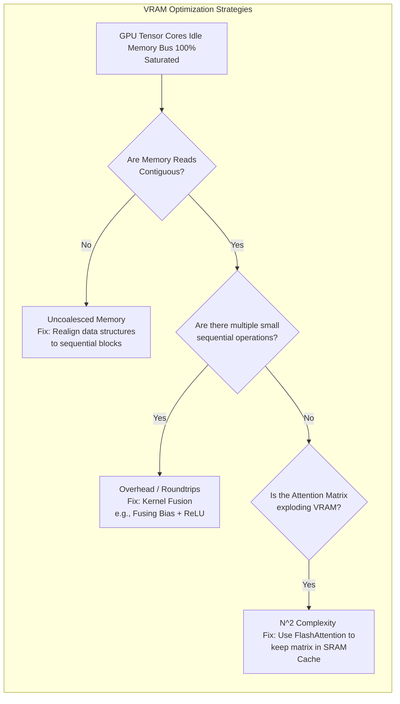

# Chapter 6 — Memory Optimization

| Chapter metadata | Value |
|---|---|
| Volume | 17 — Performance Engineering & Optimization |
| Difficulty | Expert |
| Estimated reading time | 30 minutes |
| Primary audience | AI Performance Engineers, Systems Architects |
| Core question | If a GPU has 3,000 GB/s of Memory Bandwidth, why does reading a 10MB matrix take so long? |

## Introduction

In Chapter 3 (Roofline Model), we proved that the vast majority of AI workloads (especially LLM inference) are bounded not by compute, but by **Memory Bandwidth**. 

The Tensor Cores are incredibly fast, but they sit idle if data cannot move from the physical HBM (High Bandwidth Memory) chips into the L1/L2 caches fast enough. 

Optimizing memory is not about "using less VRAM." It is about understanding how the physical wires on the silicon route the data. A Senior Architect must know how to align memory accesses and how to fuse kernels to keep data trapped in the fast cache.

## Beginner's Primer: Coalesced Memory (The Bus Analogy)

Imagine you are managing a bus terminal. 32 people (A Warp of 32 Threads) are standing on the sidewalk, and they all need to go to 32 different houses.

**Uncoalesced Memory (The Inefficient Way):**
You send 32 separate buses. Each bus picks up 1 person, drives to their house, drops them off, and drives back. The roads instantly clog with traffic. The system grinds to a halt. This is what happens when you write Python/CUDA code that asks the GPU to read random, scattered memory addresses. The GPU wastes massive bandwidth making tiny, individual trips to VRAM.

**Coalesced Memory (The Optimized Way):**
You realize all 32 people actually live on the exact same street. You put all 32 people onto a single bus. It makes one trip down the road and drops them all off sequentially. The road is completely clear of traffic. This is **Coalesced Memory Access**. 

If you align your AI data in contiguous arrays, the GPU can grab the memory for all 32 threads in a single, massive 128-byte chunk. This is the difference between a model taking 10 minutes to run versus 10 seconds.

## 1. Coalesced Memory Access

When a GPU thread asks for a single byte of data from VRAM, the memory controller does not fetch one byte. It fetches a massive 128-byte chunk of data across the memory bus. 

**The Uncoalesced Disaster:**
Imagine 32 threads in a Warp. 
*   Thread 1 asks for Byte 0.
*   Thread 2 asks for Byte 500.
*   Thread 3 asks for Byte 1000.
Because the memory locations are scattered, the GPU must execute 32 separate 128-byte fetches from VRAM to satisfy the Warp. This completely saturates the memory bus with useless data, destroying bandwidth. 

**The Coalesced Fix:**
If Thread 1 asks for Byte 0, Thread 2 asks for Byte 4, and Thread 3 asks for Byte 8, all the data sits next to each other. The GPU executes a *single* 128-byte fetch that satisfies all 32 threads simultaneously. 

*Architectural Mandate:* Memory access patterns in custom CUDA code (or custom PyTorch operators) must be contiguous and aligned.

## 2. Kernel Fusion (Keeping Data in Cache)

Fetching data from global VRAM is slow (e.g., 3,000 GB/s).
Fetching data from the L1 cache (SRAM) sitting right next to the Tensor Cores is blindingly fast (e.g., 30,000+ GB/s).

As discussed in Volume 12, standard PyTorch executes layer-by-layer. 
1. Load data from VRAM. Do Matrix Math. Save result to VRAM.
2. Load result from VRAM. Do Activation (ReLU). Save result to VRAM.

**Kernel Fusion** compiles these two operations into one. 
1. Load data from VRAM. Do Matrix Math. *Keep the result in the L1 cache.* Do Activation (ReLU). Save final result to VRAM.

By fusing the kernel, we eliminated an entire round-trip to global VRAM, doubling our effective memory bandwidth.

## 3. FlashAttention: The Ultimate Memory Hack

The standard Attention mechanism in Transformer models (LLMs) requires creating a massive $N \times N$ matrix (where N is the sequence length). 
For a 32K context window, this intermediate matrix is gigabytes in size. It physically cannot fit in the ultra-fast L1/SRAM cache. It is forced to spill out to slow global VRAM, crushing performance.

**FlashAttention** is a mathematical breakthrough in memory optimization. 
Instead of calculating the massive $N \times N$ matrix all at once, FlashAttention breaks the math into tiny blocks (Tiling). It loads a tiny block into the fast SRAM cache, computes the attention score, updates the final answer, and discards the block. 

The massive $N \times N$ matrix is never actually written to global VRAM. It only exists in pieces inside the fast cache. This dramatically reduces memory read/writes and allows models to process 128K+ context windows without grinding to a halt.

## Customer Scenario (Senior Level)

**The Situation:**
An AI team is fine-tuning a Transformer model using a massive sequence length (16,000 tokens) to process legal documents. They are using standard HuggingFace PyTorch implementations on A100 GPUs. The training job is catastrophically slow. They run `nsys`, and the timeline shows the GPUs are heavily saturated, but the compute is taking far longer than expected. They check `ncu` (Nsight Compute), which reports the `Self-Attention` kernels are severely Memory Bandwidth Bound.

**The Senior Architect Response:**
"Your model is choking on the O(N^2) memory complexity of standard Transformer Attention.

In a standard Attention mechanism, the size of the intermediate attention matrix grows quadratically with the sequence length. At 16,000 tokens, this intermediate matrix becomes so large that it instantly overflows the A100's ultra-fast L1/SRAM cache. The GPU is forced to write this massive matrix out to the slower global VRAM, and then immediately read it back to perform the Softmax operation. 

The `ncu` trace confirms this: the Tensor Cores are sitting idle while the memory bus is pinned at 100% trying to move gigabytes of intermediate activation data back and forth.

We must immediately rewrite the model configuration to utilize **FlashAttention-2**. 

FlashAttention is a hardware-aware algorithm that mathematically calculates exact Attention without ever materializing the massive N^2 matrix in global VRAM. It uses **Tiling** to load small blocks of the Query, Key, and Value matrices directly into the fast SRAM, computes the Softmax, and writes only the final output back to VRAM. 

By keeping the intermediate math trapped inside the ultra-fast SRAM cache, FlashAttention completely eliminates the massive VRAM read/write bottleneck. Your training step time will likely drop by 50% to 70%, and your memory footprint will shrink drastically, allowing you to increase the batch size further."

## Interview Preparation

**Conceptual:** What is the difference between Coalesced and Uncoalesced memory access on a GPU? *(Hint: When a warp of 32 threads requests data, the GPU fetches a large chunk (e.g., 128 bytes) from VRAM. If the threads ask for contiguous, sequential memory addresses (Coalesced), one fetch satisfies all threads efficiently. If they ask for random, scattered addresses (Uncoalesced), the GPU must execute 32 separate fetches, saturating the memory bus with useless data and destroying bandwidth).*

**Architecture:** How does FlashAttention solve the sequence-length bottleneck in LLM training and inference? *(Hint: Standard Attention requires writing a massive $N \times N$ intermediate matrix to slow global VRAM, which bottlenecks the GPU. FlashAttention uses Tiling to break the math into chunks that fit perfectly inside the ultra-fast SRAM (L1 cache). It calculates the attention scores in the cache and only writes the final output to VRAM, drastically reducing memory bandwidth requirements).*

## Architecture Summary

Memory bandwidth is the hardest limit in generative AI. Platform engineers must aggressively implement strategies that minimize VRAM read/writes. This involves ensuring Coalesced memory access (so the GPU pulls data in massive sequential chunks), combining multiple mathematical operations into a single kernel (Kernel Fusion), and deploying hardware-aware algorithms like FlashAttention to trap data inside the ultra-fast SRAM caches.

